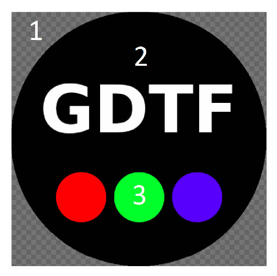

## Annex E (normative) Wheel Slot Image Definition

Definition of images used in wheel slots to visualize gobos, animation
wheels or color wheels.

Gobo images shall be in PNG format with an alpha channel. Indexed,
Greyscale and Alpha, 8bit RGB and Alpha, or 16bit RGB and Alpha are
accepted pixel formats.

A gobo image is comprised of a transparent Background (1) and the image
itself on top. The Background shall be fully transparent and should be
considered to be the equivalent of a gobo holder. The Image region shall
be fully opaque aside from anti-aliasing, and shall be as large as
possible.

Note 1: This allows a data consumer to determine the precise pixel extents of
the Image and place the provided PNG over an arbitrary GUI background without
additional processing.

The Background region, the equivalent of gobo holder, is defined by full
transparency (Alpha 0). In the Image region, Pure Black (RGB 0,0,0) is
opaque (2), and Pure White (RGB 255,255,255) is transparent (letter A).

Colored gobos (3) shall use an RGB approximation. The RGB approximation
shall be calculated on the basis of Pure White being the CCT of the
fixture light source and the ICC color profile embedded within the PNG.
(See ISO 15076-1:2010) The default shall be sRGB.

