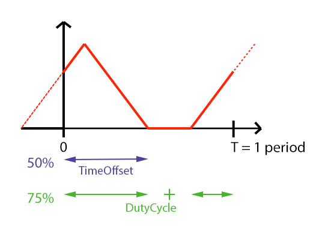
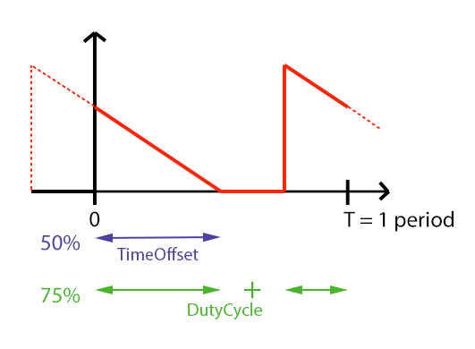
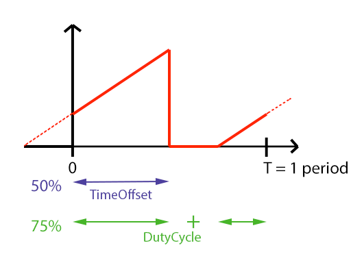

## Annex F (normative) SubPhysicalUnit precisions

### Pulse

Some attributes are named "[EFFECT]Pulse" (for example Shutter(n)StrobePulse). They should behave like a triangular function. Here is how they are defined:
- The main PhysicalUnit is a **frequency** which allows to modify the duration of the period T.
- t = 0s corresponds to the activation of the channel function.
- The **TimeOffset** SubPhysicalUnit is the offset of the end of the pulse from 0, the activation of the channel function, as a percentage of the period T.
- The **DutyCycle** SubPhysicalUnit corresponds to the fraction of one period in which the value is not 0.

*Figure 5. Pulse-like attribute and their SubPhysicalUnits*

If there aren't any value given by the user, the TimeOffset and DutyCycle SubPhysicalUnits are defaulted to 100%:

*Figure 6. Default Pulse-like attribute and their SubPhysicalUnits*

### PulseClose

Some attributes are named "[EFFECT]PulseClose" (for example IrisPulseClose). They should behave like a decreasing ramp. Here is how they are defined:
- The main PhysicalUnit is a **frequency** which allows to modify the duration of the period T.
- t = 0s corresponds to the activation of the channel function.
- The **TimeOffset** SubPhysicalUnit is the offset of the end of the pulse from 0, the activation of the channel function, as a percentage of the period T.
- The **DutyCycle** SubPhysicalUnit corresponds to the fraction of one period in which the value is not 0.

*Figure 7. PulseClose-like attribute and their SubPhysicalUnits*

If there aren't any value given by the user, the TimeOffset and DutyCycle SubPhysicalUnits are defaulted to 100%:

*Figure 8. Default PulseClose-like attribute and their SubPhysicalUnits*

### PulseOpen

Some attributes are named "[EFFECT]PulseOpen" (for example Frost(n)PulseOpen). They should behave like an increasing ramp. Here is how they are defined:
- The main PhysicalUnit is a **frequency** which allows to modify the duration of the period T.
- t = 0s corresponds to the activation of the channel function.
- The **TimeOffset** SubPhysicalUnit is the offset of the end of the pulse from 0, the activation of the channel function, as a percentage of the period T.
- The **DutyCycle** SubPhysicalUnit corresponds to the fraction of one period in which the value is not 0.

*Figure 9. PulseOpen-like attribute and their SubPhysicalUnits*

If there aren't any value given by the user, the TimeOffset and DutyCycle SubPhysicalUnits are defaulted to 100%:

*Figure 10. Default PulseOpen-like attribute and their SubPhysicalUnits*

# Revision History

This section lists all the changes that are made to GDTF.

