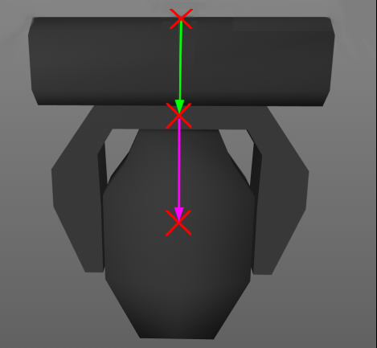
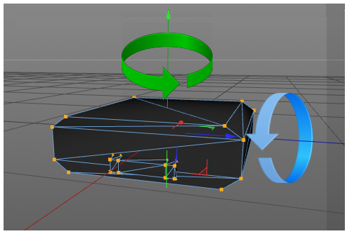
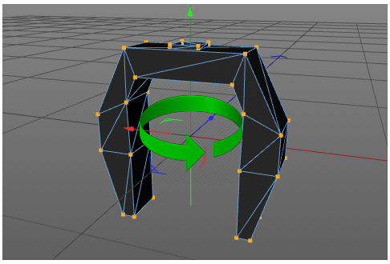
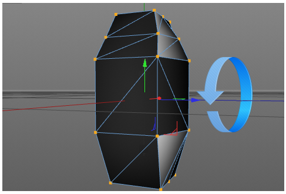
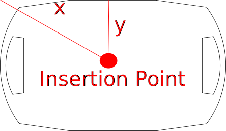

## Model Collect
  
### General

Each device is divided into smaller parts: body, yoke, head and so on.
These are called geometries. Each geometry has a separate model
description and a physical description. Model collect contains model
descriptions of the fixture parts. The model collect currently does not
have any XML attributes (XML node `<Models>`). As children, Model Collect
has a list of [model](#model ).

### Model

This section defines the type and dimensions of the model (XML node
`<Model>`). The currently defined XML attributes of the model are
specified in [table 32](#table-32 ).

#### Table 32. *Model Attributes*

| XML Attribute Name | Value Type | Description |
|----|----|----|
| Name               | [Name](../file-format-definition#attrtype-name )       | The unique name of the model |
| Length             | [Float](../file-format-definition#attrtype-float )     | Unit: meter; Default value: 0 |
| Width              | [Float](../file-format-definition#attrtype-float )     | Unit: meter; Default value: 0 |
| Height             | [Float](../file-format-definition#attrtype-float )     | Unit: meter; Default value: 0 |
| PrimitiveType      | [Enum](../file-format-definition#attrtype-enum )       | Type of 3D model; The currently defined values are: “Undefined”, “Cube”, “Cylinder”, “Sphere”, “Base”, “Yoke”, “Head”, “Scanner”, “Conventional”, “Pigtail”, "Base1_1", "Scanner1_1", "Conventional1_1"; TODO Default value: “Undefined” |
| File               | [Resource](../file-format-definition#attrtype-resource )   | Optional. File name without extension and without subfolder containing description of the model. Use the following as a resource file: - 3DS or GLB to file to provide 3D model. - SVG file to provide the 2D symbol. It is possible to add several files with the same name but different formats. Preferable format for the 3D model is GLTF. The resource files are located in subfolders of a folder called <code>./models</code>. The names of the subfolders correspond to the file format of the resource files (3ds, step, svg). The path for 3ds files would be <code>./models/3ds</code>. For glb files, it would be <code>./models/gltf</code>.
 Software that is utilizing GDTF files should always be able to read both 3ds and GlTF file formats and should be able to write at least one of these formats. It is preferable that only one type of 3D model file formats is used within one GDTF file. |
| SVGOffsetX            | [Float](../file-format-definition#attrtype-float )  | Offset in X from the 0,0 point to the desired insertion point of the top view svg. Unit based on the SVG. Default value: 0|
| SVGOffsetY            | [Float](../file-format-definition#attrtype-float )  | Offset in Y from the 0,0 point to the desired insertion point of the top view svg. Unit based on the SVG. Default value: 0|
| SVGSideOffsetX        | [Float](../file-format-definition#attrtype-float )  | Offset in X from the 0,0 point to the desired insertion point of the side view svg. Unit based on the SVG. Default value: 0|
| SVGSideOffsetY        | [Float](../file-format-definition#attrtype-float )  | Offset in Y from the 0,0 point to the desired insertion point of the side view svg. Unit based on the SVG. Default value: 0|
| SVGFrontOffsetX       | [Float](../file-format-definition#attrtype-float )  | Offset in X from the 0,0 point to the desired insertion point of the front view svg. Unit based on the SVG. Default value: 0|
| SVGFrontOffsetY       | [Float](../file-format-definition#attrtype-float )  | Offset in Y from the 0,0 point to the desired insertion point of the front view svg. Unit based on the SVG. Default value: 0|

The model currently does not have any children.

All models of a device combined should not exceed a maximum vertices count of 1200 for the default mesh level of detail.

There are three level of details that you can define:

#### Table 33. *Mesh level of detail*

| LOD  | Description  |  Folder 3DS / gltf |
|---|---|---|
| Low  | Optional; This is the mesh for fixtures that are far away from the camera. It should have 30% of the the vertexes from the default mesh vertex count.  | `3ds_low` / `gltf_low`  |
| Default  | This is the default mesh that is used for real time visualization in preprogramming tool. It should have the minimum vertex count possible, while still looking like the fixture in 3D.  | `3ds` / `gltf` |
| High  | Optional; This is high quality mesh targeting non-realtime applications, where the vertex count is not that important. There is no limit for the vertex count. | `3ds_high` / `gltf_high`  |

Low and High meshes definitions are optional. Place the file with the same name in the defined folder.

The device shall be drawn in a hanging position displaying the front
view. That results in the pan axis is Z aligned, and the tilt axis is X
aligned.

The metric system consists of the Right-handed Cartesian Coordinates
XYZ: X – from left (-X) to right (+X), Y – from the outside of the
monitor (-Y) to the inside of the monitor (+Y), Z – from bottom (-Z) to
top (+Z). 0,0,0 – center base plate. See Figure 2.

 

Figure 2. Device in a hanging position – front view

The mesh of each fixture part shall be drawn around its own suspension
point. The zero point of a device does not necessarily have to contain
the offset related to the yoke, but it must be centered on its axis of
rotation. The offset is defined by the geometry and has to be related to
its parent geometry and not to the base. 

Note 1: In general, the offsets are mostly negative, because the device is
displayed in a hanging position.

Figure 3. Offsets of the parts

In Figure 3 the green arrow displays the offset of the yoke related to
the base. The magenta arrow displays the offset of the head related to
the yoke. The offsets are to be defined by the position matrix of the
according geometry ([table 32](#table-32)). 
It is important that the axis of rotation of
each device part is exactly positioned (see Figure 4).

 
 
 

Figure 4. Positions of rotation axis

The dimension XML attributes of model (see [table
32](#table-32 )) are always used, no matter the scaling and
ratio of the mesh file. The mesh is explicitly scaled to this dimension.
The length defines the dimension of the model on the X axis, the width
on the Y axis and the height on the Z axis.

SVG use viewboxes to align their content. The viewbox is always defined ny the
top left of the bounding box. With the attributes `SVG_VIEW_Offset_XY` you can
define the insertion point in relation to the view box.

SVG can have background filling. This filling should have the color #C8C8C8. By
this color, any software can replace it with another color.

| Type  | Description  | Folder 3DS / gltf |
|---|---|---|
| Top View  | View from top in -Z direction. | `svg` |
| Front View  | View from  fron in Y direction | `svg_front` |
| Side View  | View from  fron in -X direction  | `svg_side` |

SVG images should be drawn in a 1:1 scale to the actual device. Use mm as base unit. Scaling operation from 3D meshes will not be applied to the SVG informations

### Regarding glTF Files

The used glTF files should follow these requirements:

 - Use the `glb` binary format
 - Only use the 2.0 version
 - Do not use extension
 - Do not use animations
 - Only use jpeg or png texture resource
 - all vertex attributes are `GL_FLOAT`

 ### Regarding SVG Files

- Use SVG 1.1 spec
- Don't embed bitmap images.
- Align the viewbox to the top left of the device

