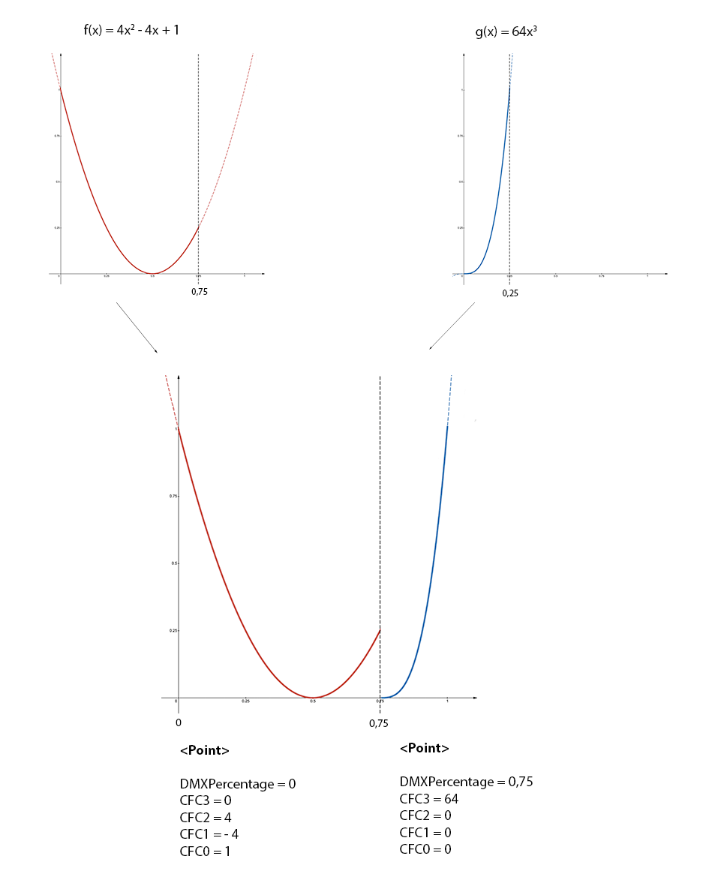

 
## Physical Descriptions
  
### General

This section describes the physical constitution of the device. It
currently does not have any XML Attributes (XML node
`<PhysicalDescriptions>`). Children of Physical Description are specified
in [table 15](#table-15 ).

#### Table 15. *Physical Description Children*

| XML node                               | Mandatory | Description                                                                         |
|----|----|----|
| [Emitters](#emitter-collect )       | No        | Describes device emitters                                                           |
| [Filters](#filter-collect )         | No        | Describes device filters                                                            |
| [ColorSpace](#color-space )   | No        | Describes device default color space                                                       |
| [AdditionalColorSpaces](#color-spaces )   | No        | Describes additional device color spaces                                                        |
| [Gamuts](#gamut-collect)   | No        | Describes device gamuts                                                        |
| [DMXProfiles](#dmx-profile-collect) | No        | Describes nonlinear correlation between DMX input and physical output of a channel. |
| [CRIs](#color-rendering-index-collect)               | No        | Describes color rendering with IES TM-30-15 (99 color samples).                     |
| [Connectors](#connector-collect )   | No        | Obsolete now. See Geometry Collect, WiringObject. Describes physical connectors of the device.              |
| [Properties](#properties-collect )   | No        | Describes physical properties of the device.                                        |

### Emitter Collect
  
#### General

This section contains the description of the emitters. Emitter Collect
defines additive mixing of light sources, such as LEDs and tungsten
lamps with permanently fitted filters. It currently does not have any
XML Attributes (XML node `<Emitters>`). As children the emitter collect
has a list of a [emitter](#emitter ).

#### Emitter

This section defines the description of the emitter (XML node
<Emitter>). The currently defined XML attributes of the emitter are
specified in [table 16](#table-16 ).

#### Table 16. *Emitter Attributes*

| XML Attribute Name | Value Type                                | Description                                                                                                                                                                                                                   |
|----|----|----|
| Name               | [Name](../file-format-definition#attrtype-name )         | Unique Name of the emitter                                                                                                                                                                                                    |
| Color              | [ColorCIE](../file-format-definition#attrtype-colorcie ) | Approximate absolute color point if applicable. Omit for non-visible emitters (eg., UV). For Y give relative value compared to overall output defined in property Luminous Flux of related Beam Geometry (transmissive case). |
| DominantWaveLength | [Float](../file-format-definition#attrtype-float )       | Required if color is omitted, otherwise it is optional. Dominant wavelength of the LED.                                                                                                                                       |
| DiodePart          | [String](../file-format-definition#attrtype-string )     | Optional. Manufacturer’s part number of the diode.                                                                                                                                                                            |

As children, the Emitter has a list of
[measurements](#measurement ).

### Filter Collect
  
#### General

This section contains the description of the filters. The Filter Collect
defines subtractive mixing of light sources by filters, such as
subtractive mixing flags and media used in physical or virtual Color
Wheels. It currently does not have any XML Attributes (XML node
`<Filters>`). As children the filter collect has a list of a
[filters](#filter ).

#### Filter

This section defines the description of the filter (XML node `<Filter>`).
The currently defined XML attributes of the filter are specified in
[table 17](#table-17 ).

#### Table 17. *Filter Attributes*

| XML Attribute Name | Value Type                                | Description                                                                                                                                                                                                                                                                   |
|----|----|----|
| Name               | [Name](../file-format-definition#attrtype-name )         | Unique Name of the filter.                                                                                                                                                                                                                                                    |
| Color              | [ColorCIE](../file-format-definition#attrtype-colorcie ) | Approximate absolute color point when this filter is the only item fully inserted into the beam and the fixture is at maximum intensity. For Y give relative value compared to overall output defined in property Luminous Flux of related Beam Geometry (transmissive case). |

As children the Filter has a list of
[measurements](#measurement ).

### Measurement
  
#### General

The measurement defines the relation between the requested output by a
control channel and the physically achieved intensity. XML node for
measurement is `<Measurement>`. The currently defined XML attributes of
the measurement are specified in [table 18](#table-18 ).

#### Table 18. *Measurement Attributes*

| XML Attribute Name | Value Type                          | Description                                                                                                                                                                                                                  |
|----|----|----|
| Physical           | [Float](../file-format-definition#attrtype-float ) | For additive color mixing: uniquely given emitter intensity DMX percentage. Value range between \> 0 and \<= 100. For subtractive color mixing: uniquely given flag insertion DMX percentage. Value range between 0 and 100. |
| LuminousIntensity  | [Float](../file-format-definition#attrtype-float ) | Used for additive color mixing: overall candela value for the enclosed set of measurement.                                                                                                                                   |
| Transmission       | [Float](../file-format-definition#attrtype-float ) | Used for subtractive color mixing: total amount of lighting energy passed at this insertion percentage.                                                                                                                      |
| InterpolationTo    | [Enum](../file-format-definition#attrtype-enum )   | Interpolation scheme from the previous value. The currently defined values are: "Linear", "Step", "Log"; Default: Linear                                                                                                     |

The order of the measurements corresponds to their ascending physical
values.

Additional definition for additive color mixing: It is assumed that the
physical value 0 exists and has zero output.

Additional definition for subtractive color mixing: The flag is removed
with physical value 0 and it does not affect the beam. Physical value
100 is maximally inserted and affects the beam.

Note 1: Some fixtures may vary in color response. These fixtures define
multiple measurement points and corresponding interpolations.

As children the Measurement Collect has an optional list of a
[measurement point](#measurement-point ).

#### Measurement Point

The measurement point defines the energy of a specific wavelength of a
spectrum. The XML node for measurement point is `<MeasurementPoint>`. The
defined XML attributes of the measurement points are specified in [table 
19](#table-19 ).

It is recommended, but not required, that measurement points are evenly
spaced. Regions with minimal light energy can be omitted, but the
decisive range of spectrum must be included. Recommended measurement
spacing is 1 nm. Measurement spacing should not exceed 4 nm.

#### Table 19. *Measurement Point Attributes*

| XML Attribute Name | Value Type                          | Description                            |
|----|----|----|
| WaveLength         | [Float](../file-format-definition#attrtype-float ) | Center wavelength of measurement (nm). |
| Energy             | [Float](../file-format-definition#attrtype-float ) | Lighting energy (W/m2/nm)              |

The measurement point does not have any children.

### Color Space Collect
  
#### General

This section defines color spaces. Currently it does not
have any XML attributes (XML node `<AdditionalColorSpaces>`). As children, color space collect has a list of a [ColorSpace](#color-space ).

#### Color Space

This section defines the color space that is used for color mixing with
indirect RGB, Hue/Sat, xyY or CMY control input. (XML node
`<ColorSpace>`). The currently defined XML attributes of the color space
are specified in [table 20](#table-20 ).

#### Table 20. *Color Space Attributes*

| XML Attribute Name | Value Type                                | Description                                                                                                                                                      |
|----|----|----|
| Name               | [Name](../file-format-definition#attrtype-name )         | Unique Name of the Color Space. Default Value: "Default". Note that the name need to be unique for the default colorspace and all color spaces in the AdditionalColorSpaces node. |                                                                                                                            |
| Mode               | [Enum](../file-format-definition#attrtype-enum )         | Definition of the Color Space that used for the indirect color mixing. The defined values are "Custom", "sRGB", "ProPhoto" and "ANSI". Default Value: "sRGB"  |
| Red                | [ColorCIE](../file-format-definition#attrtype-colorcie ) | Optional. CIE xyY of the Red Primary; this is used only if the ColorSpace is "Custom".                                                                        |
| Green              | [ColorCIE](../file-format-definition#attrtype-colorcie ) | Optional. CIE xyY of the Green Primary; this is used only if the ColorSpace is "Custom".                                                                      |
| Blue               | [ColorCIE](../file-format-definition#attrtype-colorcie ) | Optional. CIE xyY of the Blue Primary; this is used only if the ColorSpace is "Custom".                                                                       |
| WhitePoint         | [ColorCIE](../file-format-definition#attrtype-colorcie ) | Optional. CIE xyY of the White Point; this is used only if the ColorSpace is "Custom".                                                                        |

The predefined modes for the color space XML Attributes are are
specified in [table 21](#table-21 ).

#### Table 21. *Predefined Modes for Color Space Attribute Mode*

|             |                                     |                                          |                 |
|----|----|----|----|
| Mode        | sRGB                                | ProPhoto                                 | ANSI            |
| Description | Adobe sRGB, HDTV IEC 61966-2-1:1999 | Kodak ProPhoto ROMM RGB ISO 22028-2:2013 | ANSI E1.54-2015 |
| Red         | 0.6400, 0.3300, 0.2126              | 0.7347, 0.2653                           | 0.7347, 0.2653  |
| Green       | 0.3000, 0.6000, 0.7152              | 0.1596, 0.8404                           | 0.1596, 0.8404  |
| Blue        | 0.1500, 0.0600, 0.0722              | 0.0366, 0.0001                           | 0.0366, 0.001   |
| WhitePoint  | 0.3127, 0.3290, 1.0000              | 0.3457, 0.3585                           | 0.4254, 0.4044  |

The color space does not have any children.

### Gamut Collect
  
#### General

This section defines gamuts. Currently it does not
have any XML attributes (XML node `<Gamuts>`). As children, gamut collect has a list of a [Gamut](#gamut ).

#### Gamut

This section defines the color gamut of the fixture (XML node `<Gamut>`), which is the set of attainable colors by the fixture. The currently defined XML attributes of a gamut
are specified in [table 22](#table-22 ).

#### Table 22. *Gamut Attributes*

| XML Attribute Name | Value Type                                             | Description                                                 |
|----|----|----|
| Name               | [Name](../file-format-definition#attrtype-name )                   | Unique Name of the Gamut.                                   |
| Points             | [Array of ColorCIE](../file-format-definition#attrtype-colorcie )  | Set of points defining the vertice of the gamut's polygon.  |

The gamut does not have any children.

### DMX Profile Collect
  
#### General

This section defines DMX profile descriptions. Currently it does not
have any XML attributes (XML node `<DMXProfiles>`). As children DMX
profile collect has a list of [DMX profiles](#dmx-profile ).

#### DMX Profile

This section defines the DMX profile description (XML node
`<DMXProfile>`). The currently defined XML attributes of the DMX profile
are specified in [table 23](#table-23 ).

#### Table 23. *DMX Profile Attributes*

| XML Attribute Name  | Value Type                           | Description                    |
|----|----|----|
| Name                | [Name](../file-format-definition#attrtype-name ) | Unique name of the DMX profile |

As children a DMX Profile has a list of [point](#point ).

##### Point

This section contains points to define the DMX profile (XML node `<Point>`). The currently defined XML attributes of a point
are specified in [table 24](#table-24 ).

#### Table 24. *Point Attributes*

| XML Attribute Name  | Value Type                             | Description                    |
|----|----|----|
| DMXPercentage       | [Float](../file-format-definition#attrtype-float ) | DMX percentage of the point; Unit: Percentage; Default value: 0 |
| CFC0                | [Float](../file-format-definition#attrtype-float ) | Cubic Function Coefficient for x⁰; Default value: 0  |
| CFC1                | [Float](../file-format-definition#attrtype-float ) | Cubic Function Coefficient for x;  Default value: 0  |
| CFC2                | [Float](../file-format-definition#attrtype-float ) | Cubic Function Coefficient for x²; Default value: 0  |
| CFC3                | [Float](../file-format-definition#attrtype-float ) | Cubic Function Coefficient for x³; Default value: 0  |

Find the Point with the biggest DMXPercentage below or equal x. If there is none, the output is expected to be 0.

Output(x) = CFC3 * (x - DMXPercent)³ + CFC2 * (x - DMXPercent)² + CFC1 * (x - DMXPercent) + CFC0

Here is an example where the output follows a function f for 75% of the DMX Range and another function g for the last 25%. The Point attributes are given to illustrate how they are defined.

*Figure 1. DMXProfile example*

A Point does not have any children.

### Color Rendering Index Collect
  
#### General

This section contains TM-30-15 Fidelity Index (Rf) for 99 color samples.
Currently it does not have any XML attributes (XML node `<CRIs>`). As
children, CRIs has a list of [CRI groups](#color-rendering-index-group ).

#### Color Rendering Index Group
  
##### General

This section contains CRIs for a single color temperature (XML node
`<CRIGroup>`). The currently defined XML attributes of the CRI group are
specified in [table 25](#table-25 ).

#### Table 25. *CRI Group Attributes*

| XML Attribute Name | Value Type                          | Description                                          |
|----|----|----|
| ColorTemperature   | [Float](../file-format-definition#attrtype-float ) | Color temperature; Default value: 6000; Unit: Kelvin |

As children, the CRIGroup has an optional list of [Color Rendering Index](#color-rendering-index ).

##### Color Rendering Index

This section defines the CRI for one of the 99 color samples (XML node
`<CRI>`). The currently defined XML attributes of the measurement point
are specified in [table 26](#table-26 ).

#### Table 26. *CRI Attributes*

| XML Attribute Name  | Value Type                        | Description                                                                             |
|----|----|----|
| CES                 | [Enum](../file-format-definition#attrtype-enum ) | Color sample. The defined values are “CES01”, “CES02”, … “CES99”. Default Value “CES01" |
| ColorRenderingIndex | [UInt](../file-format-definition#attrtype-uint ) | The color rendering index for this sample. Size: 1 byte; Default value: 100             |

The color rendering index does not have any children.

### Connector Collect
  
#### General

This section defined the physical connectors and is kept for backwards compatibility. From DIN SPEC 15800:2022 or GDTF v1.2 onwards physical connectors shall be decribed as WiringObjects in the Geometry Collect. 
It currently does not have any XML attributes (XML node `<Connectors>`). As children, the Connector Collect has a list of a [connectors](#connector ).

#### Connector

See Geometry Collect WiringObject. For easier transition find below the equivalent of the WiringObject.
This section defines the connector (XML node `<Connector>`). The currently
defined XML attributes of the connector are specified in [table
27](#table-27 ).

#### Table 27. *Connector Attributes*

| XML Attribute Name | Value Type                          | Description                                                                                                                                            |
|----|----|----|
| Name               | [Name](../file-format-definition#attrtype-name )   | Unique Name of the connector. Now: Geometry Type WiringObject, XML Attribute: Name                                                                                                                         |
| Type               | [Name](../file-format-definition#attrtype-name )   | The type of the connector. Find a list of predefined types in [Annex D](/gdtf/annex/annex-d/). Now: Geometry Type WiringObject, XML Attribute: ConnectorType.                                                        |
| DMXBreak           | [Uint](../file-format-definition#attrtype-uint )   | Optional. Defines to which DMX Break this connector belongs to.  Obsolete now.                                                                                       |
| Gender             | [Int](../file-format-definition#attrtype-int )     | Connectors where the addition of the Gender value equal 0, can be connected; Default value: 0; Male Connectors are -1, Female are +1, Universal are 0. Obsolete now.  |
| Length             | [Float](../file-format-definition#attrtype-float ) | Defines the length of the connector's wire in meters. "0" means that there is no cable and the connector is build into the housing. Default value "0".  Obsolete now. |

The connector does not have any children.

### Properties Collect
  
#### General

This section defines the general properties of the device type (XML node
`<Properties>`). The Properties Collect currently does not have any XML
attributes. The currently defined children nodes of properties collect
are specified in [table 28](#table-28 ).

#### Table 28. *Properties Collect*

| XML node                                                 | Amount | Description                                            |
|----|----|----|
| [OperatingTemperature](#operatingtemperature ) | 0 or 1 | Temperature range in which the device can be operated. |
| [Weight](#weight )                             | 0 or 1 | Weight of the device including all accessories.        |
| [PowerConsumption](#powerconsumption )         | Any    | Power information for a given connector.               |
| [LegHeight](#legheight )                       | 0 or 1 | Height of the legs.                                    |

#### OperatingTemperature

This section defines the ambient operating temperature range (XML node
`<OperatingTemperature>`). The currently defined XML attributes of the
OperatingTemperature are specified in [table 29](#table-29 ).

#### Table 29. *Operating Temperature Attributes*

| XML Attribute Name | Value Type                          | Description                                                                 |
|----|----|----|
| Low                | [Float](../file-format-definition#attrtype-float ) | Lowest temperature the device can be operated. Unit: °C. Default value: 0   |
| High               | [Float](../file-format-definition#attrtype-float ) | Highest temperature the device can be operated. Unit: °C. Default value: 40 |

The OperatingTemperature currently does not have any children.

#### Weight

This section defines the overall weight of the device (XML node
`<Weight>`). The currently defined XML attributes of the weight are
specified in [table 30](#table-30 ).

#### Table 30. *Weight Attributes*

| XML Attribute Name | Value Type                          | Description                                                                      |
|----|----|----|
| Value              | [Float](../file-format-definition#attrtype-float ) | Weight of the device including all accessories. Unit: kilogram. Default value: 0 |

The weight currently does not have any children.

#### LegHeight

This section defines the height of the legs (XML node `<LegHeight>`). The
currently defined XML attributes of the LegHeight are specified in
[table 31](#table-31 ).

#### Table 31. *Leg Height Attributes*

| XML Attribute Name | Value Type                          | Description                                                                                                      |
|----|----|----|
| Value              | [Float](../file-format-definition#attrtype-float ) | Defines height of the legs - distance between the floor and the bottom base plate. Unit: meter. Default value: 0 |

The LegHeight currently does not have any children.

