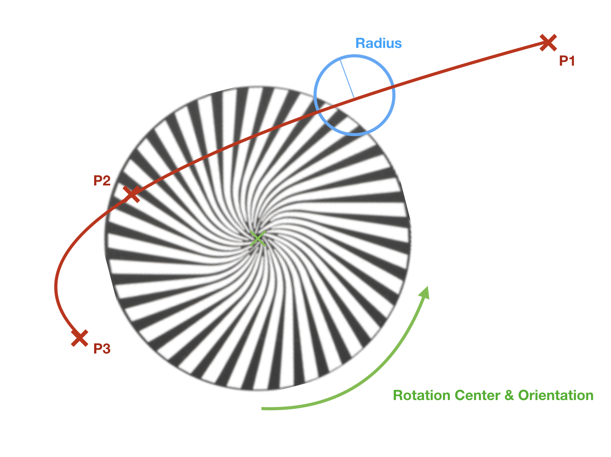

## Wheel Collect
  
### General

This section defines all physical or virtual wheels of the device. It
currently does not have any XML attributes (XML node `<Wheels>`). As
children wheel collect can have a list of a [wheels](#wheel ).

Note 1: Physical or virtual wheels represent the changes to the light beam
within the device. Typically color, gobo, prism, animation, content and others
are described by wheels.

### Wheel
  
#### General

Each wheel describes a single physical or virtual wheel of the fixture
type. If the real device has wheels you can change, then all wheel
configurations have to be described. Wheel has the following XML node:
`<Wheel>`. The currently defined XML attributes of the wheel are specified
in [table 11](#table-11 ).

#### Table 11. *Wheel Attributes*

| XML Attribute Name | Value Type                        | Description                  |
|----|----|----|
| Name               | [Name](../file-format-definition#attrtype-name ) | The unique name of the wheel |

As children, Wheel has a list of [wheel
slots](#wheel-slot ).

#### Wheel Slot
  
##### General

The wheel slot represents a slot on the wheel (XML node `<Slot>`). The
currently defined XML attributes of the wheel slot are specified in
[table 12](#table-12 ).

#### Table 12. *Wheel Slot Attributes*

| XML Attribute Name | Value Type | Description                                                                                                                                                                                                                                                                                                                       |
|----|----|----|
| Name               | [Name](../file-format-definition#attrtype-name )        | The unique name of the wheel slot                                                                                                                                                                                                                                                                                                 |
| Color              | [ColorCIE](../file-format-definition#attrtype-colorcie )   | Color of the wheel slot, Default value: {0.3127, 0.3290, 100.0 } (white) For Y give relative value compared to overall output defined in property Luminous Flux of related Beam Geometry (transmissive case).                                                                                                                     |
| Filter             | [Node](../file-format-definition#attrtype-node )       | Optional. Link to filter in the physical description; Do not define color if filter is used; Starting point: Filter Collect                                                                                                                                                                                                       |
| MediaFileName | [Resource](../file-format-definition#attrtype-resource ) | Optional. PNG file name without extension containing image for specific gobos etc.  - Maximum resolution of picture: 1024x1024 - Recommended resolution of gobo: 256x256 - Recommended resolution of animation wheel: 256x256 These resource files are located in a folder called `./wheels` in the zip archive. Default value: empty. |

Note 1: More information on the definitions of images used in wheel slots to
visualize gobos, animation wheels or color wheels can be found in [Annex E
"Wheel Slot Image Definition"](/gdtf/annex/annex-e/).

The link between a slot and a [channel set](../dmx-mode-collect/#channel-set) is
done via the wheel slot index. The wheel slot index of a slot is derived
from the order of a wheel's slots. The wheel slot index is normalized to
1.

If the wheel slot has a prism, it has to have one or several children
called [prism facet](#prism-facet ). If the wheel slot has an
AnimationWheel, it has to have one child called [Animation
Wheel](#animation-system ).

##### Prism Facet

This section can only be defined for the prism wheel slot and has a
description for the prism facet (XML node `<Facet>`). The currently
defined XML attributes of the prism facet are specified in [table
13](#table-13 ).

#### Table 13. *Wheel Slot Attributes*

| XML Attribute Name | Value Type                                | Description                                                           |
|----|----|----|
| Color              | [ColorCIE](../file-format-definition#attrtype-colorcie ) | Color of prism facet, Default value: {0.3127, 0.3290, 100.0 } (white) |
| Rotation           | [Rotation](../file-format-definition#attrtype-rotation ) | Specify the rotation, translation and scaling for the facet.          |

The prism facet cannot have any children.

##### Animation System

This section can only be defined for the animation system disk and it
describes the animation system behavior (XML node `<AnimationSystem>`).
The currently defined XML attributes of the AnimationSystem are
specified in [table 14](#table-14 ).

#### Table 14. *AnimationSystem Attributes*

| XML Attribute Name | Value Type                                   | Description                                                                                                                                                                                                              |
|----|----|----|
| P1                 | [Array of Float](../file-format-definition#attrtype-float ) | First Point of the Spline describing the path of animation system in the beam in relation to the middle of the Media File; Array of two floats; Separator of values is ","; First Float is X-axis and second is Y-axis.  |
| P2                 | [Array of Float](../file-format-definition#attrtype-float ) | Second Point of the Spline describing the path of animation system in the beam in relation to the middle of the Media File; Array of two floats; Separator of values is ","; First Float is X-axis and second is Y-axis. |
| P3                 | [Array of Float](../file-format-definition#attrtype-float ) | Third Point of the Spline describing the path of animation system in the beam in relation to the middle of the Media File; Array of two floats; Separator of values is ","; First Float is X-axis and second is Y-axis.  |
| Radius             | [Float](../file-format-definition#attrtype-float )          | Radius of the circle that defines the section of the animation system which will be shown in the beam                                                                                                                    |

The AnimationSystem cannot have any children.

Example of an animation system

