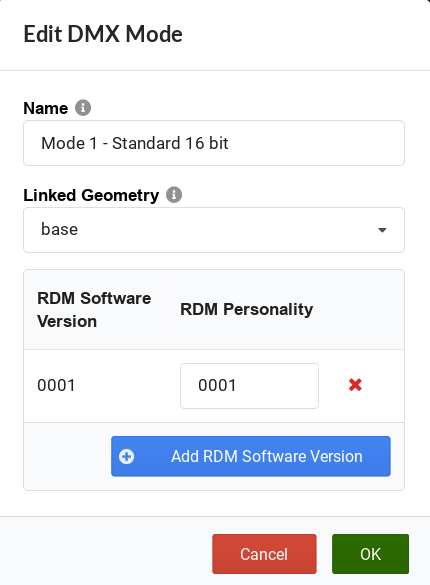
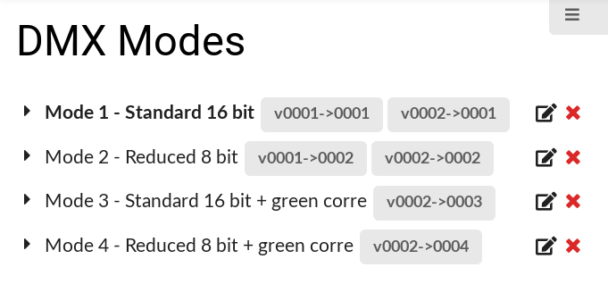

Enter all data regarding the fixture’s DMX settings.

{}
Refer to the fixture's DMX table and identify the available DMX modes.
{}

{}
A GDTF file should contain all DMX modes, including changes to the DMX modes made by a firmware update of a fixture.
{}

 {} 

_DMX window_

## DMX Modes

A DMX Mode is a container holding definition of DMX channels. You can define multiple DMX modes for a single device within one GDTF file. DMX Modes are linked to the software versions of the device and you can define DMX modes for different software version of the device.

1.  To add a new DMX mode, click **Add Mode**.
    The Add new Mode pop-up opens. Enter **Mode name** and select the linked geometry.
2.  To add **RDM Software version** and **RDM Personality ID** pair, click the Add **RDM Software version**
    The Add RDM Software Version pop-up opens. Enter **Software version** and click OK.
    Enter the **RDM Personality** ID and click OK

New DMX Mode window

3.  If you have for example a DMX Mode which was added only in software version 2 of the device, you can define this pair of **RDM Software Version** - **RDM Personality** values in the DMX Mode definition. In the following example, we have a DMX Mode 1 and 2 available from software version 1. Then we have DMX Modes 3 and 4, which are available from software version 2 on:

RDM Modes listing with multiple DMX Modes and multiple RDM Software versions defined

## DMX Channels

1.  To add a DMX Channel, click **Add new Channel**.
    The Add new Channel pop-up opens. Select the linked geometry and an attribute.

{}
To keep the control of the fixture type as simple as possible – especially when using several fixture types at the same time – it is recommended to use the predefined attributes. That is, only create a new attribute if a function of the fixture type cannot be described using a predefined one.
{}

{}
An attribute must only be used once in a geometry.
Several attributes require separate geometries.
Not allowed in one geometry: **Shutter1** and **Shutter1**.
Allowed: **Shutter1** and **Shutter2**.
{}

3.  Select the **Resolution** of the DMX channel.
    The available resolutions are 8 bit, 16 bit, 24 bit, 32 bit and Virtual.

 {} 

_DMX channel resolution window_

4.  Enter the **Coarse**, **Fine**, **Ultra** and **Uber** value.
    The relative patch addresses describes the DMX address offset of the DMX channel. Offset 1 is the same as the start patch address. As tilt in this example has a resolution of 16 bits, two relative patch addresses (Coarse & Fine) must be set. If the resolution of a channel was 32 bits, four relative patch address would be set.
5.  Enter the **Default Value** for the DMX channel (for example 128 for PAN/TILT). Select a readout of 8 bit, 16 bit, 24 bit, 32 bit or % via the arrow button.

**Hint:**
Changing the readout does not change the resolution of the property but allows to enter the values in a different resolution or as percentage.

4.  Enter the **Highlight Value** for the DMX channel.
    The checkbox defines whether this DMX channel reacts to highlight function.
    The highlight value is the value that will be output in highlighted DMX channels. Select a readout of 8 bit, 16 bit, 24 bit, 32 bit or % via the arrow button.
5.  Enter the **DMX Break** value for the DMX channel.
    Breaks are used if a fixture needs more than one start address. For example, a scroller is added to an existing conventional fixture and the fixture is connected to a dimmer. This dimmer is patched in one universe and the scroller is connected to a controller that, on the other hand, is patched in another universe. Both, the conventional fixture and scroller, are treated as one combined fixture.

Repeat steps 1 through 8 until all desired DMX channels are defined.

**Hint:**
The tabs in the horizontal menu bar (Fixture, Geometry, etc.) are flagged with a green dot as soon as you change any value.

## DMX Mode Preview

To display the DMX mode and its DMX channels, click the desired mode.

 {} 

_DMX mode preview_

{}
If the DMX mode contains any errors in the DMX channels, logical channels, channel functions or channel sets, the errors are indicated with red color.
{}
