## Root File Definition

The name of the file is: `GeneralSceneDescription.xml`

This file is required in the archive for it to be a valid MVR.

The root file is an XML file with root node named:
`GeneralSceneDescription`

[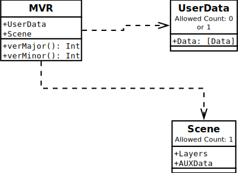](media/mvr.svg)

| Attribute Name | Attribute Value Type                      | Default Value when Optional | Description                                                         |
| -------------- | ----------------------------------------- | --------------------------- | ------------------------------------------------------------------- |
| verMajor       | [Integer](../generic-value-types#attrtype-integer) | Not Optional                | Denotes the major version of the format used when saving this file. |
| verMinor       | [Integer](../generic-value-types#attrtype-integer) | Not Optional                | Denotes the minor version of the format used when saving this file. |

| Child Node | Allowed Count | Description                                    |
| ---------- | ------------- | ---------------------------------------------- |
| UserData   | 0 or 1        | Specifies user data associated with this file. |
| Scene      | 1             | Defines the scene described in this file.      |

Find a complete example of a file [here
](https://github.com/mvrdevelopment/spec/blob/main/Sample_GeneralSceneDescription).

# Node Definition: UserData

This node contains a collection of user data nodes defined and used by
provider applications if required.

[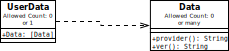](media/user_data.svg)

Node name: `UserData`

| Child Node                    | Allowed Count | Description                   |
| ----------------------------- | ------------- | ----------------------------- |
| [Data](#node-definition-data) | 0 or many     | Defines a block of user data. |

## Node Definition: Data

This node contains a collection of data specified by the provider
application.

[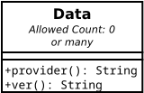](media/data.svg)

Node name: `Data`

| Attribute Name | Attribute Value Type                    | Default Value when Optional | Description                                                               |
| -------------- | --------------------------------------- | --------------------------- | ------------------------------------------------------------------------- |
| provider       | [String](../generic-value-types#attrtype-string) | Not Optional                | Specifies the name of the provider application that created this data.    |
| ver            | [String](../generic-value-types#attrtype-string) | 1                           | Version information of the data as specified by the provider application. |

# Node Definition: Scene

This node contains information about the scene.

[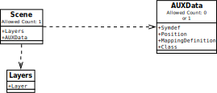](media/scene.svg)

Node name: `Scene`

| Child Node                          | Allowed Count | Description                           |
| ----------------------------------- | ------------- | ------------------------------------- |
| [AUXData](#node-definition-auxdata) | 0 or 1        | Defines auxiliary data for the scene. |
| [Layers](#node-definition-layers)   | 1             | A list of layers in the scene.        |

## Node Definition: AUXData

This node contains auxiliary data for the scene node.

[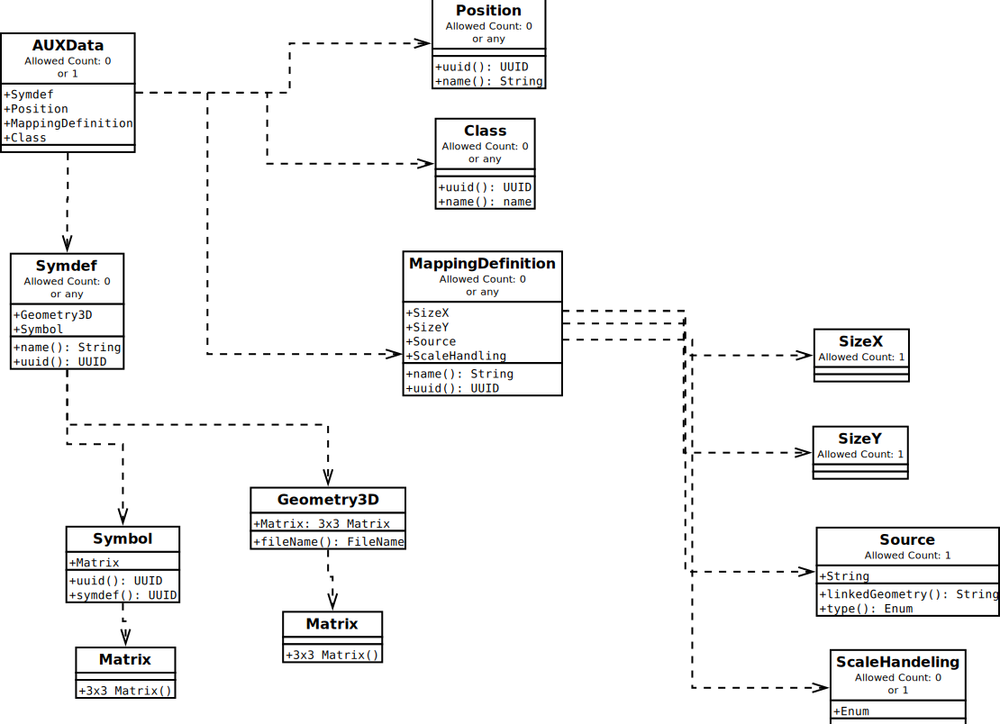](media/aux_data.svg)

Node name: `AUXData`

| Child Node                                              | Allowed Count | Description                                                    |
| ------------------------------------------------------- | ------------- | ---------------------------------------------------------------|
| [Symdef](#node-definition-symdef)                       | 0 or any      | Graphical representation that will be instanced in the scene.  |
| [Position](#node-definition-position)                   | 0 or any      | Defines a logical group of lighting devices.                   |
| [MappingDefinition](#node-definition-mappingdefinition) | 0 or any      | Defines a input source for fixture color mapping applications. |
| [Class](#node-definition-class)                         | 0 or any      | Defines a Class for object visiblity filtering.                |

### Node Definition: Symdef

This node contains the graphics so the scene can refer to this, thus
optimizing repetition of the geometry. The child objects are located
within a local coordinate system.


[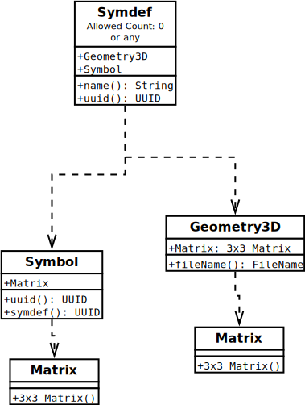](media/symdef.svg)

Node name: `Symdef`

| Attribute Name | Attribute Value Type                    | Default Value when Optional | Description                          |
| -------------- | --------------------------------------- | --------------------------- | ------------------------------------ |
| uuid           | [UUID](../generic-value-types#attrtype-uuid)      | Not Optional                | The unique identifier of the object. |
| name           | [String](../generic-value-types#attrtype-string) | Empty                       | The name of the object               |

The child list contains a list of the following nodes:

| Child Node                                | Description                                                          |
| ----------------------------------------- | -------------------------------------------------------------------- |
| [Geometry3D](#node-definition-geometry3d) | The geometry of this definition that will be instanced in the scene. |
| [Symbol](#node-definition-symbol)         | The symbol instance that will provide a geometry of this definition. |

### Node Definition: Position

This node defines a logical grouping of lighting devices and trusses.

Node name: `Position`

| Attribute Name | Attribute Value Type                    | Default Value when Optional | Description                          |
| -------------- | --------------------------------------- | --------------------------- | ------------------------------------ |
| uuid           | [UUID](../generic-value-types#attrtype-uuid)     | Not Optional                | The unique identifier of the object. |
| name           | [String](../generic-value-types#attrtype-string) | Empty                       | The name of the object               |

### Node Definition: MappingDefinition

This node specified a input source for fixture color mapping
applications.

[](media/mapping_definition.svg)

Node name: `MappingDefinition`

| Attribute Name | Attribute Value Type                | Default Value when Optional | Description                             |
| -------------- | ----------------------------------- | --------------------------- | --------------------------------------- |
| uuid           | [UUID](../generic-value-types#attrtype-uuid) | Not Optional                | The unique identifier of the object.    |
| name           | [name](#attrtype-name)              |                             | The name of the source for the mapping. |

| Child Node                                        | Allowed Count | Description                                         |
| ------------------------------------------------- | ------------- | --------------------------------------------------- |
| [SizeX](#node-definition-sizex)                   | 1             | The size in x direction in pixels of the source.    |
| [SizeY](#node-definition-sizey)                   | 1             | The size in x direction in pixels of the source.    |
| [Source](#node-definition-source)                 | 1             | The video source that will be used for the Mapping. |
| [ScaleHandeling](#node-definition-scalehandeling) | 0 or 1        | How the source will be scaled to the mapping.       |

```xml
<MappingDefinition name="MappingStyle for View 1" uuid="BEF95EB8-98AC-4217-B10D-FB4B83381398">
    <SizeX>1920</SizeX>
    <SizeY>1080</SizeY>
   movie.mov
    
    <ScaleHandeling>UpScale</ScaleHandeling>
</MappingDefinition>
```

### Node Definition: Class

This node defines a logical grouping across different layers. Primarily used for controlling object visibility of objects across multiple Layers.

Node name: `Class`

| Attribute Name | Attribute Value Type                | Default Value when Optional | Description                         |
| -------------- | ----------------------------------- | --------------------------- | ----------------------------------- |
| uuid           | [UUID](../generic-value-types#attrtype-uuid) | Not Optional                | The unique identifier of the class. |
| name           | [name](#attrtype-name)              |                             | The name of the Class.              |

## Node Definition: Layers

This node defines a list of layers inside the scene. The layer is a
container of graphical objects defining a local coordinate system.

Node name: `Layers`

The child list contains a list of layer nodes:

| Child Node                      | Description             |
| ------------------------------- | ----------------------- |
| [Layer](#node-definition-layer) | A layer representation. |

### Node Definition: Layer

This node defines a layer. The layer is a spatial representation of a
geometric container. The child objects are located inside a local
coordinate system.

Node name: `Layer`

| Attribute Name | Attribute Value Type                    | Default Value when Optional | Description                          |
| -------------- | --------------------------------------- | --------------------------- | ------------------------------------ |
| uuid           | [UUID](../generic-value-types#attrtype-uuid)     | Not Optional                | The unique identifier of the object. |
| name           | [String](../generic-value-types#attrtype-string) | Empty                       | The name of the object               |

| Child Node                              | Allowed Count | Description                                                                                                                                                                                                                                                                      |
| --------------------------------------- | ------------- | -------------------------------------------------------------------------------------------------------------------------------------------------------------------------------------------------------------------------------------------------------------------------------- |
| [Matrix](#node-definition-matrix)       | 0 or 1        | The transformation matrix that defines the location and orientation of this the layer inside its global coordinate space. This effectively defines local coordinate space for the objects inside. The Matrix of the Layer is only allowed to have a vertical Transform (elevation). Rotation and scale must be identity. Rotation and scale must be identity, means no rotation and no scale. |
| [ChildList](#node-definition-childlist) | 1             | A list of graphic objects that are part of the layer.                                                                                                                                                                                                                            |

# Node Definition for Parametric Objects

## Node Definition: SceneObject

This node defines a generic graphical object.

[](media/scene_object.svg)

Node name: `SceneObject`

| Attribute Name | Attribute Value Type                  | Default Value when Optional | Description                          |
| -------------- | ------------------------------------- | --------------------------- | ------------------------------------ |
| uuid           | [UUID](../generic-value-types#attrtype-uuid)   | Not Optional                | The unique identifier of the object. |
| name           | [String](../generic-value-types#attrtype-name) | Empty                       | The name of the object               |

| Child Node                                        | Allowed Count | Value Type                                  | Description                                                                              |
| ------------------------------------------------- | ------------- |---------------------------------------------|----------------------------------------------------------------------------------------- |
| [Matrix](#node-definition-matrix)                 | 0 or 1        |                                             | The location and orientation of the object inside the parent coordinate system.          |
| [Classing](#node-definition-classing)             | 0 or 1        | [UUID](../generic-value-types#attrtype-uuid)         | The Class the object belongs to.                                                         |
| [Geometries](#node-definition-geometries)         | 1             |                                             | A list of geometrical representation objects that are part of the object.                |
| GDTFSpec                                          | 0 or 1        | [FileName](../generic-value-types#attrtype-filename) | The name of the file containing the GDTF information for this object.                    |
| GDTFMode                                          | 1             | [String](../generic-value-types#attrtype-string)     | The name of the used DMX mode. This has to match the name of a DMXMode in the GDTF file. |
| [Addresses](#node-definition-addresses)           | 0 or 1        |                                             | The container for DMX Addresses for this object.                                         |
| [Alignments](#node-definition-alignments)         | 0 or 1        |                                             | The container for Alignments for this object.                                            |
| [CustomCommands](#node-definition-customcommands) | 0 or 1        |                                             | The container for custom command for this object.                                        |
| [Overwrites](#node-definition-overwrites)         | 0 or 1        |                                             | The container for overwrites for this object.                                            |
| [Connections](#node-definition-connections)       | 0 or 1        |                                             | The container for connections for this object.                                           |


## Node Definition: GroupObject

This node defines logical group of objects. The child objects are
located inside a local coordinate system.

[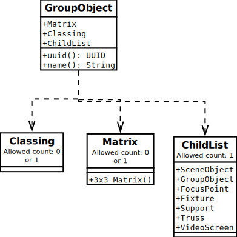](media/group_object.svg)

Node name: `GroupObject`

| Attribute Name | Attribute Value Type                    | Default Value when Optional | Description                          |
| -------------- | --------------------------------------- | --------------------------- | ------------------------------------ |
| uuid           | [UUID](../generic-value-types#attrtype-uuid)     | Not Optional                | The unique identifier of the object. |
| name           | [String](../generic-value-types#attrtype-string) | Empty                       | The name of the object               |

| Child Node                              | Allowed Count | Value Type                          | Description                                                                     |
| --------------------------------------- | ------------- | ----------------------------------- | ------------------------------------------------------------------------------- |
| [Matrix](#node-definition-matrix)       | 0 or 1        |                                     | The location and orientation of the object inside the parent coordinate system. |
| [Classing](#node-definition-classing)   | 0 or 1        | [UUID](../generic-value-types#attrtype-uuid) | The Class the object belongs to.                                                |
| [ChildList](#node-definition-childlist) | 1             |                                     | A list of graphic objects that are part of the group.                           |

## Node Definition: FocusPoint

This node defines a focus point object.

[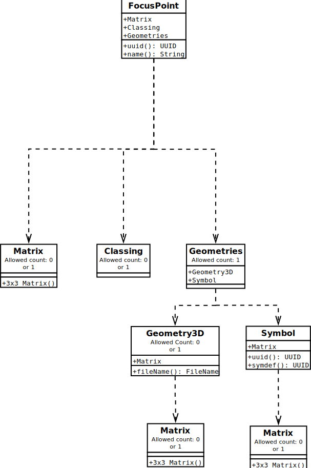](media/focus_point.svg)

Node name: `FocusPoint`

| Attribute Name | Attribute Value Type                    | Default Value when Optional | Description                          |
| -------------- | --------------------------------------- | --------------------------- | ------------------------------------ |
| uuid           | [UUID](../generic-value-types#attrtype-uuid)     | Not Optional                | The unique identifier of the object. |
| name           | [String](../generic-value-types#attrtype-string) | Empty                       | The name of the object               |

| Child Node                                | Allowed Count | Value Type                          | Description                                                                     |
| ----------------------------------------- | ------------- | ----------------------------------- | ------------------------------------------------------------------------------- |
| [Matrix](#node-definition-matrix)         | 0 or 1        |                                     | The location and orientation of the object inside the parent coordinate system. |
| [Classing](#node-definition-classing)     | 0 or 1        | [UUID](../generic-value-types#attrtype-uuid) | The Class the object belongs to.                                                |
| [Geometries](#node-definition-geometries) | 1             |                                     | A list of geometrical representation objects that are part of the object.       |

## Node Definition: Fixture

This node defines a light fixture object.

Node name: `Fixture`

[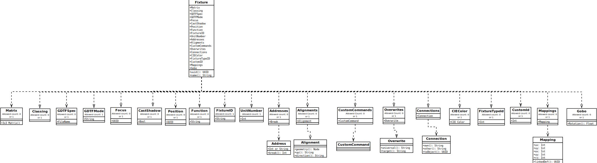](media/fixture.svg)

| Attribute Name | Attribute Value Type                    | Default Value when Optional | Description                          |
| -------------- | --------------------------------------- | --------------------------- | ------------------------------------ |
| uuid           | [UUID](../generic-value-types#attrtype-uuid)     | Not Optional                | The unique identifier of the object. |
| name           | [String](../generic-value-types#attrtype-string) | Empty                       | The name of the object               |

| Child Node                              | Allowed Count | Value Type                                   | Description                                                                                                                                   |
| --------------------------------------- | ------------- | -------------------------------------------- | --------------------------------------------------------------------------------------------------------------------------------------------- |
| [Matrix](#node-definition-matrix)       | 0 or 1        |                                              | The location of the object inside the parent coordinate system. |
| [Classing](#node-definition-classing)   | 0 or 1        | [UUID](../generic-value-types#attrtype-uuid)          | The Class the object belongs to.                                |
| GDTFSpec                                | 0 or 1        | [FileName](../generic-value-types#attrtype-filename)  | The name of the file containing the GDTF information for this light fixture.                                                                  |
| GDTFMode                                | 1             | [String](../generic-value-types#attrtype-string)      | The name of the used DMX mode. This has to match the name of a DMXMode in the GDTF file.                                                      |
| Focus                                   | 0 or 1        | [UUID](../generic-value-types#attrtype-uuid)          | A focus point reference that this lighting fixture aims at if this reference exists.                                                          |
| CastShadow                              | 0 or 1        | [Bool](#attrType-Bool)                       | Defines if a Object cast Shadows.                                                                                                             |
| Position                                | 0 or 1        | [UUID](../generic-value-types#attrtype-uuid)          | A position reference that this lighting fixture belongs to if this reference exists.                                                          |
| Function                                | 0 or 1        | [String](../generic-value-types#attrtype-string)      | The name of the function this Fixture is used for.                                                       |
| FixtureID                               | 1             | [String](../generic-value-types#attrtype-string)      | The Fixture ID of the lighting fixture. This is the short name of the fixture.                                                                |
| UnitNumber                              | 1             | [Integer](../generic-value-types#attrtype-integer)    | The unit number of the lighting fixture in a position.                                                                                        |
| [Addresses](#node-definition-addresses) | 0 or 1        |                                              | The container for DMX Addresses for this fixture.                                                                                             |
| [Alignments](#node-definition-alignments) | 0 or 1        |                                              | The container for Alignments for this fixture.                                                                                             |
| [CustomCommands](#node-definition-customcommands) | 0 or 1        |                                              | The container for custom command for this fixture.                                                                                             |
| [Overwrites](#node-definition-overwrites) | 0 or 1        |                                              | The container for overwrites for this fixture.                                                                                             |
| [Connections](#node-definition-connections) | 0 or 1        |                                             | The container for connections for this fixture.                                                                                             |
| CIEColor                                | 0 or 1        | [CIE Color](../generic-value-types#attrtype-ciecolor) | A color assigned to a fixture. If it is not defined, there is no color for the fixture.                                                       |
| FixtureTypeId                           | 0 or 1        | [Integer](../generic-value-types#attrtype-integer)    | The Fixture Type ID is a value that can be used as a short name of the Fixture Type. This does not have to be unique. The default value is 0. |
| CustomId                                | 0 or 1        | [Integer](../generic-value-types#attrtype-integer)    | The Custom ID is a value that can be used as a short name of the Fixture Instance. This does not have to be unique. The default value is 0.   |
| Mappings                                | 0 or 1        | [Mappings](#node-definition-mappings)        | The container for Mappings for this fixture.                                                                                                  |
| Gobo                                    | 0 or 1        | [Gobo](#node-definition-gobo)                | The Gobo used for the fixture. The image ressource must apply to the GDTF standard.                                                           |

Note: _The fixture has no `Geometries` node as geometry is defined in a
GDTF file._

An example of a node definition is shown below:

```xml
<Fixture name="Robe Robin MMX WashBeam" uuid="8BF13DD7-CBF4-415B-99E4-625FE4D2DAF6">
    <Matrix>{0.158127,-0.987419,0.000000}{0.987419,0.158127,0.000000}{0.000000,0.000000,1.000000}{6020.939200,2838.588955,4978.134459}</Matrix>
    <GDTFSpec>Custom@Robe Robin MMX WashBeam</GDTFSpec>
    <GDTFMode>DMX Mode</GDTFMode>
    <Focus>4A B1 94 62 A6 E3 4C 3B B2 5A D8 09 9F 78 17 0C</Focus>
    <Position>77 BC DE 16 95 A6 47 25 9D 04 16 A0 BD 67 CD 1A</Position>
    <Addresses>
        <Address break="0">45</Address>
    </Addresses>
    <Alignments>
        <Alignment geometry="Beam" up="0,0,1" direction="0,0,-1"/>
    </Alignments>
     <CustomCommands>
        <CustomCommand>Body_Pan,f 50</CustomCommand>
        <CustomCommand>Yoke_Tilt,f 50</CustomCommand>
    </CustomCommands>
    <Overwrites>
            <Overwrite universal="Universal Wheel 1.Universal Wheel Slot 1" target="Wheel 1.Wheel Slot"/>
            <Overwrite universal="Universal Emitter 1" target="Emitter 1" />
            <Overwrite universal="Universal Filter 1" target="Filter 1" />
            <Overwrite universal="Universal Wheel 1.Universal Wheel Slot 2"/>
    </Overwrites>
    <Mappings>
        <Mapping linkedDef="BEF95EB8-98AC-4217-B10D-FB4B83381398">
            <ux>10</ux>
            <uy>10</uy>
            <ox>5</ox>
            <oy>5</oy>
            <rz>45</rz>
        </Mapping>
    </Mappings>
    <Connections>    
      <Connection own="Input" toObject="8BF13DD7-CBF4-415B-99E4-625FE4D2DAF6" other="Output1"/>
      <Connection own="1" toObject="8BF13DD7-CBF4-415B-99E4-625FE4D2DAF6" other="IN"/>
      <Connection own="2" toObject="8BF13DD7-CBF4-415B-99E4-625FE4D2DAF6" other="IN"/>
    </Connections>
    <FixtureID></FixtureID>
    <UnitNumber>0</UnitNumber>
    <Function>Speaker 1</Function>
    <FixtureTypeId>0</FixtureTypeId>
    <CustomId>0</CustomId>
    <Color>2.533316,-5.175210,3.699302</Color>
    <Gobo rotation="32.5">image_file_forgobo</Gobo>
</Fixture>
```

### Node Definition: Gobo

This node defines a Gobo.

Node name: `Gobo`

| Attribute Name | Attribute Value Type                  | Default Value when Optional | Description                        |
| -------------- | ------------------------------------- | --------------------------- | ---------------------------------- |
| rotation       | [Float](../generic-value-types#attrtype-float) | 0                           | The roation of the Gobo in degree. |

The node value is he Gobo used for the fixture. The image ressource must
apply to the GDTF standard. Use a FileName to specify.

### Node Definition: Addresses

This node defines a group of DMX Addresses.

Node name: `Addresses`

The child list contains a list of the following nodes:

| Child Node                          | Description             |
| ----------------------------------- | ----------------------- |
| [Address](#node-definition-address) | One address of fixture. |

#### Node Definition: Address

This node defines a DMX address.

Node name: `Address`

| Attribute Name | Attribute Value Type                      | Default Value when Optional | Description                                                                            |
| -------------- | ----------------------------------------- | --------------------------- | -------------------------------------------------------------------------------------- |
| break          | [Integer](../generic-value-types#attrtype-integer) | 0                           | This is the break ident for this address. This value has to be unique for one fixture. |

| Value Type                                                                          | Default Value When Missing | Description                                                    |
| ----------------------------------------------------------------------------------- | -------------------------- | -------------------------------------------------------------- |
| [Integer](../generic-value-types#attrtype-integer) or [String](../generic-value-types#attrtype-string)| Not Optional               | This is the DMX address. <br/><br/>`Integer Format:` <br/>`Absolute DMX address;` <br/><br/>`String format:` `Universe - integer universe number, starting with 1; Address - address within universe from 1 to  512.`*`Universe.Address`* |

### Node Definition: Alignments

This node defines a group of Alignment.

Node name: `Alignments`

The child list contains a list of the following nodes:

| Child Node                            | Description                                                   |
| ------------------------------------- | ------------------------------------------------------------- |
| [Alignment](#node-definition-address) | Defines a custom alignment for a beam inside the linked GDTF. |

#### Node Definition: Alignment

This node defines a alignment for an Beam Geometry inside the linked GDTF.

Node name: `Address`

| Attribute Name | Attribute Value Type                   | Default Value               | Description                                                                          |
| -------------- | -------------------------------------- | --------------------------- | ------------------------------------------------------------------------------------ |
| geometry       | [Node](../generic-value-types#attrtype-node)    | Beam Geometry of the first Beam in the kinematic chain of the GDTF. | Defines the Beam Geometry that gets aligned. |
| up             | [String](../generic-value-types#attrtype-vector)| 0,0,1                                                               | Defines the up vector of the direction.      |
| direction      | [String](../generic-value-types#attrtype-vector)| 0,0,-1                                                              | Defines the direction vector of the lamp.    |

### Node Definition: CustomCommands

This node defines a group of CustomCommand.

Node name: `CustomCommands`

The child list contains a list of the following nodes:

| Child Node                                      | Description                                                                  |
| ----------------------------------------------- | ---------------------------------------------------------------------------- |
| [CustomCommand](#node-definition-customcommand) | Contains a list with custom commands that should be executed on the fixture  |

#### Node Definition: CustomCommand

This node defines a custom command for the linked GDTF.

Node name: `CustomCommand`

The Custom command contains the command that will be executed on the fixture. The definition from the syntax for the command
aligns with the [GDTF 1.2 defintion for control based symbol](https://github.com/mvrdevelopment/spec/blob/main/gdtf-spec.md#channel-function). 

With this feature you can control static properties for fixture that can not be controlled via DMX.

### Node Definition: Overwrites

This node defines a group of Overwrite.

Node name: `Overwrites`

The child list contains a list of the following nodes:

| Child Node                              | Description                                                       |
| --------------------------------------- | ----------------------------------------------------------------- |
| [Overwrite](#node-definition-Overwrite) | Contains a list with overwrites for gobos, filters and emitters.  |

#### Node Definition: Overwrite

This node defines a overwrite with Universal Fixture inside the MVR to overwrite Wheel Slots, Emitters and Filters for the fixture.

Node name: `Overwrite`

| Attribute Name | Attribute Value Type                      | Default Value | Description                                                                                                                                                                                                             |
| -------------- | ----------------------------------------- | ------------- | ----------------------------------------------------------------------------------------------------------------------------------------------------------------------------------------------------------------------- |
| universal      | [String](../generic-value-types#attrtype-node)     | Mandatory.    | Node Link to the Wheel, Emitter or Filter. Starting point is the the collect of the Universal GDTF.                                                                                                                     |
| target         | [String](../generic-value-types#attrtype-node)     | Empty String  | Node Link to the Wheel, Emitter or Filter. Starting point is the the collect of the linked GDTF of the fixture. When no target is given, it will be like a static gobo or filter that you attach in front of all beams. |

### Node Definition: Connections

This node defines a group of Connection.

Node name: `Connections`

The child list contains a list of the following nodes:

| Child Node                               | Description                                               |
| ---------------------------------------- | --------------------------------------------------------- |
| [Connection](#node-definition-Overwrite) | Contains an definition of an object to object connection. |

#### Node Definition: Connection

This nodes defines an connection of two scene object. The connection can be an electrical or data connection.

Node name: `Connection`

| Attribute Name | Attribute Value Type                      | Default Value               | Description                                                                                                                                                                                                                                     |
| -------------- | ----------------------------------------- | --------------------------- | ----------------------------------------------------------------------------------------------------------------------------------------------------------------------------------------------------------------------------------------------- |
| own            | [String](../generic-value-types#attrtype-node)     | Mandatory.                  | Node Link to the Geometry with [Type Wiring Object](https://github.com/mvrdevelopment/spec/blob/main/gdtf-spec.md#geometry-type-wiring-object) . Starting point is the Geometry Collect of the linked GDTF.                                     |
| other          | [String](../generic-value-types#attrtype-node)     | Mandatory.                  | Node Link to the Geometry with [Type Wiring Object](https://github.com/mvrdevelopment/spec/blob/main/gdtf-spec.md#geometry-type-wiring-object) . Starting point is the Geometry Collect of the linked GDTF of the object defined in `toObject`. |
| toObject       | [UUID](../generic-value-types#attrtype-uuid)       | Mandatory.                  | UUID of an other object in the scene.                                                                                                                                                                                                           |

### Node Definition: Mappings

This node defines a group of Mappings.

Node name: `Mappings`

The child list contains a list of the following nodes:

| Child Node                            | Allowed Count | Description                  |
| ------------------------------------- | ------------- | ---------------------------- |
| [Mappings](#node-definition-mappings) | 0 or any      | One Mapping for the fixture. |

It is only allowed to have one Mapping linked to the same
MappingDefinition once per Fixture.

#### Node Definition: Mapping

This node defines a Mapping.

Node name: `Mapping`

| Attribute Name | Attribute Value Type                | Default Value when Optional | Description                                                                                 |
| -------------- | ----------------------------------- | --------------------------- | ------------------------------------------------------------------------------------------- |
| linkedDef      | [UUID](../generic-value-types#attrtype-uuid) |                             | The unique identifier of the MappingDefinition node that will be the source of the mapping. |

| Child Node | Allowed Count | Value Type | Description                                                                                                       |
| ---------- | ------------- | ---------- | ----------------------------------------------------------------------------------------------------------------- |
| ux  | 0 or 1        | Integer    | The offset in pixels in x direction from top left corner of the source that will be used for the mapped object.   |
| uy  | 0 or 1        | Integer    | The offset in pixels in y direction from top left corner of the source that will be used for the mapped object.   |
| ox  | 0 or 1        | Integer    | The size in pixels in x direction from top left of the starting point.                                            |
| uy  | 0 or 1        | Integer    | The size in pixels in y direction from top left of the starting point.                                            |
| rz  | 0 or 1        | Float      | The rotation around the middle point of the defined rectangle in degree. Positive direction is counter cock wise. |

Note: The transformation will be applied in the following order: -
Translation - Rotation

## Node Definition: Truss

This node defines a truss object.

[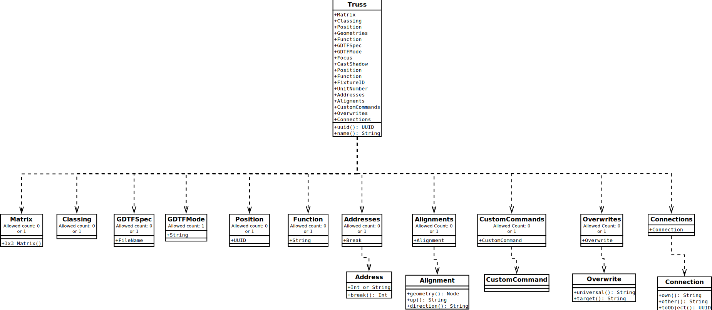](media/truss.svg)

Node name: `Truss`


| Attribute Name | Attribute Value Type                    | Default Value when Optional | Description                          |
| -------------- | --------------------------------------- | --------------------------- | ------------------------------------ |
| uuid           | [UUID](../generic-value-types#attrtype-uuid)     | Not Optional                | The unique identifier of the object. |
| name           | [String](../generic-value-types#attrtype-string) | Empty                       | The name of the object               |

| Child Node                                        | Allowed Count | Value Type                                  | Description                                                                              |
| ------------------------------------------------- | ------------- | ------------------------------------------- | ---------------------------------------------------------------------------------------- |
| [Matrix](#node-definition-matrix)                 | 0 or 1        |                                             | The location of the object inside the parent coordinate system.                          |
| [Classing](#node-definition-classing)             | 0 or 1        | [UUID](../generic-value-types#attrtype-uuid)         | The Class the object belongs to.                                                         |
| [Position](#node-definition-position)             | 0 or 1        | [UUID](../generic-value-types#attrtype-uuid)         | A position reference that this truss belongs to if this reference exists.                |
| [Geometries](#node-definition-geometries)         | 1             |                                             | A list of geometrical representation objects that are a part of the object.              |
| Function                                          | 0 or 1        | [String](../generic-value-types#attrtype-string)     | The name of the function this Truss is used for.                                         |
| GDTFSpec                                          | 0 or 1        | [FileName](../generic-value-types#attrtype-filename) | The name of the file containing the GDTF information for this object.                    |
| GDTFMode                                          | 1             | [String](../generic-value-types#attrtype-string)     | The name of the used DMX mode. This has to match the name of a DMXMode in the GDTF file. |
| [Addresses](#node-definition-addresses)           | 0 or 1        |                                             | The container for DMX Addresses for this object.                                         |
| [Alignments](#node-definition-alignments)         | 0 or 1        |                                             | The container for Alignments for this object.                                            |
| [CustomCommands](#node-definition-customcommands) | 0 or 1        |                                             | The container for custom command for this object.                                        |
| [Overwrites](#node-definition-overwrites)         | 0 or 1        |                                             | The container for overwrites for this object.                                            |
| [Connections](#node-definition-connections)       | 0 or 1        |                                             | The container for connections for this object.                                           |


## Node Definition: Support

This node defines a support object.

[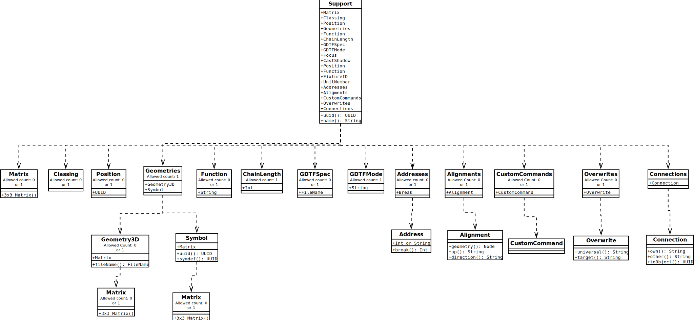](media/support.svg)

Node name: `Support`

| Attribute Name | Attribute Value Type                    | Default Value when Optional | Description                          |
| -------------- | --------------------------------------- | --------------------------- | ------------------------------------ |
| uuid           | [UUID](../generic-value-types#attrtype-uuid)     | Not Optional                | The unique identifier of the object. |
| name           | [String](../generic-value-types#attrtype-string) | Empty                       | The name of the object               |

| Child Node                                        | Allowed Count | Value Type                                   | Description                                                                              |
| ------------------------------------------------- | ------------- | -------------------------------------------- | ---------------------------------------------------------------------------------------- |
| [Matrix](#node-definition-matrix)                 | 0 or 1        |                                              | The location of the object inside the parent coordinate system.                          |
| [Classing](#node-definition-classing)             | 0 or 1        | [UUID](../generic-value-types#attrtype-uuid)          | The Class the object belongs to.                                                         |
| [Position](#node-definition-position)             | 0 or 1        | [UUID](../generic-value-types#attrtype-uuid)          | A position reference that this support belongs to if this reference exists.              |
| [Geometries](#node-definition-geometries)         | 1             |                                              | A list of geometrical representation objects that are a part of the object.              |
| Function                                          | 0 or 1        | [String](../generic-value-types#attrtype-string)      | The name of the function this support is used for.                                       |
| ChainLength                                       | 1             | [Real](../generic-value-types#attrtype-real)          | The chain length that will be applied to the GDTF .                                      |
| GDTFSpec                                          | 0 or 1        | [FileName](../generic-value-types#attrtype-filename)  | The name of the file containing the GDTF information for this object.                    |
| GDTFMode                                          | 1             | [String](../generic-value-types#attrtype-string)      | The name of the used DMX mode. This has to match the name of a DMXMode in the GDTF file. |
| [Addresses](#node-definition-addresses)           | 0 or 1        |                                              | The container for DMX Addresses for this object.                                         |
| [Alignments](#node-definition-alignments)         | 0 or 1        |                                              | The container for Alignments for this object.                                            |
| [CustomCommands](#node-definition-customcommands) | 0 or 1        |                                              | The container for custom command for this object.                                        |
| [Overwrites](#node-definition-overwrites)         | 0 or 1        |                                              | The container for overwrites for this object.                                            |
| [Connections](#node-definition-connections)       | 0 or 1        |                                              | The container for connections for this object.                                           |


## Node Definition: VideoScreen

This node defines a video screen object.

[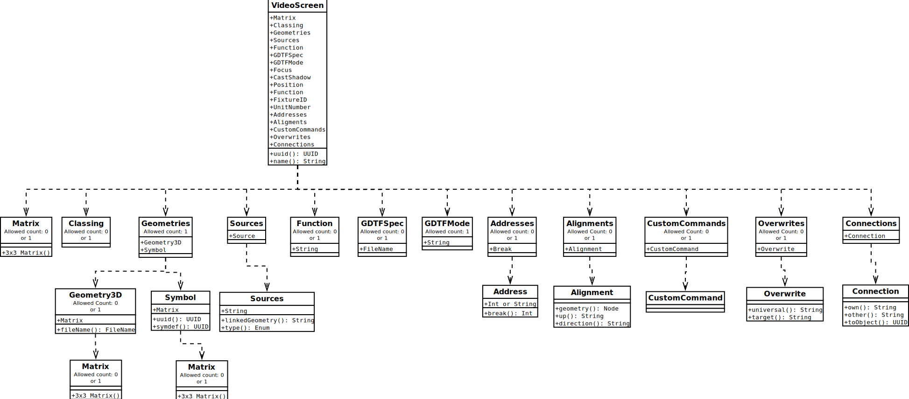](media/video_screen.svg)

Node name: `VideoScreen`

| Attribute Name | Attribute Value Type                    | Default Value when Optional | Description                          |
| -------------- | --------------------------------------- | --------------------------- | ------------------------------------ |
| uuid           | [UUID](../generic-value-types#attrtype-uuid)     | <Not Optional>              | The unique identifier of the object. |
| name           | [String](../generic-value-types#attrtype-string) | Empty                       | The name of the object.              |

| Child Node                                        | Allowed Count | Value Type                                   | Description                                                                              |
| ------------------------------------------------- | ------------- | -------------------------------------------- | ---------------------------------------------------------------------------------------- |
| [Matrix](#node-definition-matrix)                 | 0 or 1        |                                              | The location of the object inside the parent coordinate system.                          |
| [Classing](#node-definition-classing)             | 0 or 1        | [UUID](../generic-value-types#attrtype-uuid)          | The Class the object belongs to.                                                         |
| [Geometries](#node-definition-geometries)         | 1             |                                              | A list of geometrical representation objects that are a part of the object.              |
| [Sources](#node-definition-sources)               | 0 or 1        |                                              | A list of video input sources..                                                          |
| Function                                          | 0 or 1        | [String](../generic-value-types#attrtype-string)      | The name of the function this VideoScreen is used for.                                   |
| GDTFSpec                                          | 0 or 1        | [FileName](../generic-value-types#attrtype-filename)  | The name of the file containing the GDTF information for this object.                    |
| GDTFMode                                          | 1             | [String](../generic-value-types#attrtype-string)      | The name of the used DMX mode. This has to match the name of a DMXMode in the GDTF file. |
| [Addresses](#node-definition-addresses)           | 0 or 1        |                                              | The container for DMX Addresses for this object.                                         |
| [Alignments](#node-definition-alignments)         | 0 or 1        |                                              | The container for Alignments for this object.                                            |
| [CustomCommands](#node-definition-customcommands) | 0 or 1        |                                              | The container for custom command for this object.                                        |
| [Overwrites](#node-definition-overwrites)         | 0 or 1        |                                              | The container for overwrites for this object.                                            |
| [Connections](#node-definition-connections)       | 0 or 1        |                                              | The container for connections for this object.                                           |

An example of a node definition is shown below:

```xml
<VideoScreen name="Television" uuid="BEF95EB8-98AC-4217-B10D-FB4B83381398">
    <Matrix>{0.158127,-0.987419,0.000000}{0.987419,0.158127,0.000000}{0.000000,0.000000,1.000000}{6020.939200,2838.588955,4978.134459}</Matrix>
    <GDTFSpec>Generic@TV</GDTFSpec>
    <GDTFMode>DisplayModeWideScreen</GDTFMode>
    <Addresses>
        <Address break="0">45</Address>
    </Addresses>
    <FixtureID>25</FixtureID>
    <UnitNumber>0</UnitNumber>
    <FixtureTypeId>0</FixtureTypeId>
    <CustomId>0</CustomId>
    <Sources>
    movie.mov
   </Sources>
</Fixture>
```

## Node Definition: Projector

This node defines a video projector object.

[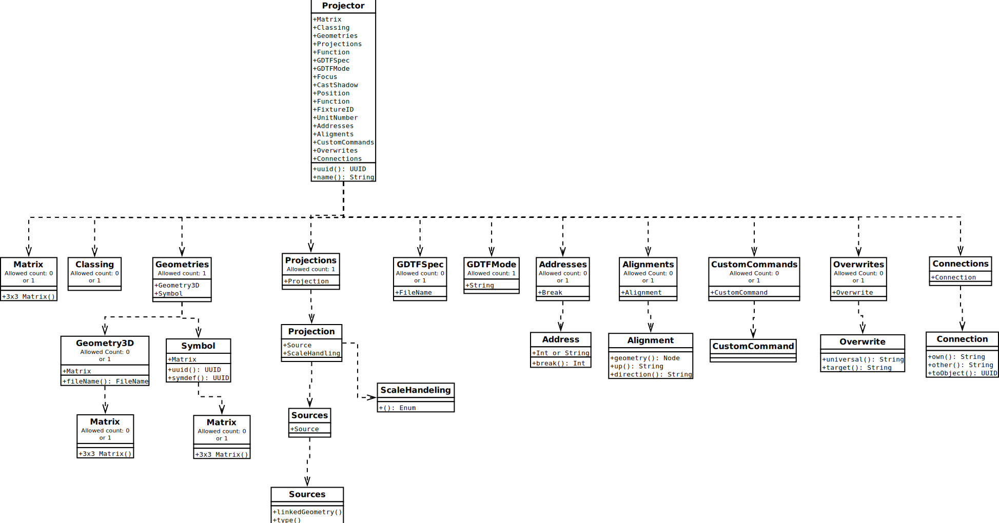](media/projector.svg)

Node name: `Projector`

| Attribute Name | Attribute Value Type                    | Default Value when Optional | Description                          |
| -------------- | --------------------------------------- | --------------------------- | ------------------------------------ |
| uuid           | [UUID](../generic-value-types#attrtype-uuid)     |  Not Optional               | The unique identifier of the object. |
| name           | [String](../generic-value-types#attrtype-string) | Empty                       | The name of the object.              |

| Child Node                                        | Allowed Count | Value Type                                  | Description                                                                              |
| ------------------------------------------------- | ------------- | ------------------------------------------- | ---------------------------------------------------------------------------------------- |
| [Matrix](#node-definition-matrix)                 | 0 or 1        |                                             | The location of the object inside the parent coordinate system.                          |
| [Classing](#node-definition-classing)             | 0 or 1        | [UUID](../generic-value-types#attrtype-uuid)         | The Class the object belongs to.                                                         |
| [Geometries](#node-definition-geometries)         | 1             |                                             | A list of geometrical representation objects that are a part of the object.              |
| [Projections](#node-definition-projection)        | 1             |                                             | A list of video source for Beam Geometries in the GDTF file.                             |
| GDTFSpec                                          | 0 or 1        | [FileName](../generic-value-types#attrtype-filename) | The name of the file containing the GDTF information for this object.                    |
| GDTFMode                                          | 1             | [String](../generic-value-types#attrtype-string)     | The name of the used DMX mode. This has to match the name of a DMXMode in the GDTF file. |
| [Addresses](#node-definition-addresses)           | 0 or 1        |                                             | The container for DMX Addresses for this object.                                         |
| [Alignments](#node-definition-alignments)         | 0 or 1        |                                             | The container for Alignments for this object.                                            |
| [CustomCommands](#node-definition-customcommands) | 0 or 1        |                                             | The container for custom command for this object.                                        |
| [Overwrites](#node-definition-overwrites)         | 0 or 1        |                                             | The container for overwrites for this object.                                            |
| [Connections](#node-definition-connections)       | 0 or 1        |                                             | The container for connections for this object.                                           |

An example of a node definition is shown below:

```xml
<Projector name="Projector" uuid="BEF95EB8-98AC-4217-B10D-FB4B83381398">
    <Matrix>{0.158127,-0.987419,0.000000}{0.987419,0.158127,0.000000}{0.000000,0.000000,1.000000}{6020.939200,2838.588955,4978.134459}</Matrix>
    <GDTFSpec>Generic@Projector</GDTFSpec>
    <GDTFMode>Projector@ThrowRatio1_7_to_2_2</GDTFMode>
    <Addresses>
        <Address break="0">45</Address>
    </Addresses>
    <FixtureID>25</FixtureID>
    <UnitNumber>0</UnitNumber>
    <FixtureTypeId>0</FixtureTypeId>
    <CustomId>0</CustomId>
    <Projections>
        <Projection>movie.mov
            
            <ScaleHandeling>UpScale</ScaleHandeling>
        </Projection>
    </Projections>
</Projector> 
```

### Node Definition: Projections

This node defines a group of Projections.

Node name: `Projections`

The child list contains a list of the following nodes:

| Child Node                                | Description             |
| ----------------------------------------- | ----------------------- |
| [Projection](#node-definition-projection) | Defines the Projection. |

#### Node Definition: Projection

This node defines a Projection.

Node name: `Projection`

The child list contains a list of the following nodes:

| Child Node                                        | Description                                      |
| ------------------------------------------------- | ------------------------------------------------ |
| [Source](#node-definition-source)                 | Defines the source for the projection.           |
| [ScaleHandeling](#node-definition-scalehandeling) | How the source will be scaled to the projection. |

# Other Node Definition

## Node Definition: Sources

This node defines a group of sources for VideoScreen.

Node name: `Sources`

The child list contains a list of the following nodes:

| Child Node                        | Description                 |
| --------------------------------- | --------------------------- |
| [Source](#node-definition-source) | One Source for the fixture. |

### Node Definition: Source

This node defines a Source.

Node name: `Source`

| Attribute Name | Attribute Value Type                   | Default Value when Optional | Description                                                                                                                                                                                                                         |
| -------------- | -------------------------------------- | --------------------------- | ----------------------------------------------------------------------------------------------------------------------------------------------------------------------------------------------------------------------------------- |
| linkedGeometry | [String](../generic-value-types#attrtype-string) |  Not Optional               | For a Display: The GDTF Geometry Type Display whose linked texture will get replaced by the source value. <br/><br/>`For a Beam: Defines the source for the GDTF Geometry Type Beam. Only applicable when BeamType is "Rectangle".` |
| type           | [Enum](#attrType-Enum)                 |  Not Optional               | Defines the type of source of the media ressource that will be used. The currently defined types are: NDI, File, CITP, CaptureDevice                                                                                                |

| Value Type                              | Default Value When Missing | Description                                                                                                                     |
| --------------------------------------- | -------------------------- | ------------------------------------------------------------------------------------------------------------------------------- |
| [String](../generic-value-types#attrtype-string) | Not Optional               | When NDI/CITP -&gt; Stream Name<br /><br />`When File -> Filename in MVR file` <br />`When CaptureDevice -> CaptureDevice Name` |

### Node Definition: ScaleHandeling

This node defines how the MappingDefinition will react if the video
source has not the same resolution.

Node name: `ScaleHandeling`

| Value Type | Default Value When Missing | Description                                                                     |
| ---------- | -------------------------- | ------------------------------------------------------------------------------- |
| Enum       | ScaleKeepRatio             | The available value are `ScaleKeepRatio`, `ScaleIgnoreRatio`, `KeepSizeCenter`. |

## Node Definition: Geometries

This node defines a group of graphical objects.

Node name: `Geometries`

The child list contains a list of the following nodes:

| Child Node                                | Description                                                          |
| ----------------------------------------- | -------------------------------------------------------------------- |
| [Geometry3D](#node-definition-geometry3d) | The geometry of this definition that will be instanced in the scene. |
| [Symbol](#node-definition-symbol)         | The symbol instance that will provide a geometry of this definition. |

## Node Definition: Symbol

This node specified a symbol instance (geometry insert) of the
definition geometry defined by a [
Symdef](#node-definition-symdef) node.

Node name: `Symbol`

| Attribute Name | Attribute Value Type                | Default Value when Optional | Description                                                                   |
| -------------- | ----------------------------------- | --------------------------- | ----------------------------------------------------------------------------- |
| uuid           | [UUID](../generic-value-types#attrtype-uuid) | Not Optional                | The unique identifier of the object.                                          |
| symdef         | [UUID](../generic-value-types#attrtype-uuid) | Not Optional                | The unique identifier of the Symdef node that will be the source of geometry. |

| Child Node                        | Allowed Count | Description                                                                                                                                                                      |
| --------------------------------- | ------------- | -------------------------------------------------------------------------------------------------------------------------------------------------------------------------------- |
| [Matrix](#node-definition-matrix) | 0 or 1        | The transformation matrix that defines the location. orientation and scale of the geometry inside the local coordinate space of the container. Considered identity when missing. |

## Node Definition: Geometry3D

This node provides geometry from another file within the archive.

Node name: `Geometry3D`

| Attribute Name | Attribute Value Type                        | Default Value when Optional | Description                                                                                                                                  |
| -------------- | ------------------------------------------- | --------------------------- | -------------------------------------------------------------------------------------------------------------------------------------------- |
| fileName       | [FileName](../generic-value-types#attrtype-filename) | Not Optional                | The file name, including extension, of the external file in the archive. If there is no extension, it will assume that the extension is 3ds. |

| Child Node                        | Allowed Count | Description                                                                                                                                                                      |
| --------------------------------- | ------------- | -------------------------------------------------------------------------------------------------------------------------------------------------------------------------------- |
| [Matrix](#node-definition-matrix) | 0 or 1        | The transformation matrix that defines the location, orientation and scale of the geometry inside the local coordinate space of the container. Considered identity when missing. |

### Supported 3D file formats

| Format Name | File Extensions | Requirements                        | Notes                                                                                                                        |
| ----------- | --------------- | ----------------------------------- | ---------------------------------------------------------------------------------------------------------------------------- |
| 3DS         | 3ds             | 1 Unit = 1 mm                       | [Deprecated Discreet 3DS](https://en.wikipedia.org/wiki/.3ds)                                                                |
| gltf 2.0    | gltf, glb       | `extensionsRequired` shall be empty | GLB packaging is recommended [ISO/IEC 12113 Khronos glTF 2.0](https://www.khronos.org/registry/glTF/specs/2.0/glTF-2.0.html) |

All referenced files (eg texture images, binary blobs) shall be present in the archive.

All file references (URIs etc) shall be relative to the root of the archive. Absolute URIs and file paths are not permitted.

## Node Definition: Matrix

This node contains a definition of a transformation matrix.

- Right-handed
- Z-Up
- 1 Distance Unit equals 1 mm

Node name: `Matrix`

| Value Type                                                | Default Value When Missing   | Description                                                                                                                                   |
| --------------------------------------------------------- | ---------------------------- | --------------------------------------------------------------------------------------------------------------------------------------------- |
| {float,float,float}{float,float,float}{float,float,float} | {1,0,0}{0,1,0}{0,0,1}{0,0,0} | This node contains the array for a 4x3 transform matrix.<br \>The order is:<br \>`u1,u2,u3`<br \> `v1,v2,v3`<br \> `w1,w2,w3`<br \>`o1,o2,o3` |

## Node Definition: ChildList

This node defines a list of graphical objects.

Node name: `ChildList`

The child list contains a list of one of the following nodes:

| Child Node                                  | Description                                                                  |
| ------------------------------------------- | ---------------------------------------------------------------------------- |
| [SceneObject](#node-definition-sceneobject) | A generic graphical object from the scene.                                   |
| [GroupObject](#node-definition-groupobject) | A grouping object of other graphical objects inside local coordinate system. |
| [FocusPoint](#node-definition-focuspoint)   | A definition of a focus point.                                               |
| [Fixture](#node-definition-fixture)         | A definition of a fixture.                                                   |
| [Support](#node-definition-support)         | A definition of a support.                                                   |
| [Truss](#node-definition-truss)             | A definition of a truss.                                                     |
| [VideoScreen](#node-definition-videoscreen) | A definition of a video screen.                                              |

