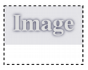
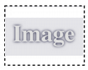

## Node Definiftions

The first XML node is always the XML description node: `<?xml version="1.0" encoding="UTF-8"?>` 

## GeneralSceneDescription Node 

The second XML node is the mandatory GeneralSceneDescription node. The attributes of this node are listed in Table 2, the children of this node are given in Table 3. 

##### Table 2 — *GeneralSceneDescription Node Attributes*

| Attribute Name | Attribute Value Type                      | Default Value when Optional | Description                                  |
| -------------- | ----------------------------------------- | --------------------------- | ------------------------------------------------------------------- |
| verMajor       | [Integer](../generic-value-types#user-content-attrtype-integer) | Not Optional                | Denotes the major version of the format used when saving this file. |
| verMinor       | [Integer](../generic-value-types#user-content-attrtype-integer) | Not Optional                | Denotes the minor version of the format used when saving this file. |
| provider       | [String](../generic-value-types#user-content-attrtype-string)   | Not Optional                | The name of the application that is generating the MVR export. This should stay the same between multiple version.     |
| providerVersion| [String](../generic-value-types#user-content-attrtype-string)   | Not Optional                | The version of the software that is generating the MVR export. This should be different for each version that is available.    |

The current version of MVR reflected by this document is 1.6.


##### Table 3 — *GeneralSceneDescription Node Children*

| Child Node | Allowed Count | Description                                    |
| ---------- | ------------- | ---------------------------------------------- |
| UserData   | 0 or 1        | Specifies user data associated with this file. |
| Scene      | 1             | Defines the scene described in this file.      |

## Node Definition: UserData

### General

This node contains a collection of user data nodes defined and used by provider applications if required. User data should not be expected to be preserved in the workflow of multiple applications importing and exporting the data. The defined UserData Node Children are specified in Table 4.

Node name: `UserData`

##### Table 4 — *UserData Node Children*

| Child Node                    | Allowed Count | Description                   |
| ----------------------------- | ------------- | ----------------------------- |
| [Data](#node-definition-data) | 0 or many     | Defines a block of user data. |


### Node Definition: Data

This node contains a collection of data specified by the provider application. The defined Data Node Attributes are specified in Table 5.

Node name: `Data`

##### Table 5 — *Data Node Attributes*

| Attribute Name | Attribute Value Type                    | Default Value when Optional | Description                                                               |
| -------------- | --------------------------------------- | --------------------------- | ------------------------------------------------------------------------- |
| provider       | [String](../generic-value-types#user-content-attrtype-string) | Not Optional                | Specifies the name of the provider application that created this data.    |
| ver            | [String](../generic-value-types#user-content-attrtype-string) | 1                           | Version information of the data as specified by the provider application. |


## Node Definition: Scene

This node contains information about the scene. The defined Scene Node Children are specified in Table 6.

Node name: `Scene`

##### Table 6 — *Scene Node Children*

| Child Node                          | Allowed Count | Description                           |
| ----------------------------------- | ------------- | ------------------------------------- |
| [AUXData](#node-definition-auxdata) | 0 or 1        | Defines auxiliary data for the scene. |
| [Layers](#node-definition-layers)   | 1             | A list of layers in the scene.        |


## Node Definition: AUXData

### General

This node contains auxiliary data for the scene node. The defined AUXData Node Children are specified in Table 7.

Node name: `AUXData`

##### Table 7 — *AUXData Node Children*

| Child Node                                              | Allowed Count | Description                                                    |
| ------------------------------------------------------- | ------------- | ---------------------------------------------------------------|
| [Symdef](#node-definition-symdef)                       | 0 or any      | Graphical representation that will be instanced in the scene.  |
| [Position](#node-definition-position)                   | 0 or any      | Defines a logical group of lighting devices.                   |
| [MappingDefinition](#node-definition-mappingdefinition) | 0 or any      | Defines a input source for fixture color mapping applications. |
| [Class](#node-definition-class)                         | 0 or any      | Defines a Class for object visiblity filtering.                |


### Node Definition: Symdef

This node contains the graphics so the scene can refer to this, thus optimizing repetition of the geometry. The child objects are located within a local coordinate system. The defined Symdef Node Attributes are specified in Table 8.

Node name: `Symdef`

##### Table 8 — *Symdef Node Attributes*

| Attribute Name | Attribute Value Type                    | Default Value when Optional | Description                          |
| -------------- | --------------------------------------- | --------------------------- | ------------------------------------ |
| uuid           | [UUID](../generic-value-types#user-content-attrtype-uuid)     | Not Optional                | The unique identifier of the object. |
| name           | [String](../generic-value-types#user-content-attrtype-string) | Empty                       | The name of the object               |


The Symdef node (Table 9) contains the following children.

##### Table 9 — *Symdef Node Children*

| Child Node                                        | Allowed Count | Value Type                                | Description                                         |
| ------------------------------------------------- | ------------- | ----------------------------------------- | --------------------------------------------------- |
| ChildList                                        | 1             | [Integer](../generic-value-types#user-content-attrtype-integer) | The size in x direction in pixels of the source.    |

The child list (Table 10) contains a list of the following nodes:

##### Table 10 — *Symdef Childlist Node Children*

| Child Node                                | Description                                                          |
| ----------------------------------------- | -------------------------------------------------------------------- |
| [Geometry3D](#node-definition-geometry3d) | The geometry of this definition that will be instanced in the scene. |
| [Symbol](#node-definition-symbol)         | The symbol instance that will provide a geometry of this definition. |


### Node Definition: Position

This node defines a logical grouping of lighting devices and trusses. The defined Position Node Attributes are specified in Table 11.

Node name: `Position`

##### Table 11 — *Position Node Attributes*

| Attribute Name | Attribute Value Type                    | Default Value when Optional | Description                          |
| -------------- | --------------------------------------- | --------------------------- | ------------------------------------ |
| uuid           | [UUID](../generic-value-types#user-content-attrtype-uuid)     | Not Optional                | The unique identifier of the object. |
| name           | [String](../generic-value-types#user-content-attrtype-string) | Empty                       | The name of the object               |


### Node Definition: MappingDefinition

This node specifies an input source for fixture color mapping applications. The defined MappingDefinition Node Attributes are specified in Table 12.

Node name: `MappingDefinition`

##### Table 12 — *MappingDefinition Node Attributes*

| Attribute Name | Attribute Value Type                | Default Value when Optional | Description                             |
| -------------- | ----------------------------------- | --------------------------- | --------------------------------------- |
| uuid           | [UUID](../generic-value-types#user-content-attrtype-uuid) | Not Optional                | The unique identifier of the object.    |
| name           | [String](../generic-value-types#user-content-attrtype-string)              |                             | The name of the source for the mapping. |

The child list (Table 13) contains a list of the following nodes:

##### Table 13 — *MappingDefinition Node Children*

| Child Node                                        | Allowed Count | Value Type                                | Description                                         |
| ------------------------------------------------- | ------------- | ----------------------------------------- | --------------------------------------------------- |
| SizeX                                             | 1             | [Integer](../generic-value-types#user-content-attrtype-integer) | The size in x direction in pixels of the source.    |
| SizeY                                             | 1             | [Integer](../generic-value-types#user-content-attrtype-integer) | The size in y direction in pixels of the source.    |
| [Source](#node-definition-source)                 | 1             |                                           | The video source that will be used for the Mapping. |
| [ScaleHandeling](#node-definition-scalehandeling) | 0 or 1        |                                           | How the source will be scaled to the mapping.       |

```xml
<MappingDefinition name="MappingStyle for View 1" uuid="BEF95EB8-98AC-4217-B10D-FB4B83381398">
    <SizeX>1920</SizeX>
    <SizeY>1080</SizeY>
   movie.mov
    
    <ScaleHandeling>UpScale</ScaleHandeling>
</MappingDefinition>
```

### Node Definition: Class

This node defines a logical grouping across different layers. Primarily used for controlling object visibility of objects across multiple Layers. The defined Class Node Attributes are specified in Table 14.

Node name: `Class`

##### Table 14 — *Class Node Attributes*

| Attribute Name | Attribute Value Type                | Default Value when Optional | Description                         |
| -------------- | ----------------------------------- | --------------------------- | ----------------------------------- |
| uuid           | [UUID](../generic-value-types#user-content-attrtype-uuid) | Not Optional                | The unique identifier of the class. |
| name           | [String](../generic-value-types#user-content-attrtype-string)              |                             | The name of the Class.              |


### Node Definition: Layers

This node defines a list of layers inside the scene. The layer is a container of graphical objects defining a local coordinate system.

Node name: `Layers`

The child list (Table 15) contains a list of layer nodes:

##### Table 15 — *Layers Node Childs*

| Child Node                      | Description             |
| ------------------------------- | ----------------------- |
| [Layer](#node-definition-layer) | A layer representation. |


#### Node Definition: Layer

This node defines a layer. The layer is a spatial representation of a geometric container. The child objects are located inside a local coordinate system. The defined Layer Node Attributes are specified in Table 16.

Node name: `Layer`

##### Table 16 — *Layer Node Attributes*

| Attribute Name | Attribute Value Type                    | Default Value when Optional | Description                          |
| -------------- | --------------------------------------- | --------------------------- | ------------------------------------ |
| uuid           | [UUID](../generic-value-types#user-content-attrtype-uuid)     | Not Optional                | The unique identifier of the object. |
| name           | [String](../generic-value-types#user-content-attrtype-string) | Empty                       | The name of the object               |

The child list (Table 17) contains a list of layer nodes:

##### Table 17 — *Layer Node Childs*

| Child Node                              | Allowed Count | Description                                                          |
| --------------------------------------- | ------------- | -------------------------------------------------------------------- |
| [Matrix](#node-definition-matrix)       | 0 or 1        | The transformation matrix that defines the location and orientation of this the layer inside its global coordinate space. This effectively defines local coordinate space for the objects inside. The Matrix of the Layer is only allowed to have a vertical Transform (elevation). Rotation and scale must be identity. Rotation and scale must be identity, means no rotation and no scale. |
| [ChildList](#node-definition-childlist) | 0 or 1            | A list of graphic objects that are part of the layer.           |


## Node Definition: ChildList

This node defines a list of graphical objects.

Node name: `ChildList`

The child list (Table 18) contains a list of the following nodes:

##### Table 18 — *ChildList Node Childs*

| Child Node                                  | Description                                                                  |
| ------------------------------------------- | ---------------------------------------------------------------------------- |
| [SceneObject](#node-definition-sceneobject) | A generic graphical object from the scene.                                   |
| [GroupObject](#node-definition-groupobject) | A grouping object of other graphical objects inside local coordinate system. |
| [FocusPoint](#node-definition-focuspoint)   | A definition of a focus point.                                               |
| [Fixture](#node-definition-fixture)         | A definition of a fixture.                                                   |
| [Support](#node-definition-support)         | A definition of a support.                                                   |
| [Truss](#node-definition-truss)             | A definition of a truss.                                                     |
| [VideoScreen](#node-definition-videoscreen) | A definition of a video screen.                                              |
| [Projector](#node-definition-projector)     | A definition of a projector.                                                 |


## Node Definition for Parametric Objects

### Node Definition: SceneObject

This node defines a generic graphical object. The defined SceneObject Node Attributes are specified in Table 19.

Node name: `SceneObject`

##### Table 19 — *SceneObject Node Attributes*

| Attribute Name | Attribute Value Type                    | Default Value when Optional | Description                          |
| -------------- | -------------------------------------   | --------------------------- | ------------------------------------ |
| uuid           | [UUID](../generic-value-types#user-content-attrtype-uuid)     | Not Optional                | The unique identifier of the object. |
| name           | [String](../generic-value-types#user-content-attrtype-string) | Empty                       | The name of the object               |
| multipatch     | [UUID](../generic-value-types#user-content-attrtype-uuid)     | Empty                       | The unique identifier of the parent multipatch fixture. When this value is set, you may not define a FixtureID or CustomID for this fixture. The FixtureID and CustomID from the object defined as multi parent also applies to this object.   |

The child list (Table 20) contains a list of one of the following nodes:

##### Table 20 — *SceneObject Node Childs*

| Child Node                                        | Allowed Count | Value Type                                  | Description                                     |
| ------------------------------------------------- | ------------- | ------------------------------------------- | ----------------------------------------------- |
| [Matrix](#node-definition-matrix)                 | 0 or 1        |                                             | The location and orientation of the object inside the parent coordinate system. |
| [Classing](#node-definition-class)             | 0 or 1        | [UUID](../generic-value-types#user-content-attrtype-uuid)         | The Class the object belongs to.                |
| [Geometries](#node-definition-geometries)         | 1             |                                             | A list of geometrical representation objects that are part of the object.       |
| GDTFSpec                                          | 0 or 1        | [FileName](../generic-value-types#user-content-attrtype-filename) | The name of the file containing the GDTF information for this object, conforming to the DIN SPEC 15800. |
| GDTFMode                                          | 0 or 1        | [String](../generic-value-types#user-content-attrtype-string)     | The name of the used DMX mode. This has to match the name of a DMXMode in the GDTF file. Mandatory when `GDTFSpec` as been defined.                                                      |
| CastShadow                                        | 0 or 1        | [Bool](../generic-value-types#user-content-attrtype-bool)         | Defines if an object cast shadows.              |
| [Addresses](#node-definition-addresses)           | 0 or 1        |                                             | The container for DMX Addresses for this object.|
| [Alignments](#node-definition-alignments)         | 0 or 1        |                                             | The container for Alignments for this object.   |
| [CustomCommands](#node-definition-customcommands) | 0 or 1        |                                             | The container for custom command for this object.|
| [Overwrites](#node-definition-overwrites)         | 0 or 1        |                                             | The container for overwrites for this object.   |
| [Connections](#node-definition-connections)       | 0 or 1        |                                             | The container for connections for this object.  |
| FixtureID                               | 1             | [String](../generic-value-types#user-content-attrtype-string)      | The Fixture ID is an identifier for the instance of this fixture that can be used to activate / select them for programming. |
| FixtureIDNumeric                        | 1             | [Integer](../generic-value-types#user-content-attrtype-integer)    | The Fixture ID is an identifier for the instance of this fixture that can be used to activate / select them for programming. |
| UnitNumber                                        | 0 or 1        | [Integer](../generic-value-types#user-content-attrtype-integer)   | The identification of a fixture on its position. </b> Use this as an alternative numbering scheme if the planning and programming numbering is different.  |
| CustomId                                          | 0 or 1        | [Integer](../generic-value-types#user-content-attrtype-integer)   | The Custom ID is a value that can be used as a short name of the Fixture Instance. This does not have to be unique. The default value is 0.   |
| CustomIdType                            | 0 or 1        | [Integer](../generic-value-types#user-content-attrtype-integer)    | Defines the CustomID Type this object belongs to.    |
| [ChildList](#node-definition-childlist) | 0 or 1             | A list of graphic objects that are part of the layer.   |


### Node Definition: GroupObject

This node defines logical group of objects. The child objects are located inside a local coordinate system. The defined GroupObject Node Attributes are specified in Table 21.

Node name: `GroupObject`

##### Table 21 — *GroupObject Node Attributes*

| Attribute Name | Attribute Value Type                    | Default Value when Optional | Description                          |
| -------------- | --------------------------------------- | --------------------------- | ------------------------------------ |
| uuid           | [UUID](../generic-value-types#user-content-attrtype-uuid)     | Not Optional                | The unique identifier of the object. |
| name           | [String](../generic-value-types#user-content-attrtype-string) | Empty                       | The name of the object               |

The child list (Table 22) contains a list of one of the following nodes:

##### Table 22 — *GroupObject Node Childs*

| Child Node                              | Allowed Count | Value Type                          | Description                                                                     |
| --------------------------------------- | ------------- | ----------------------------------- | ------------------------------------------------------------------------------- |
| [Matrix](#node-definition-matrix)       | 0 or 1        |                                     | The location and orientation of the object inside the parent coordinate system. |
| [Classing](#node-definition-class)   | 0 or 1        | [UUID](../generic-value-types#user-content-attrtype-uuid) | The Class the object belongs to.                                                |
| [ChildList](#node-definition-childlist) | 0 or 1             |                                     | A list of graphic objects that are part of the group.                           |


### Node Definition: FocusPoint

This node defines a focus point object. The defined FocusPoint Node Attributes are specified in Table 23.

Node name: `FocusPoint`

##### Table 23 — *FocusPoint Node Attributes*

| Attribute Name | Attribute Value Type                    | Default Value when Optional | Description                          |
| -------------- | --------------------------------------- | --------------------------- | ------------------------------------ |
| uuid           | [UUID](../generic-value-types#user-content-attrtype-uuid)     | Not Optional                | The unique identifier of the object. |
| name           | [String](../generic-value-types#user-content-attrtype-string) | Empty                       | The name of the object               |

The child list (Table 24) contains a list of one of the following nodes:

##### Table 24 — *FocusPoint Node Childs*

| Child Node                                | Allowed Count | Value Type                          | Description                                                                     |
| ----------------------------------------- | ------------- | ----------------------------------- | ------------------------------------------------------------------------------- |
| [Matrix](#node-definition-matrix)         | 0 or 1        |                                     | The location and orientation of the object inside the parent coordinate system. |
| [Classing](#node-definition-class)     | 0 or 1        | [UUID](../generic-value-types#user-content-attrtype-uuid) | The Class the object belongs to.                                                |
| [Geometries](#node-definition-geometries) | 1             |                                     | A list of geometrical representation objects that are part of the object.       |


### Node Definition: Fixture

This node defines an entertainment fixture object. The defined FixtureNode Attributes are specified in Table 25.

Node name: `Fixture`

##### Table 25 — *Fixture Node Attributes*

| Attribute Name | Attribute Value Type                    | Default Value when Optional | Description                          |
| -------------- | --------------------------------------- | --------------------------- | ------------------------------------ |
| uuid           | [UUID](../generic-value-types#user-content-attrtype-uuid)     | Not Optional                | The unique identifier of the object. |
| name           | [String](../generic-value-types#user-content-attrtype-string) | Empty                       | The Name is the value that represents the fixture object. Is is not unique, and normally pairs with  FID in Display               |
| multipatch     | [UUID](../generic-value-types#user-content-attrtype-uuid)     | Empty                       | The unique identifier of the parent multipatch fixture. When this value is set, you may not define a FixtureID or CustomID for this fixture. The FixtureID and CustomID from the object defined as multi parent also applies to this object.              |

The child list (Table 26) contains a list of one of the following nodes:

##### Table 26 — *Fixture Node Childs*

| Child Node                              | Allowed Count | Value Type                                   | Description                                                                                                                                   |
| --------------------------------------- | ------------- | -------------------------------------------- | --------------------------------------------------------------------------------------------------------------------------------------------- |
| [Matrix](#node-definition-matrix)       | 0 or 1        |                                              | The location of the object inside the parent coordinate system. |
| [Classing](#node-definition-class)   | 0 or 1        | [UUID](../generic-value-types#user-content-attrtype-uuid)          | The Class the object belongs to.                                |
| GDTFSpec                                | 0 or 1        | [FileName](../generic-value-types#user-content-attrtype-filename)  | The name of the file containing the GDTF information for this object, conforming to the DIN SPEC 15800. |
| GDTFMode                                | 0 or 1        | [String](../generic-value-types#user-content-attrtype-string)      | The name of the used DMX mode. This has to match the name of a DMXMode in the GDTF file. Mandatory when `GDTFSpec` as been defined.                                                     |
| Focus                                   | 0 or 1        | [UUID](../generic-value-types#user-content-attrtype-uuid)          | A focus point reference that this lighting fixture aims at if this reference exists.                                                          |
| CastShadow                              | 0 or 1        | [Bool](../generic-value-types#user-content-attrtype-bool)                       | Defines if a Object cast Shadows.                                                                                                             |
| DMXInvertPan                            | 0 or 1        | [Bool](../generic-value-types#user-content-attrtype-bool)                       | Defines of all Pan Channels of the fixture should be DMX Inverted.                                                                                                             |
| DMXInvertTilt                           | 0 or 1        | [Bool](../generic-value-types#user-content-attrtype-bool)                       | Defines of all Tilt Channels of the fixture should be DMX Inverted.                                                                                                             |
| Position                                | 0 or 1        | [UUID](../generic-value-types#user-content-attrtype-uuid)          | A position reference that this lighting fixture belongs to if this reference exists.                                                          |
| Function                                | 0 or 1        | [String](../generic-value-types#user-content-attrtype-string)      | The name of the purpose this Fixture has.                                                       |
| FixtureID                               | 1             | [String](../generic-value-types#user-content-attrtype-string)      | The Fixture ID is an identifier for the instance of this fixture that can be used to activate / select them for programming.                  |
| FixtureIDNumeric                        | 1             | [Integer](../generic-value-types#user-content-attrtype-integer)    | The Fixture ID is an identifier for the instance of this fixture that can be used to activate / select them for programming.                |
| UnitNumber                              | 1             | [Integer](../generic-value-types#user-content-attrtype-integer)    | The identification of a fixture on its position. </b> Use this as an alternative numbering scheme if the planning and programming numbering is different. |
| ChildPosition                           | 0 or 1        | [String](../generic-value-types#user-content-attrtype-string)        | Node link to the geometry. Starting point is the Geometry Collect of the linked parent GDTF of this object.                                   |
| [Addresses](#node-definition-addresses) | 0 or 1        |                                              | The container for DMX Addresses for this fixture.                                                                                             |
| [Protocols](#node-definition-protocols) | 0 or 1        |                                              | The container for protocols assignments.                                                                                                      |
| [Alignments](#node-definition-alignments) | 0 or 1      |                                              | The container for Alignments for this fixture.                                                                                              |
| [CustomCommands](#node-definition-customcommands) | 0 or 1 |                                           | The container for custom command for this fixture.                                                                                  |
| [Overwrites](#node-definition-overwrites) | 0 or 1      |                                              | The container for overwrites for this fixture.                                                                                              |
| [Connections](#node-definition-connections) | 0 or 1    |                                              | The container for connections for this fixture.                                                                                            |
| Color                                | 0 or 1        | [CIE Color](../generic-value-types#user-content-attrtype-ciecolor) | A color assigned to a fixture. If it is not defined, there is no color for the fixture.                                                       |
| CustomIdType                            | 0 or 1        | [Integer](../generic-value-types#user-content-attrtype-integer)    | Defines the CustomID Type this fixture belongs to. A Custom ID Type defines to which group of objects this objects belongs as an additional object identifier.  The types for the custom ID Types are defined below. |
| CustomId                                | 0 or 1        | [Integer](../generic-value-types#user-content-attrtype-integer)    | The CustomId ID is an identifier for the instance of this fixture within the Custom ID Type that can be used to activate / select them for programming.   |
| [Mappings](#node-definition-mappings)   | 0 or 1        |                                              | The container for Mappings for this fixture.                                                                                                  |
| [Gobo](#node-definition-gobo)           | 0 or 1        |                                              | The Gobo used for the fixture. The image resource must conform to the GDTF standard.                                 |
| [ChildList](#node-definition-childlist) | 0 or 1             |   | A list of graphic objects that are part of the layer.                                                                                                                                    |

Note: _The fixture has no `Geometries` node as geometry is defined in a GDTF file._

CustomID Types
- 0 Undefined
- 1 Fixture
- 2 Channel
- 4 Houselights
- 5 NonDim
- 6 Media
- 7 Fog
- 8 Effect
- 9 Pyro
- 10 Marker

For further information about the difference between FixtureID and CustomID refer to [Annex A](annex/#annex-a-object-id-for-selection-purposes-informative).

EXAMPLE An example of a node definition is shown below:


```xml
<Fixture name="Robe Robin MMX WashBeam" uuid="8BF13DD7-CBF4-415B-99E4-625FE4D2DAF6">
    <Matrix>{0.158127,-0.987419,0.000000}{0.987419,0.158127,0.000000}{0.000000,0.000000,1.000000}{6020.939200,2838.588955,4978.134459}</Matrix>
    <GDTFSpec>Custom@Robe Robin MMX WashBeam</GDTFSpec>
    <GDTFMode>DMX Mode</GDTFMode>
    <Focus>4A B1 94 62 A6 E3 4C 3B B2 5A D8 09 9F 78 17 0C</Focus>
    <Position>77 BC DE 16 95 A6 47 25 9D 04 16 A0 BD 67 CD 1A</Position>
    <Addresses>
        <Address break="0">45</Address>
        <Network Interface="ethernet_1" IPv4="192.168.11.5" SubnetMask="255.255.0.0" />
        <Network Interface="ethernet_2" IPv6="2001:0db8:85a3:0000:0000:8a2e:0370:7344" />
        <Network Interface="wireless_1" DHCP="on" />
    </Addresses>
    <Protocols>
        <Protocol geometry="NetworkInOut_1" type="Art-Net" />
        <Protocol geometry="NetworkInOut_3" name="NDI 1" type="NDI"/>
    </Protocols>
    <Alignments>
        <Alignment geometry="Beam" up="0,0,1" direction="0,0,-1"/>
    </Alignments>
     <CustomCommands>
        <CustomCommand>Body_Pan,f 50</CustomCommand>
        <CustomCommand>Yoke_Tilt,f 50</CustomCommand>
    </CustomCommands>
    <Overwrites>
            <Overwrite universal="Universal Wheel 1.Universal Wheel Slot 1" target="Wheel 1.Wheel Slot"/>
            <Overwrite universal="Universal Emitter 1" target="Emitter 1" />
            <Overwrite universal="Universal Filter 1" target="Filter 1" />
            <Overwrite universal="Universal Wheel 1.Universal Wheel Slot 2"/>
    </Overwrites>
    <Mappings>
        <Mapping linkedDef="BEF95EB8-98AC-4217-B10D-FB4B83381398">
            <ux>10</ux>
            <uy>10</uy>
            <ox>5</ox>
            <oy>5</oy>
            <rz>45</rz>
        </Mapping>
    </Mappings>
    <Connections>    
      <Connection own="Input" toObject="8BF13DD7-CBF4-415B-99E4-625FE4D2DAF6" other="Output1"/>
      <Connection own="1" toObject="8BF13DD7-CBF4-415B-99E4-625FE4D2DAF6" other="IN"/>
      <Connection own="2" toObject="8BF13DD7-CBF4-415B-99E4-625FE4D2DAF6" other="IN"/>
    </Connections>
    <FixtureID></FixtureID>
    <UnitNumber>0</UnitNumber>
    <Function>Speaker 1</Function>
    <CustomId>0</CustomId>
    <CustomIdType>0</CustomIdType>
    <DMXInvertPan>true</DMXInvertPan>
    <DMXInvertTilt>true</DMXInvertTilt>
    <Color>2.533316,-5.175210,3.699302</Color>
    <Gobo rotation="32.5">image_file_forgobo</Gobo>
    <ChildList>
      <Fixture name="Fancy Attachment to the Beam" uuid="8BF13DD7-CBF4-415B-99E4-625FE4D2DAF5">
        <GDTFSpec>Fancy@Attachment</GDTFSpec>
        <GDTFMode>DMX Mode</GDTFMode>
        <!-->The parent GDTF here is the one from the Robe Robin MMX WashBeam</!-->
        <ChildPosition>Base.Yoke.Head</ChildPosition>
        <!-->The position is now defined based on the ECS from the geometry of parents GDTF including all applied Rotation via DMX or other protocols</!-->
        <Matrix>{0.158127,-0.987419,0.000000}{0.987419,0.158127,0.000000}{0.000000,0.000000,1.000000}{6020.939200,2838.588955,4978.134459}</Matrix>
      </Fixture>
    </ChildList>
</Fixture>
```


## Node Definition: Truss

This node defines a truss object. The defined Truss Node Attributes are specified in Table 27.

Node name: `Truss`

##### Table 27 — *Truss Node Attributes*

| Attribute Name | Attribute Value Type                    | Default Value when Optional | Description                          |
| -------------- | --------------------------------------- | --------------------------- | ------------------------------------ |
| uuid           | [UUID](../generic-value-types#user-content-attrtype-uuid)     | Not Optional                | The unique identifier of the object. |
| name           | [String](../generic-value-types#user-content-attrtype-string) | Empty                       | The name of the object               |
| multipatch     | [UUID](../generic-value-types#user-content-attrtype-uuid)     | Empty                       | The unique identifier of the parent multipatch fixture. When this value is set, you may not define a FixtureID or CustomID for this fixture. The FixtureID and CustomID from the object defined as multi parent also applies to this object.              |

The child list (Table 28) contains a list of one of the following nodes:

##### Table 28 — *Truss Node Childs*

| Child Node                                        | Allowed Count | Value Type                                  | Description                                                                                                                                   |
| ------------------------------------------------- | ------------- | ------------------------------------------- | --------------------------------------------------------------------------------------------------------------------------------------------- |
| [Matrix](#node-definition-matrix)                 | 0 or 1        |                                             | The location of the object inside the parent coordinate system.                                                                               |
| [Classing](#node-definition-class)             | 0 or 1        | [UUID](../generic-value-types#user-content-attrtype-uuid)         | The Class the object belongs to.                                                                                                              |
| [Position](#node-definition-position)             | 0 or 1        | [UUID](../generic-value-types#user-content-attrtype-uuid)         | A position reference that this truss belongs to if this reference exists.                                                                     |
| [Geometries](#node-definition-geometries)         | 1             |                                             | A list of geometrical representation objects that are a part of the object.                                                                   |
| Function                                          | 0 or 1        | [String](../generic-value-types#user-content-attrtype-string)     | The name of the function this Truss is used for.                                                                                              |
| GDTFSpec                                          | 0 or 1        | [FileName](../generic-value-types#user-content-attrtype-filename) | The name of the file containing the GDTF information for this object, conforming to the DIN SPEC 15800.                                       |
| GDTFMode                                          | 0 or 1        | [String](../generic-value-types#user-content-attrtype-string)     | The name of the used DMX mode. This has to match the name of a DMXMode in the GDTF file.  Mandatory when `GDTFSpec` as been defined.                                                     |
| CastShadow                              | 0 or 1        | [Bool](../generic-value-types#user-content-attrtype-bool)                       | Defines if a Object cast Shadows.                                                                                                             |
| [Addresses](#node-definition-addresses)           | 0 or 1        |                                             | The container for DMX Addresses for this object.                                                                                              |
| [Alignments](#node-definition-alignments)         | 0 or 1        |                                             | The container for Alignments for this object.                                                                                                 |
| [CustomCommands](#node-definition-customcommands) | 0 or 1        |                                             | The container for custom command for this object.                                                                                             |
| [Overwrites](#node-definition-overwrites)         | 0 or 1        |                                             | The container for overwrites for this object.                                                                                                 |
| [Connections](#node-definition-connections)       | 0 or 1        |                                             | The container for connections for this object.                                                                                                |
| ChildPosition                           | 0 or 1        | [String](../generic-value-types#user-content-attrtype-string)        | Node Link to the Geometry. Starting point is the Geometry Collect of the linked parent GDTF of this object.                                   |
| [ChildList](#node-definition-childlist) | 0 or 1             | A list of graphic objects that are part of the layer.                                                                                                                                                                                                                            |
| FixtureID                               | 1             | [String](../generic-value-types#user-content-attrtype-string)      | The Fixture ID is an identifier for the instance of this fixture that can be used to activate / select them for programming.                  |
| FixtureIDNumeric                        | 1             | [Integer](../generic-value-types#user-content-attrtype-integer)    | The Fixture ID is an identifier for the instance of this fixture that can be used to activate / select them for programming.                |
| UnitNumber                                        | 0 or 1        | [Integer](../generic-value-types#user-content-attrtype-integer)   | The identification of a fixture on its position. </b> Use this as an alternative numbering scheme if the planning and programming numbering is different. |
| CustomIdType                            | 0 or 1        | [Integer](../generic-value-types#user-content-attrtype-integer)    | Defines the CustomID Type this fixture belongs to. A Custom ID Type defines to which group of objects this objects belongs as an additional object identifier.  The types for the custom ID Types are defined below. |
| CustomId                                | 0 or 1        | [Integer](../generic-value-types#user-content-attrtype-integer)    | The CustomId ID is an identifier for the instance of this fixture within the Custom ID Type that can be used to activate / select them for programming.   |


## Node Definition: Support

This node defines a support object. The defined Support Node Attributes are specified in Table 29.

Node name: `Support`

##### Table 29 — *Support Node Attributes*

| Attribute Name | Attribute Value Type                    | Default Value when Optional | Description                          |
| -------------- | --------------------------------------- | --------------------------- | ------------------------------------ |
| uuid           | [UUID](../generic-value-types#user-content-attrtype-uuid)     | Not Optional                | The unique identifier of the object. |
| name           | [String](../generic-value-types#user-content-attrtype-string) | Empty                       | The name of the object               |
| multipatch     | [UUID](../generic-value-types#user-content-attrtype-uuid)     | Empty                       | The unique identifier of the parent multipatch fixture. When this value is set, you may not define a FixtureID or CustomID for this fixture. The FixtureID and CustomID from the object defined as multi parent also applies to this object.              |

The child list (Table 30) contains a list of one of the following nodes:

##### Table 30 — *Support Node Childs*

| Child Node                                        | Allowed Count | Value Type                                   | Description                                                                                                                                   |
| ------------------------------------------------- | ------------- | -------------------------------------------- | --------------------------------------------------------------------------------------------------------------------------------------------- |
| [Matrix](#node-definition-matrix)                 | 0 or 1        |                                              | The location of the object inside the parent coordinate system.                                                                               |
| [Classing](#node-definition-class)             | 0 or 1        | [UUID](../generic-value-types#user-content-attrtype-uuid)          | The Class the object belongs to.                                                                                                              |
| [Position](#node-definition-position)             | 0 or 1        | [UUID](../generic-value-types#user-content-attrtype-uuid)          | A position reference that this support belongs to if this reference exists.                                                                   |
| [Geometries](#node-definition-geometries)         | 1             |                                              | A list of geometrical representation objects that are a part of the object.                                                                   |
| Function                                          | 0 or 1        | [String](../generic-value-types#user-content-attrtype-string)      | The name of the function this support is used for.                                                                                            |
| ChainLength                                       | 1             | [Float](../generic-value-types#user-content-attrtype-float)          | The chain length that will be applied to the GDTF .                                                                                           |
| GDTFSpec                                          | 0 or 1        | [FileName](../generic-value-types#user-content-attrtype-filename)  | The name of the file containing the GDTF information for this object, conforming to the DIN SPEC 15800.                                       |
| GDTFMode                                          | 0 or 1        | [String](../generic-value-types#user-content-attrtype-string)      | The name of the used DMX mode. This has to match the name of a DMXMode in the GDTF file. Mandatory when `GDTFSpec` as been defined.                                                     |
| CastShadow                              | 0 or 1        | [Bool](../generic-value-types#user-content-attrtype-bool)                       | Defines if a Object cast Shadows.                                                                                                             |
| [Addresses](#node-definition-addresses)           | 0 or 1        |                                              | The container for DMX Addresses for this object.                                                                                              |
| [Alignments](#node-definition-alignments)         | 0 or 1        |                                              | The container for Alignments for this object.                                                                                                 |
| [CustomCommands](#node-definition-customcommands) | 0 or 1        |                                              | The container for custom command for this object.                                                                                             |
| [Overwrites](#node-definition-overwrites)         | 0 or 1        |                                              | The container for overwrites for this object.                                                                                                 |
| [Connections](#node-definition-connections)       | 0 or 1        |                                              | The container for connections for this object.                                                                                                |
| FixtureID                               | 1             | [String](../generic-value-types#user-content-attrtype-string)      | The Fixture ID is an identifier for the instance of this fixture that can be used to activate / select them for programming.                  |
| FixtureIDNumeric                        | 1             | [Integer](../generic-value-types#user-content-attrtype-integer)    | The Fixture ID is an identifier for the instance of this fixture that can be used to activate / select them for programming.                |
| UnitNumber                                        | 0 or 1        | [Integer](../generic-value-types#user-content-attrtype-integer)    | The identification of a fixture on its position. </b> Use this as an alternative numbering scheme if the planning and programming numbering is different. |
| CustomIdType                            | 0 or 1        | [Integer](../generic-value-types#user-content-attrtype-integer)    | Defines the CustomID Type this fixture belongs to. A Custom ID Type defines to which group of objects this objects belongs as an additional object identifier.  The types for the custom ID Types are defined below. |
| CustomId                                | 0 or 1        | [Integer](../generic-value-types#user-content-attrtype-integer)    | The CustomId ID is an identifier for the instance of this fixture within the Custom ID Type that can be used to activate / select them for programming.   |
| [ChildList](#node-definition-childlist) | 0 or 1             | A list of graphic objects that are part of the layer.                                                                                                                                                                                                                            |


## Node Definition: VideoScreen

This node defines a video screen object. The defined VideoScreen Node Attributes are specified in Table 31.

Node name: `VideoScreen`

##### Table 31 — *VideoScreen Node Attributes*

| Attribute Name | Attribute Value Type                    | Default Value when Optional | Description                          |
| -------------- | --------------------------------------- | --------------------------- | ------------------------------------ |
| uuid           | [UUID](../generic-value-types#user-content-attrtype-uuid)     | <Not Optional>              | The unique identifier of the object. |
| name           | [String](../generic-value-types#user-content-attrtype-string) | Empty                       | The name of the object.              |
| multipatch     | [UUID](../generic-value-types#user-content-attrtype-uuid)     | Empty                       | The unique identifier of the parent multipatch fixture. When this value is set, you may not define a FixtureID or CustomID for this fixture. The FixtureID and CustomID from the object defined as multi parent also applies to this object.              |

The child list (Table 32) contains a list of one of the following nodes:

##### Table 32 — *VideoScreen Node Childs*

| Child Node                                        | Allowed Count | Value Type                                   | Description                                                                                                                                   |
| ------------------------------------------------- | ------------- | -------------------------------------------- | --------------------------------------------------------------------------------------------------------------------------------------------- |
| [Matrix](#node-definition-matrix)                 | 0 or 1        |                                              | The location of the object inside the parent coordinate system.                                                                               |
| [Classing](#node-definition-class)             | 0 or 1        | [UUID](../generic-value-types#user-content-attrtype-uuid)          | The Class the object belongs to.                                                                                                              |
| [Geometries](#node-definition-geometries)         | 1             |                                              | A list of geometrical representation objects that are a part of the object.                                                                   |
| [Sources](#node-definition-sources)               | 0 or 1        |                                              | A list of video input sources..                                                                                                               |
| Function                                          | 0 or 1        | [String](../generic-value-types#user-content-attrtype-string)      | The name of the function this VideoScreen is used for.                                                                                        |
| GDTFSpec                                          | 0 or 1        | [FileName](../generic-value-types#user-content-attrtype-filename)  | The name of the file containing the GDTF information for this object, conforming to the DIN SPEC 15800.                                       |
| GDTFMode                                          | 0 or 1        | [String](../generic-value-types#user-content-attrtype-string)      | The name of the used DMX mode. This has to match the name of a DMXMode in the GDTF file. Mandatory when `GDTFSpec` as been defined.                                                      |
| CastShadow                              | 0 or 1        | [Bool](../generic-value-types#user-content-attrtype-bool)                       | Defines if a Object cast Shadows.                                                                                                             |
| [Addresses](#node-definition-addresses)           | 0 or 1        |                                              | The container for DMX Addresses for this object.                                                                                              |
| [Alignments](#node-definition-alignments)         | 0 or 1        |                                              | The container for Alignments for this object.                                                                                                 |
| [CustomCommands](#node-definition-customcommands) | 0 or 1        |                                              | The container for custom command for this object.                                                                                             |
| [Overwrites](#node-definition-overwrites)         | 0 or 1        |                                              | The container for overwrites for this object.                                                                                                 |
| [Connections](#node-definition-connections)       | 0 or 1        |                                              | The container for connections for this object.                                                                                                |
| [ChildList](#node-definition-childlist) | 0 or 1             | A list of graphic objects that are part of the layer.                                                                                                                                                                                                                            |
| FixtureID                               | 1             | [String](../generic-value-types#user-content-attrtype-string)      | The Fixture ID is an identifier for the instance of this fixture that can be used to activate / select them for programming.                  |
| FixtureIDNumeric                        | 1             | [Integer](../generic-value-types#user-content-attrtype-integer)    | The Fixture ID is an identifier for the instance of this fixture that can be used to activate / select them for programming.                |
| UnitNumber                                        | 0 or 1        | [Integer](../generic-value-types#user-content-attrtype-integer)    | The identification of a fixture on its position. </b> Use this as an alternative numbering scheme if the planning and programming numbering is different.                                                                                                  |
| CustomIdType                            | 0 or 1        | [Integer](../generic-value-types#user-content-attrtype-integer)    | Defines the CustomID Type this fixture belongs to. A Custom ID Type defines to which group of objects this objects belongs as an additional object identifier.  The types for the custom ID Types are defined below. |
| CustomId                                | 0 or 1        | [Integer](../generic-value-types#user-content-attrtype-integer)    | The CustomId ID is an identifier for the instance of this fixture within the Custom ID Type that can be used to activate / select them for programming.   |


EXAMPLE An example of a node definition is shown below:

```xml
<VideoScreen name="Television" uuid="BEF95EB8-98AC-4217-B10D-FB4B83381398">
    <Matrix>{0.158127,-0.987419,0.000000}{0.987419,0.158127,0.000000}{0.000000,0.000000,1.000000}{6020.939200,2838.588955,4978.134459}</Matrix>
    <GDTFSpec>Generic@TV</GDTFSpec>
    <GDTFMode>DisplayModeWideScreen</GDTFMode>
    <Addresses>
        <Address break="0">45</Address>
    </Addresses>
    <FixtureID>25</FixtureID>
    <UnitNumber>0</UnitNumber>
    <CustomId>0</CustomId>
    <Sources>
    movie.mov
   </Sources>
</Fixture>
```


## Node Definition: Projector

This node defines a video projector object. The defined Projector Node Attributes are specified in Table 33.

Node name: `Projector`

##### Table 33 — *Projector Node Attributes*

| Attribute Name | Attribute Value Type                    | Default Value when Optional | Description                          |
| -------------- | --------------------------------------- | --------------------------- | ------------------------------------ |
| uuid           | [UUID](../generic-value-types#user-content-attrtype-uuid)     |  Not Optional               | The unique identifier of the object. |
| name           | [String](../generic-value-types#user-content-attrtype-string) | Empty                       | The name of the object.              |
| multipatch     | [UUID](../generic-value-types#user-content-attrtype-uuid)     | Empty                       | The unique identifier of the parent multipatch fixture. When this value is set, you may not define a FixtureID or CustomID for this fixture. The FixtureID and CustomID from the object defined as multi parent also applies to this object.              |

The child list (Table 34) contains a list of one of the following nodes:

##### Table 34 — *Projector Node Childs*

| Child Node                                        | Allowed Count | Value Type                                  | Description                                                                                                                                   |
| ------------------------------------------------- | ------------- | ------------------------------------------- | --------------------------------------------------------------------------------------------------------------------------------------------- |
| [Matrix](#node-definition-matrix)                 | 0 or 1        |                                             | The location of the object inside the parent coordinate system.                                                                               |
| [Classing](#node-definition-class)             | 0 or 1        | [UUID](../generic-value-types#user-content-attrtype-uuid)         | The Class the object belongs to.                                                                                                              |
| [Geometries](#node-definition-geometries)         | 1             |                                             | A list of geometrical representation objects that are a part of the object.                                                                   |
| [Projections](#node-definition-projections)        | 1             |                                             | A list of video source for Beam Geometries in the GDTF file.                                                                                  |
| GDTFSpec                                          | 0 or 1        | [FileName](../generic-value-types#user-content-attrtype-filename) | The name of the file containing the GDTF information for this object, conforming to the DIN SPEC 15800.                                       |
| GDTFMode                                          | 0 or 1        | [String](../generic-value-types#user-content-attrtype-string)     | The name of the used DMX mode. This has to match the name of a DMXMode in the GDTF file. Mandatory when `GDTFSpec` as been defined.                                                     |
| CastShadow                              | 0 or 1        | [Bool](../generic-value-types#user-content-attrtype-bool)                       | Defines if a Object cast Shadows.                                                                                                             |
| [Addresses](#node-definition-addresses)           | 0 or 1        |                                             | The container for DMX Addresses for this object.                                                                                              |
| [Alignments](#node-definition-alignments)         | 0 or 1        |                                             | The container for Alignments for this object.                                                                                                 |
| [CustomCommands](#node-definition-customcommands) | 0 or 1        |                                             | The container for custom command for this object.                                                                                             |
| [Overwrites](#node-definition-overwrites)         | 0 or 1        |                                             | The container for overwrites for this object.                                                                                                 |
| [Connections](#node-definition-connections)       | 0 or 1        |                                             | The container for connections for this object.                                                                                                |
| [ChildList](#node-definition-childlist) | 0 or 1             | A list of graphic objects that are part of the layer.                                                                                                                                                                                                                            |
| FixtureID                               | 1             | [String](../generic-value-types#user-content-attrtype-string)      | The Fixture ID is an identifier for the instance of this fixture that can be used to activate / select them for programming.                  |
| FixtureIDNumeric                        | 1             | [Integer](../generic-value-types#user-content-attrtype-integer)    | The Fixture ID is an identifier for the instance of this fixture that can be used to activate / select them for programming.                |
| UnitNumber                                        | 0 or 1        | [Integer](../generic-value-types#user-content-attrtype-integer)   | The identification of a fixture on its position. </b> Use this as an alternative numbering scheme if the planning and programming numbering is different.                                                                                           |
| CustomIdType                            | 0 or 1        | [Integer](../generic-value-types#user-content-attrtype-integer)    | Defines the CustomID Type this fixture belongs to. A Custom ID Type defines to which group of objects this objects belongs as an additional object identifier.  The types for the custom ID Types are defined below. |
| CustomId                                | 0 or 1        | [Integer](../generic-value-types#user-content-attrtype-integer)    | The CustomId ID is an identifier for the instance of this fixture within the Custom ID Type that can be used to activate / select them for programming.   |


EXAMPLE An example of a node definition is shown below:


```xml
<Projector name="Projector" uuid="BEF95EB8-98AC-4217-B10D-FB4B83381398">
    <Matrix>{0.158127,-0.987419,0.000000}{0.987419,0.158127,0.000000}{0.000000,0.000000,1.000000}{6020.939200,2838.588955,4978.134459}</Matrix>
    <GDTFSpec>Generic@Projector</GDTFSpec>
    <GDTFMode>Projector@ThrowRatio1_7_to_2_2</GDTFMode>
    <Addresses>
        <Address break="0">45</Address>
    </Addresses>
    <FixtureID>25</FixtureID>
    <UnitNumber>0</UnitNumber>
    <CustomId>0</CustomId>
    <Projections>
        <Projection>movie.mov
            
            <ScaleHandeling>UpScale</ScaleHandeling>
        </Projection>
    </Projections>
</Projector> 
```


## Other Node Definition

### Node Definition: Matrix

This node contains a definition of a transformation matrix:

- Right-handed
- Z-Up
- 1 Distance Unit equals 1 mm

Node name: `Matrix`

The defined Matrix Node Value Types are specified in Table 35.

##### Table 35 — *Matrix Node Value Types*

| Value Type             | Default Value When Missing   | Description                                   |
| ---------------------- | ---------------------------- | --------------------------------------------- |
| {[Float](../generic-value-types#user-content-attrtype-float),[Float](../generic-value-types#user-content-attrtype-float),[Float](../generic-value-types#user-content-attrtype-float)} {[Float](../generic-value-types#user-content-attrtype-float),[Float](../generic-value-types#user-content-attrtype-float),[Float](../generic-value-types#user-content-attrtype-float)} {[Float](../generic-value-types#user-content-attrtype-float),[Float](../generic-value-types#user-content-attrtype-float),[Float](../generic-value-types#user-content-attrtype-float)} {[Float](../generic-value-types#user-content-attrtype-float),[Float](../generic-value-types#user-content-attrtype-float),[Float](../generic-value-types#user-content-attrtype-float)} | {1,0,0}<br />{0,1,0}<br />{0,0,1}<br />{0,0,0} | This node contains the array for a 4x3 transform matrix.<br />The order is:<br />`u1,u2,u3`<br /> `v1,v2,v3`<br /> `w1,w2,w3`<br />`o1,o2,o3` |

### Node Definition: Gobo

This node defines a Gobo. The defined Gobo Node Attributes are specified in Table 36.

Node name: `Gobo`

##### Table 36 — *Gobo Node Attributes*

| Attribute Name | Attribute Value Type                  | Default Value when Optional | Description                        |
| -------------- | ------------------------------------- | --------------------------- | ---------------------------------- |
| rotation       | [Float](../generic-value-types#user-content-attrtype-float) | 0                           | The roation of the Gobo in degree. |

The node value is the Gobo used for the fixture. The image resource shall apply to the GDTF standard. Use a FileName to specify.


### Node Definition: Sources

This node defines a group of sources for VideoScreen.

Node name: `Sources`

The child list (Table 37) contains a list of the following nodes:

##### Table 37 — *Sources Node Children*

The child list contains a list of the following nodes:

| Child Node                        | Description                 |
| --------------------------------- | --------------------------- |
| [Source](#node-definition-source) | One Source for the fixture. |


#### Node Definition: Source

This node defines a Source. The defined Source Node Attributes are specified in Table 38. The defined Source Node Value Types are specified in Table 39.

Node name: `Source`

##### Table 38 — *Source Node Attributes*

| Attribute Name | Attribute Value Type                   | Default Value when Optional | Description                                                    |
| -------------- | -------------------------------------- | --------------------------- | -------------------------------------------------------------- |
| linkedGeometry | [String](../generic-value-types#user-content-attrtype-string)|  Not Optional               | For a Display: The GDTF Geometry Type Display whose linked texture will get replaced by the source value. <br/><br/>`For a Beam: Defines the source for the GDTF Geometry Type Beam. Only applicable when BeamType is "Rectangle".` |
| type           | [Enum](../generic-value-types#user-content-attrtype-enum)    |  Not Optional               | Defines the type of source of the media resource that will be used. The currently defined types are: NDI, File, CITP, CaptureDevice                                                                                              |

##### Table 39 — *Source Node Value Types*

| Value Type                              | Default Value When Missing | Description                                                                    |
| --------------------------------------- | -------------------------- | ------------------------------------------------------------------------------ |
| [String](../generic-value-types#user-content-attrtype-string) | Not Optional               | Based on the Attribute name `type`: <br/>- If type is NDI or CITP use the Stream Name <br/>- If type is File use the filename in MVR file <br/>- If type is CaptureDevice use the CaptureDevice Name   |

### Node Definition: ScaleHandeling

This node defines how the MappingDefinition will react if the video source has not the same resolution. The defined ScaleHandeling Node Attributes are specified in Table 40.

Node name: `ScaleHandeling`

##### Table 40 — *ScaleHandeling Node Attributes*

| Value Type                              | Default Value When Missing | Description                                                                     |
| --------------------------------------- | -------------------------- | ------------------------------------------------------------------------------- |
| [Enum](../generic-value-types#user-content-attrtype-enum)     | ScaleKeepRatio             | The available value are `ScaleKeepRatio`, `ScaleIgnoreRatio`, `KeepSizeCenter`. |

Figure 1 shows how the scaling should look like.

##### Figure 1 — *ScaleHandeling Node Attributes*

| a) ScaleKeepRatio               | b) ScaleIgnoreRatio                         | c) KeepSizeCenter                                        |
|------------------------------|------------------------------------------|-------------------------------------------------------|
|  |  |  |


## Node Definition: Geometries

This node defines a group of graphical objects.

Node name: `Geometries`

The child list (Table 41) contains a list of the following nodes:

##### Table 41 — *Geometries Node Childs*

| Child Node                                | Description                                                          |
| ----------------------------------------- | -------------------------------------------------------------------- |
| [Geometry3D](#node-definition-geometry3d) | The geometry of this definition that will be instanced in the scene. |
| [Symbol](#node-definition-symbol)         | The symbol instance that will provide a geometry of this definition. |


## Node Definition: Symbol

This node specified a symbol instance (geometry insert) of the definition geometry defined by a [Symdef](#node-definition-symdef) node. The defined Symbol Node Attributes are specified in Table 42.

Node name: `Symbol`

##### Table 42 — *Symbol Node Attributes*

| Attribute Name | Attribute Value Type                | Default Value when Optional | Description                                                                   |
| -------------- | ----------------------------------- | --------------------------- | ----------------------------------------------------------------------------- |
| uuid           | [UUID](../generic-value-types#user-content-attrtype-uuid) | Not Optional                | The unique identifier of the object.                                          |
| symdef         | [UUID](../generic-value-types#user-content-attrtype-uuid) | Not Optional                | The unique identifier of the Symdef node that will be the source of geometry. |

The child list (Table 43) contains a list of the following nodes:

##### Table 43 — *Symbol Node Childs*

| Child Node             | Allowed Count | Description                                                          |
| -----------------------| ------------- | -------------------------------------------------------------------- |
| [Matrix](#node-definition-matrix) | 0 or 1        | The transformation matrix that defines the location. orientation and scale of the geometry inside the local coordinate space of the container. Considered identity when missing. |


## Node Definition: Geometry3D

This node provides geometry from another file within the archive. The defined Geometry3D Node Attributes
are specified in Table 44.

Node name: `Geometry3D`

##### Table 44 — *Geometry3D Node Attributes*

| Attribute Name | Attribute Value Type          | Default Value when Optional | Description                                                               |
| -------------- | ----------------------------- | --------------------------- | ------------------------------------------------------------------------- |
| fileName       | [FileName](../generic-value-types#user-content-attrtype-filename) | Not Optional          | The file name, including extension, of the external file in the archive. If there is no extension, it will assume that the extension is 3ds. |

The child list (Table 45) contains a list of the following nodes:

##### Table 45 — *Geometry3D Node Childs*

| Child Node        | Allowed Count | Description                                                                         |
| ----------------- | ------------- | ----------------------------------------------------------------------------------- |
| [Matrix](#node-definition-matrix) | 0 or 1        | The transformation matrix that defines the location, orientation and scale of the geometry inside the local coordinate space of the container. Considered identity when missing. |


### Supported 3D file formats

The supported 3D file formats are specified in Table 46.

##### Table 46 — *Supported 3D file formats*

| Format Name | File Extensions | Requirements                        | Notes                                                     |
| ----------- | --------------- | ----------------------------------- | --------------------------------------------------------- |
| 3DS         | 3ds             | 1 unit = 1 mm                       | [Deprecated Discreet 3DS](https://en.wikipedia.org/wiki/.3ds)             |
| gltf 2.0    | gltf, glb       | `extensionsRequired` shall be empty | GLB packaging is recommended [ISO/IEC 12113 Khronos glTF 2.0](https://www.khronos.org/registry/glTF/specs/2.0/glTF-2.0.html) |

All referenced files (e.g. texture images, binary blobs) shall be present in the archive.

All file references (URIs etc) shall be relative to the root of the archive. Absolute URIs and file paths are not permitted.


### Node Definition: Projections

This node defines a group of Projections.

Node name: `Projections`

The child list (Table 47) contains a list of the following nodes:

##### Table 47 — *Projections Node Children*

| Child Node                                | Description             |
| ----------------------------------------- | ----------------------- |
| [Projection](#node-definition-projection) | Defines the Projection. |


#### Node Definition: Projection

This node defines a Projection.

Node name: `Projection`

The child list (Table 48) contains a list of the following nodes:

##### Table 48 — *Projection Node Childs*

| Child Node                                        | Description                                      |
| ------------------------------------------------- | ------------------------------------------------ |
| [Source](#node-definition-source)                 | Defines the source for the projection.           |
| [ScaleHandeling](#node-definition-scalehandeling) | How the source will be scaled to the projection. |


### Node Definition: Addresses

This node defines a group of Addresses.

Node name: `Addresses`

The child list (Table 49) contains a list of the following nodes:

##### Table 49 — *Adresses Node Childs*

| Child Node                          | Description             |
| ----------------------------------- | ----------------------- |
| [Address](#node-definition-address) | DMX address of the fixture. |
| [Network](#node-definition-network) | Network address of the fixture. |


#### Node Definition: Address

This node defines a DMX address. The defined Address Node Attributes are specified in Table 50.

Node name: `Address`

##### Table 50 — *Address Node Attributes*

| Attribute Name | Attribute Value Type  | Default Value when Optional | Description       |
| -------------- | --------------------- | --------------------------- | ----------------- |
| break          | [Integer](../generic-value-types#user-content-attrtype-integer) | 0       | This is the break ident for this address. This value has to be unique for one fixture. |

The child list (Table 51) contains a list of the following nodes:

##### Table 51 — *Address Node Children*

| Value Type  | Default Value When Missing | Description      |
| ----------- | -------------------------- | ---------------- |
| [Integer](../generic-value-types#user-content-attrtype-integer) or [String](../generic-value-types#user-content-attrtype-string)| Not Optional      | This is the DMX address. <br/>`Integer Format:` `Absolute DMX address;` <br/>`String format:` `Universe - integer universe number, starting with 1; Address - address within universe from 1 to 512. `*`Universe.Address`* |

#### Node Definition: Network

This node defines a network IP-address according to the physical interface. The defined Network Node Attributes are specified in Table 52.

Node name: `Network`

##### Table 52 — *Network Node Attributes*

| Attribute Name | Attribute Value Type                      | Default Value when Optional | Description                                                  |
|----------------|-------------------------------------------|-----------------------------|--------------------------------------------------------------|
| geometry       | [String](../generic-value-types#user-content-attrtype-string)   | Not Optional                | This is the name of the wire geometry of the linked GDTF that this information is of..   Typically used "ethernet_x", "wireless_x", "loopback_x" (x starting at 1 and incrementing) |
| ipv4           | [IPv4](../generic-value-types#user-content-attrtype-ipv4)       | Optional                    | This is the IPv4-address.                                                                                                |
| subnetmask     | [IPv4](../generic-value-types#user-content-attrtype-ipv4)  | optional                    | This is the SubnetMask-address. Only needed for IPv4.                                                                    |
| ipv6           | [IPv6](../generic-value-types#user-content-attrtype-ipv6)       | optional                    | This is the IPv6-address.                                                                                                |
| dhcp           | [Bool](../generic-value-types#user-content-attrtype-bool)     | false                         | This is the automated-address.   DHCP is considered off. If present it should be set "on" (true).                                |
| hostname       | [hostname](../generic-value-types#user-content-attrtype-string) | optional                    | This is the hostname for the device with an automated address.                                                           |

### Node Definition: Protocols

This node defines the supported protocols and the used interface.

Node name: `Protocols`

The child list (Table 53) contains a list of the following nodes:

##### Table 53 — *Protocols Node Childs*

| Child Node                        | Description                 |
| --------------------------------- | --------------------------- |
| [Protocol](#node-definition-protocol) | The protocol used by this instance of object. |

### Node Definition: Protocol

This node defines the protocol used by the instance of this object. The defined Protocol Node Attributes are specified in Table 54.

Node name: `Protocol`

##### Table 54 — *Protocol Node Attributes*

| Attribute Name | Attribute Value Type | Default Value when Optional | Description  |
| -------------- | -------------------- | --------------------------- | ------------ |
| geometry       | [String](../generic-value-types#user-content-attrtype-string) | NetworkInOut_1   | This is the interface name.  |
| name           | [String](../generic-value-types#user-content-attrtype-string) | empty    | Custom Name of the protocol to identify the protocol. Needs to be unique for this instance of object. |
| type           | [String](../generic-value-types#user-content-attrtype-string) | empty    | Name of the protocol. |
| version        | [String](../generic-value-types#user-content-attrtype-string) | empty    | This is the protocol version if available.|
| transmission   | [Enum](../generic-value-types#user-content-attrtype-enum)    | undefined   | Unicast, Multicast, Broadcast, Anycast |

The following names for the `type` are predefined:
- RDMNet
- Art-Net
- sACN
- PosiStageNet
- OpenSoundControl
- CITP
- NDI

Any other protocol can be freely defined.


### Node Definition: Alignments

This node defines a group of Alignment.

Node name: `Alignments`

The child list (Table 55) contains a list of the following nodes:

##### Table 55 — *Alignments Node Childs*

| Child Node                            | Description                                                   |
| ------------------------------------- | ------------------------------------------------------------- |
| [Alignment](#node-definition-alignment) | Defines a custom alignment for a beam inside the linked GDTF. |


#### Node Definition: Alignment

This node defines an alignment for a Beam Geometry inside the linked GDTF. The defined Alignment Node Attributes are specified in Table 56.

Node name: `Alignment`

##### Table 56 — *Alignment Node Attributes*

| Attribute Name | Attribute Value Type                   | Default Value               | Description                                  |
| -------------- | -------------------------------------- | --------------------------- | -------------------------------------------- |
| geometry       | [String](../generic-value-types#user-content-attrtype-string)    | Beam Geometry of the first Beam in the kinematic chain of the GDTF. | Defines the Beam Geometry that gets aligned. |
| up             | [String](../generic-value-types#user-content-attrtype-string)| 0,0,1                                                               | Defines the up vector of the direction.      |
| direction      | [String](../generic-value-types#user-content-attrtype-string)| 0,0,-1                                                              | Defines the direction vector of the lamp.    |


### Node Definition: CustomCommands

This node defines a group of CustomCommands.

Node name: `CustomCommands`

The child list (Table 57) contains a list of the following nodes:

##### Table 57 — *CustomCommands Node Childs*

| Child Node                                      | Description                                                                  |
| ----------------------------------------------- | ---------------------------------------------------------------------------- |
| [CustomCommand](#node-definition-customcommand) | Contains a list with custom commands that should be executed on the fixture  |


#### Node Definition: CustomCommand

This node defines a custom command for the linked GDTF.

Node name: `CustomCommand`

The Custom command contains the command that will be executed on the fixture. The definition from the syntax for the command
aligns with the DIN SPEC 15800:2022-02, 11.2.1.2.3, Channel Functions, [for command based control systems](https://github.com/mvrdevelopment/spec/blob/main/gdtf-spec.md#channel-function). 

With this feature you can also control static properties for fixture that cannot be controlled via DMX.


### Node Definition: Overwrites

This node defines a group of Overwrite.

Node name: `Overwrites`

The child list (Table 58) contains a list of the following nodes:

##### Table 58 — *Overwrites Node Childs*

| Child Node                              | Description                                                       |
| --------------------------------------- | ----------------------------------------------------------------- |
| [Overwrite](#node-definition-overwrite) | Contains a list with overwrites for gobos, filters and emitters.  |


#### Node Definition: Overwrite

This node defines an overwrite with the `Universal.gdtt` GDTF template inside the MVR to overwrite Wheel Slots, Emitters and Filters for the fixture. The defined Overwrite Node Attributes are specified in Table 59.

Node name: `Overwrite`

##### Table 59 — *Overwrtie Node Attributes*

| Attribute Name | Attribute Value Type                      | Default Value | Description                                                    |
| -------------- | ----------------------------------------- | ------------- | -------------------------------------------------------------- |
| universal      | [String](../generic-value-types#user-content-attrtype-string)     | Mandatory    | Node Link to the Wheel, Emitter or Filter. Starting point is the the collect of the Universal GDTF.                                                                                                                     |
| target         | [String](../generic-value-types#user-content-attrtype-string)     | Empty String  | Node Link to the Wheel, Emitter or Filter. Starting point is the the collect of the linked GDTF of the fixture. When no target is given, it will be like a static gobo or filter that you attach in front of all beams. |


### Node Definition: Connections

This node defines a group of Connection.

Node name: `Connections`

The child list (Table 60) contains a list of the following nodes:

##### Table 61 — *Connections Node Childs*

| Child Node                               | Description                                               |
| ---------------------------------------- | --------------------------------------------------------- |
| [Connection](#node-definition-connection) | Contains an definition of an object to object connection. |


#### Node Definition: Connection

This nodes defines an connection of two scene object. The connection can be an electrical or data connection. The defined Connection Node Attributes are specified in Table 61.

Node name: `Connection`

##### Table 61 — *Connection Node Attributes*

| Attribute Name | Attribute Value Type                      | Default Value               | Description                                           |
| -------------- | ----------------------------------------- | --------------------------- | ----------------------------------------------------- |
| own            | [String](../generic-value-types#user-content-attrtype-string)     | Mandatory                  | Node Link to the Geometry with DIN SPEC 15800 Type [Wiring Object](https://github.com/mvrdevelopment/spec/blob/main/gdtf-spec.md#geometry-type-wiring-object) . Starting point is the Geometry Collect of the linked GDTF.                                     |
| other          | [String](../generic-value-types#user-content-attrtype-string)     | Mandatory                  | Node Link to the Geometry with DIN SPEC 15800 Type [Wiring Object](https://github.com/mvrdevelopment/spec/blob/main/gdtf-spec.md#geometry-type-wiring-object) . Starting point is the Geometry Collect of the linked GDTF of the object defined in `toObject`. |
| toObject       | [UUID](../generic-value-types#user-content-attrtype-uuid)       | Mandatory                  | UUID of an other object in the scene.                                                                                                                                                                                                           |

### Node Definition: Mappings

This node defines a group of Mappings.

Node name: `Mappings`

The child list (Table 62) contains a list of the following nodes:

##### Table 62 — *Mappings Node Childs*

| Child Node                            | Allowed Count | Description                  |
| ------------------------------------- | ------------- | ---------------------------- |
| [Mapping](#node-definition-mapping) | 0 or any      | One Mapping for the fixture. |

It is only allowed to have one Mapping linked to the same Mapping Definition once per Fixture


#### Node Definition: Mapping

This node defines a Mapping. The defined Mapping Node Attributes are specified in Table 63.

Node name: `Mapping`

##### Table 63 — *Mapping Node Attributes*

| Attribute Name | Attribute Value Type                |  Description                                                                                |
| -------------- | ----------------------------------- | ------------------------------------------------------------------------------------------- |
| linkedDef      | [UUID](../generic-value-types#user-content-attrtype-uuid) | The unique identifier of the MappingDefinition node that will be the source of the mapping. |

The child list (Table 64) contains a list of the following nodes:

##### Table 64 — *Mapping Node Childs*

| Child Node | Allowed Count | Value Type | Description                                                                                    |
| ---------- | ------------- | ---------- | ---------------------------------------------------------------------------------------------  |
| ux         | 0 or 1        |  [Integer](../generic-value-types#user-content-attrtype-integer) | The offset in pixels in x direction from top left corner of the source that will be used for the mapped object.   |
| uy         | 0 or 1        |  [Integer](../generic-value-types#user-content-attrtype-integer) | The offset in pixels in y direction from top left corner of the source that will be used for the mapped object.   |
| ox         | 0 or 1        |  [Integer](../generic-value-types#user-content-attrtype-integer) | The size in pixels in x direction from top left of the starting point.                                            |
| oy         | 0 or 1        |  [Integer](../generic-value-types#user-content-attrtype-integer) | The size in pixels in y direction from top left of the starting point.                                            |
| rz         | 0 or 1        |  [Float](../generic-value-types#user-content-attrtype-float)     | The rotation around the middle point of the defined rectangle in degree. Positive direction is counter cock wise. |

NOTE The transformation will be applied in the following order: – Translation – Rotation
