## General
The MVR communication format - MVR-xchange - shall support the exchange of MVR files over network without the need of an external transport device like a USB-stick. The exchange allows multiple clients within the same network to share MVR files. 
  
MVR-xchange defines two modes of operation (see Figure 2): 
- TCP Mode, which works without configuration but does not support routing. 
- WebSocket Mode, which need minimal configuration but allows for routing.

##### Figure 2 — *MVR-xchange mode of operation*


<div class="container">
 <div class="row">
  <div class="col-sm border border-dark">
    <div class="text-center border-bottom border-dark font-weight-bold">
         a) TCP Mode of protocol    
    </div>
    <div class="text-center">
        <a href="media/MVR_LocalNetwork.png"></a>
   </div>
   </div>
  <div class="col-sm border border-dark">
    <div class="text-center border-bottom border-dark font-weight-bold">
         b) WebSocket Mode of protocol  
    </div>
    <div class="text-center">
        <a href="media/MVR_Websockets.png">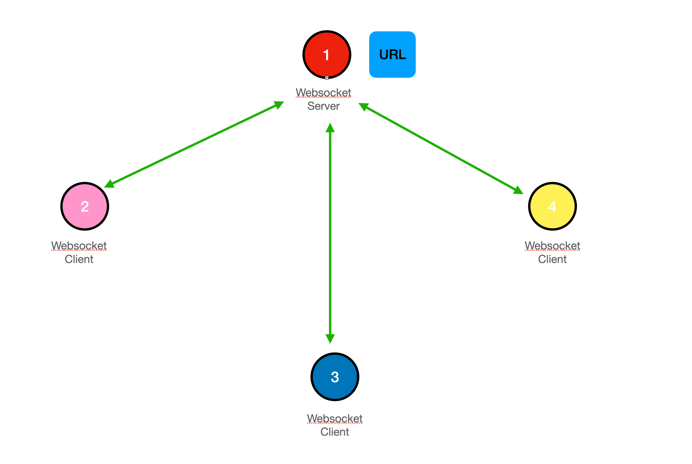</a>
   </div>
   </div>
  </div>
</div>

  
## TCP Mode of protocol

The TCP Mode allows users to directly use the MVR-xchange without the need for configuration or special hardware. Discovery of available MVR-xchange clients shall be performed by mDNS (RFC6762 Multicast DNS). Every application that wants to join a MVR-xchange group, need to register a mDNS service.

The service name shall be `_mvrxchange._tcp.local.`. The sub service name shall be `xxxx._mvrxchange._tcp.local.` where *xxxx* is the name of the group. 
. Each client shall negotiate a unique hostname via the methods described in the mDNS standards. Each client shall have a PTR, SRV, TXT and A and/or AAAA
record.

The TXT record should contain the information given in Table 65:


##### Table 65 — *TXT Record Attributes*

| Attribute Name | Attribute Value Type                |  Description                                                                   |
| -------------- | ----------------------------------- | ----------------------------------------------------------------------------- |
| StationName    | [String](../generic-value-types#user-content-attrtype-string)  | The Name of the sending station to be shown on the clients UI.                            |
| StationUUID    | [UUID](../generic-value-types#user-content-attrtype-uuid) | UUID of sending station inside the network. This UUID should be persistent across multiple start-ups of the same software on the same computer |

The format of the TXT record matches RFC1035.

When a MVR-xchange client wants to join a MVR-xchange group, he needs to register the service and sub service, and send a `MVR_JOIN` message to the other stations that register this sub service name. When a MVRxchange client wants to create a MVR-xchange group, he needs to register a service name which is currently not in use and wait for other MVR-xchange clients to join.

You can upgrade a TCP Mode MVR-xchange group to use the WebSocket Mode with sending a `MVR_NEW_SESSION_HOST` message providing the URL of the new service.

## WebSocket Mode of protocol

The WebSocket Mode allows users to create a routable service for the MVR-xchange. Discovery works with the normal DNS according to RFC6763. The service name needs to be a valid URL that can be resolved by the DNS server.

The DNS entry should point to the IP of the service running the websocket server. MVR-xchange clients that want to join this MVR-xchange Group need to connect with a web socket client (RFC6455— The WebSocket Protocol).


## Packet & Message definition

### General

Packages define how the message will be send to the MVR-xchange client, while the message describes the content. All the messages are defined, unless otherwise stated, as JSON documents (ISO/IEC 21778:2017). Packages are defined based on the mode of communication. They are defined for TCP Mode and WebSocket mode differently.

### TCP Mode

When in TCP Mode, all messages are send via TCP directly to the client. The packet is encoded as specified in Table 66:

##### Table 66 — *Packet & Message Definitions*

| Type    | Symbol  |
|---|---|
| `MVR_PACKAGE_HEADER`  |  Number that defines the package. Use 778682. |
| `MVR_PACKAGE_VERSION` |  Number that defines the version of the package format. Use 1. |
| `MVR_PACKAGE_COUNT`   |  Number that defines how many packages the current message consists of. |
| `MVR_PACKAGE_NUMBER`  |  Number that defines what number this package  in the complete message has. Zero based.  |
| `MVR_PACKAGE_TYPE`    |  Number that defines the package type. Use 0 for JSON UTF-8 Payload, use 1 for MVR FILES.  |
| `MVR_PAYLOAD_LENGTH`  |  Number showing the byte-length of transferred buffer. |
| `MVR_PAYLOAD_BUFFER`  |  Buffer data that stores the payload encoded. |


The order and size is defined as follows:
```
uint32 MVR_PACKAGE_HEADER
uint32 MVR_PACKAGE_VERSION
uint32 MVR_PACKAGE_NUMBER
uint32 MVR_PACKAGE_COUNT
uint32 MVR_PACKAGE_TYPE
uint64 MVR_PAYLOAD_LENGTH
char[] MVR_PAYLOAD_BUFFER
```

Where the following applies (Table 67):

##### Table 67 — *Data Type MVR-xchange package*

| Type    | Symbol  |
|---|---|
| uint32  |  32-bit unsigned integer |
| uint64  |  64-bit unsigned integer |
| char[]  |  8-bit character array |

NOTE All multi-byte fields defined shall be transmitted in network byte (big-endian) order

### WebSocket Mode

When in WebSocket Mode, all messages should be send as data frame Text *[RFC6455 5.6 Text 0x1](https://datatracker.ietf.org/doc/html/rfc6455#section-5.6)* unless otherwise defined. 

## `MVR_JOIN` message

### General

When a MVR-xchange client connects with another MVR-xchange client, the first MVR-xchange client needs to send a `MVR_JOIN` message. 

NOTE A MVR-xchange client can send multiple `MVR_JOIN` messages to the same server during the same connection to update its name or get the latest MVR file list.

### TCP Mode

Figure 3 shows the TCP mode for a MVR-xchange client joining MVR-xchange group.

##### Figure 3 — *TCP mode: MVR-xchange client joining MVR-xchange group*


<div class="container">
 <div class="row">
  <div class="col-sm border border-dark">
    <div class="text-center border-bottom border-dark font-weight-bold">
         a) MVR-xchange client 2 joins the MVR-xchange Group  
    </div>
    <div class="text-center">
        <a href="media/MVR_Join_mDNS_1.png">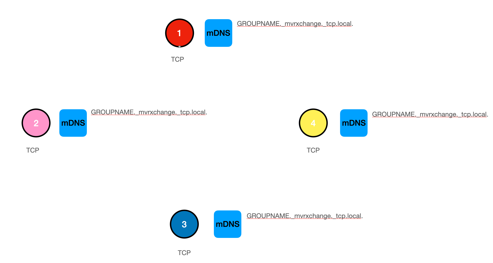</a>
   </div>
   </div>
  <div class="col-sm border border-dark">
    <div class="text-center border-bottom border-dark font-weight-bold">
         b) and sends to all mDNS Service a `MVR_JOIN` message  
    </div>
    <div class="text-center">
        <a href="media/MVR_Join_mDNS_2.png">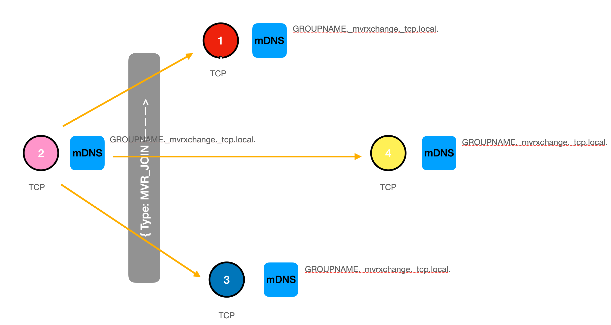</a>
   </div>
   </div>
  </div>
</div>


### WebSocket Mode

Figure 4 shows the Websocket mode for a MVR-xchange client joining MVR-xchange group.

##### Figure 4 — *Websocket mode: MVR-xchange client joining MVR-xchange group*


<div class="container">
 <div class="row">
  <div class="col-sm border border-dark">
    <div class="text-center border-bottom border-dark font-weight-bold">
         a) 1 Is a Websocket Server and has a URL    
    </div>
    <div class="text-center">
        <a href="media/MVR_Join_1.png">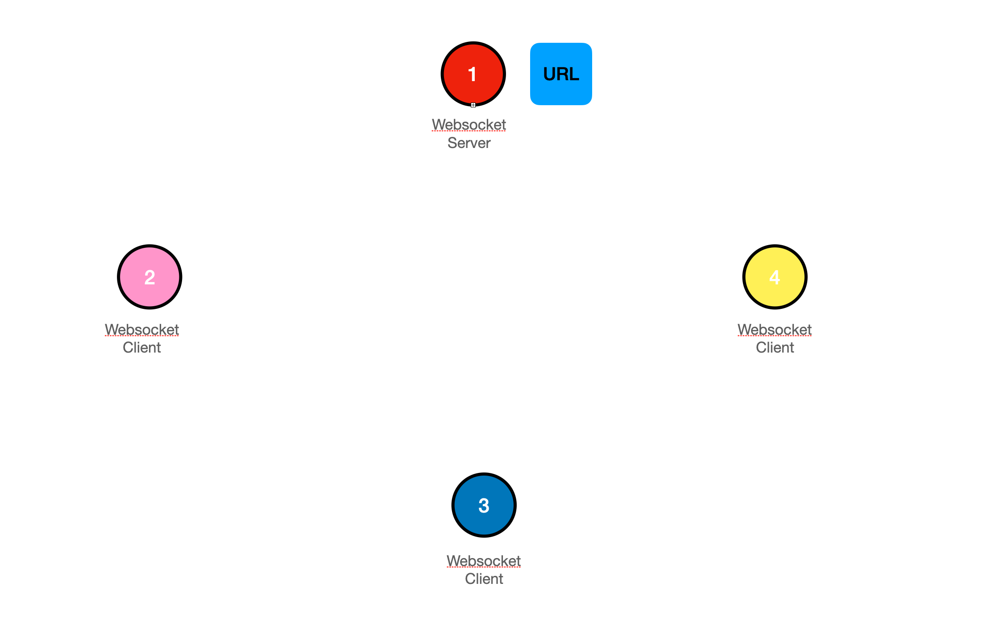</a>
   </div>
   </div>
  <div class="col-sm border border-dark">
    <div class="text-center border-bottom border-dark font-weight-bold">
         b) MVR-xchange client 2 connects to the websocket server and send a `MVR_JOIN` message  
    </div>
    <div class="text-center">
        <a href="media/MVR_Join_2.png">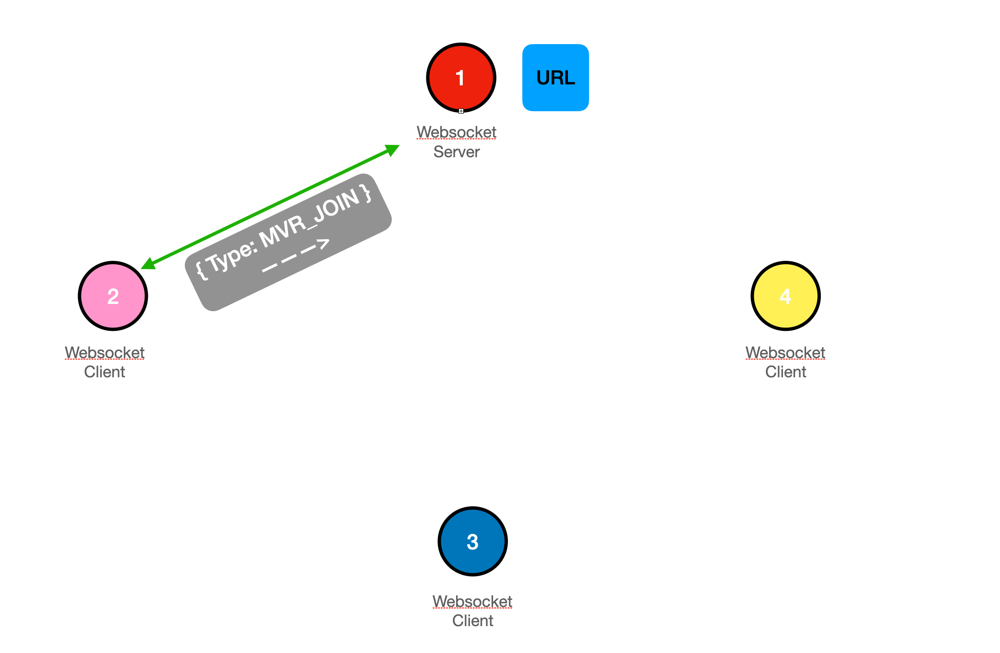</a>
   </div>
   </div>
  </div>
</div>


<div class="container">
 <div class="row">
  <div class="col-sm border border-dark">
    <div class="text-center border-bottom border-dark font-weight-bold">
         c) MVR-xchange client 3 connects to the websocket server and send a `MVR_JOIN` message 
    </div>
    <div class="text-center">
        <a href="media/MVR_Join_3.png">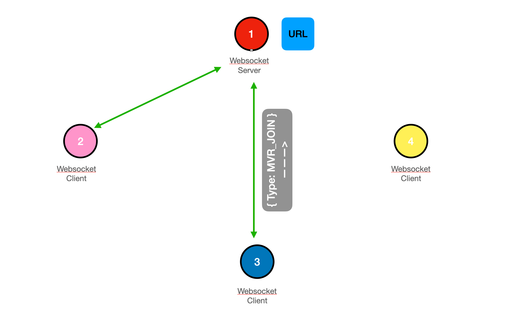</a>
   </div>
   </div>
  <div class="col-sm border border-dark">
    <div class="text-center border-bottom border-dark font-weight-bold">
         d) MVR-xchange client 3 connects to the websocket server and send a `MVR_JOIN` message  
    </div>
    <div class="text-center">
        <a href="media/MVR_Join_4.png">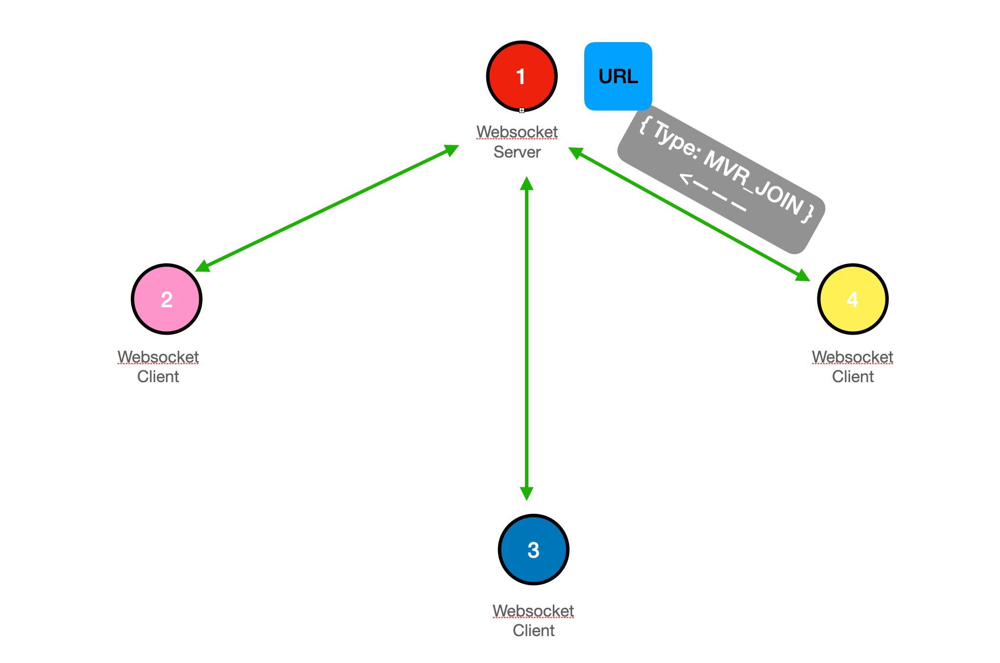</a>
   </div>
   </div>
  </div>
</div>

The defined MVR_JOIN message Attributes are specified in Table 68.

##### Table 68 — *MVR_JOIN message Attributes*

| Attribute Name | Attribute Value Type                | Default Value when Optional | Description                                                                   |
| -------------- | ----------------------------------- | --------------------------- | ----------------------------------------------------------------------------- |
| Type           | [String](../generic-value-types#user-content-attrtype-string)                              | Not Optional                | Defines the type of the message. Should be MVR_JOIN                           |
| Provider       | [String](../generic-value-types#user-content-attrtype-string)                              | Not Optional                | The application name providing MVR Import & Export                            |
| StationName    | [String](../generic-value-types#user-content-attrtype-string)                              | Not Optional                | The Name of the sending station to be shown on the clients UI.                            |
| verMajor       | [Integer](../generic-value-types#user-content-attrtype-integer) | 0                                                      | It is mandatory to transmit the version of the MVR file that the sender station supports.               |
| verMinor       | [Integer](../generic-value-types#user-content-attrtype-integer) | 0                                                      | It is mandatory to transmit the version of the MVR file that the sender station supports.               |
| StationUUID    | [UUID](../generic-value-types#user-content-attrtype-uuid) |   Not Optional                                               | UUID of sending station inside the network. This UUID should be persistent across multiple start-ups of the same software on the same computer |
| Commits          | [Array of `MVR_COMMIT`](../generic-value-types#user-content-attrtype-string)  | Empty Array                              | List all available MVR files that are on sender station in the format of the `MVR_COMMIT` packet.                |                             |

The defined MVR_JOIN response Attributes are specified in Table 69.

##### Table 69 — *MVR_JOIN response Attributes*

| Attribute Name | Attribute Value Type                | Default Value when Optional | Description                                                                   |
| -------------- | ----------------------------------- | --------------------------- | ----------------------------------------------------------------------------- |
| Type           | [String](../generic-value-types#user-content-attrtype-string)                              | Not Optional                | Defines the type of the message. Should be MVR_JOIN_RET                            |
| OK             | [Bool](../generic-value-types#user-content-attrtype-bool)                       | Not Optional                                        | True when operation is successful, false when there is an error. Check the Message for more information in this case.   |
| Message        | [String](../generic-value-types#user-content-attrtype-string)                              | Empty String                | Human readable message if there is an error.                |                             |
| Provider       | [String](../generic-value-types#user-content-attrtype-string)                              | Not Optional                | The application name providing MVR Import & Export                            |
| StationName    | [String](../generic-value-types#user-content-attrtype-string)                              | Not Optional                | The Name of the receiving station to be shown on the UI.                            |
| verMajor       | [Integer](../generic-value-types#user-content-attrtype-integer) | 0                                                      | It is mandatory to transmit the version of the MVR file that the receiver station supports.               |
| verMinor       | [Integer](../generic-value-types#user-content-attrtype-integer) | 0                                                      | It is mandatory to transmit the version of the MVR file that the receiver station supports.               |
| StationUUID    | [UUID](../generic-value-types#user-content-attrtype-uuid) |   Not Optional                                               | UUID for receiving station inside the network. This UUID should be persistent across multiple start-ups of the same software on the same computer |
| Commits         | [Array of `MVR_COMMIT`](../generic-value-types#user-content-attrtype-string)  | Empty Array                              | List all available MVR files that are on receiver station in the format of the `MVR_COMMIT` packet.                |                             |

EXAMPLE

Request:
```
{
  "Type": "MVR_JOIN",
  "Provider":"MVRApplication", 
  "verMajor":"1", 
  "verMinor":"6", 
  "StationUUID":"4aa291a1-1a62-45fe-aabc-e90e5e2399a8", 
  "StationName":"MVR Application from user A at location B",
  "Files": [
    {
      ...MVR_COMMIT_MESSAGE_ARGS
    },
    {
      ...MVR_COMMIT_MESSAGE_ARGS
    },
    {
      ...MVR_COMMIT_MESSAGE_ARGS
    }
  ]

}
```
Response:
```
{
  "Type": "MVR_JOIN_RET",
  "OK": "true",
  "Message": "",
  "verMajor":"1", 
  "verMinor":"6", 
  "StationUUID":"a7669ff9-bd61-4486-aea6-c190f8ba6b8c", 
  "StationName":"MVR Application from user A at location B",
  "Files": [
    {
      ...MVR_COMMIT_MESSAGE_ARGS
    },
    {
      ...MVR_COMMIT_MESSAGE_ARGS
    },
    {
      ...MVR_COMMIT_MESSAGE_ARGS
    }
  ]
}
```


## `MVR_LEAVE` message

A client sends a `MVR_LEAVE` when it wants to quit an MVR-xchange Group and does not want to get updates about new MVR files anymore.

For the WebSocket mode Figure 5 a): it is not required to terminate the Websockets connection, but it can be done. For the TCP mode Figure 5 b): it is not required to turn down the mDNS service, but it can be done.

In order to join again, the client needs to send a `MVR_JOIN` message again.

##### Figure 5 — *MVR_LEAVE message to quit MVR-xchange group*


<div class="container">
 <div class="row">
  <div class="col-sm border border-dark">
    <div class="text-center border-bottom border-dark font-weight-bold">
        a) In Webssocket mode: MVR-xchange client 4 send a `MVR_LEAVE` message to the websocket server. 
    </div>
    <div class="text-center">
        <a href="media/MVR_Leave_2.png">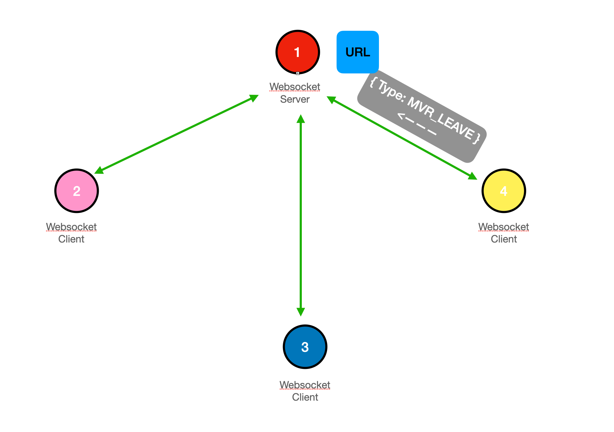</a>
   </div>
   </div>
  <div class="col-sm border border-dark">
    <div class="text-center border-bottom border-dark font-weight-bold">
         b) In TCP Mode: MVR-xchange client 2 send a `MVR_LEAVE` message to all stations  
    </div>
    <div class="text-center">
        <a href="media/MVR_Leave_1.png">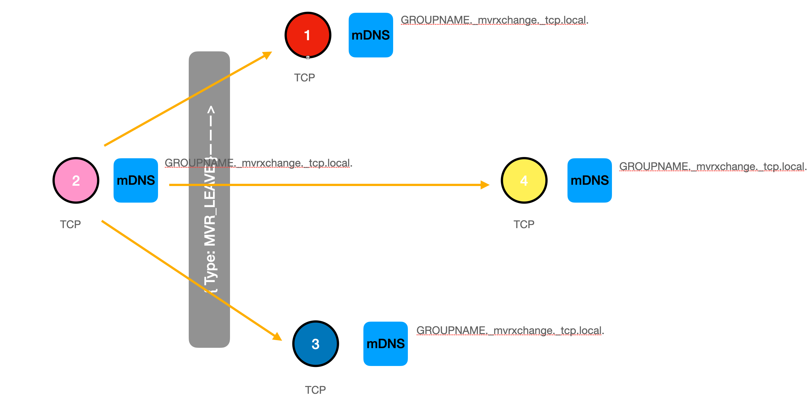</a>
   </div>
   </div>
  </div>
</div>

The defined MVR_LEAVE message Attributes are specified in Table 70.

##### Table 70 — *MVR_LEAVE message Attributes*

| Attribute Name | Attribute Value Type                | Default Value when Optional | Description                                                                   |
| -------------- | ----------------------------------- | --------------------------- | ----------------------------------------------------------------------------- |
| Type       | [String](../generic-value-types#user-content-attrtype-string)                              | Not Optional                | Defines the type of the message. Should be MVR_LEAVE                         |
| FromStationUUID      | [UUID](../generic-value-types#user-content-attrtype-uuid) |           Not Optional                  | The UUID of the station. |

The defined MVR_LEAVE response Attributes are specified in Table 71.

##### Table 71 — *MVR_LEAVE response Attributes*

| Attribute Name | Attribute Value Type                | Default Value when Optional | Description                                                                   |
| -------------- | ----------------------------------- | --------------------------- | ----------------------------------------------------------------------------- |
| Type       | [String](../generic-value-types#user-content-attrtype-string)                              | Not Optional                |     Defines the type of the message. Should be MVR_LEAVE_RET.                         |
| OK                  | [Bool](../generic-value-types#user-content-attrtype-bool)                       | Not Optional | True when operation is successful, false when there is an error. Check the Message for more information in this case.                                                                                                             |
| Message       | [String](../generic-value-types#user-content-attrtype-string)                              | Empty String | Human readable message when there is an error.                |                             |


EXAMPLE

Request:
```
{
  "Type": "MVR_LEAVE",
  "StationUUID":"", 
}
```
Response:
```
{
  "Type": "MVR_LEAVE_RET",
  "OK": "true",
  "Message": ""
}
```

## `MVR_COMMIT` message

### General

The MVR commit message informs all connected stations that there is a new MVR commit. This message only informs the stations about the existence of the new file. Stations needs to request the MVR file with a `MVR_REQUEST` message.

Each MVR commit represents one revision of the project. Therefore an array of MVR commits, as found in the `MVR_JOIN` message, represents the working history of the project. It is up to the client how many commits are kept in store at any time.

The following chart displays the process when one client sends a `MVR_COMMIT` message to the server, and the server distributes this in the session.

### TCP Mode

The MVR-xchange client informs all other MVR-xchange clients about the new commit (see Figure 6). Note that the client needs to respect any previous `MVR_LEAVE` messages themselves.

##### Figure 6 — *TCP mode: MVR-xchange client commits to MVR-xchange group.*


<div class="container">
 <div class="row">
  <div class="col-sm border border-dark">
    <div class="text-center border-bottom border-dark font-weight-bold">
MVR-xchange client sends the `MVR_COMMIT` message to the connected stations.
    </div>
    <div class="text-center">
        <a href="media/MVR_Commit_4.png">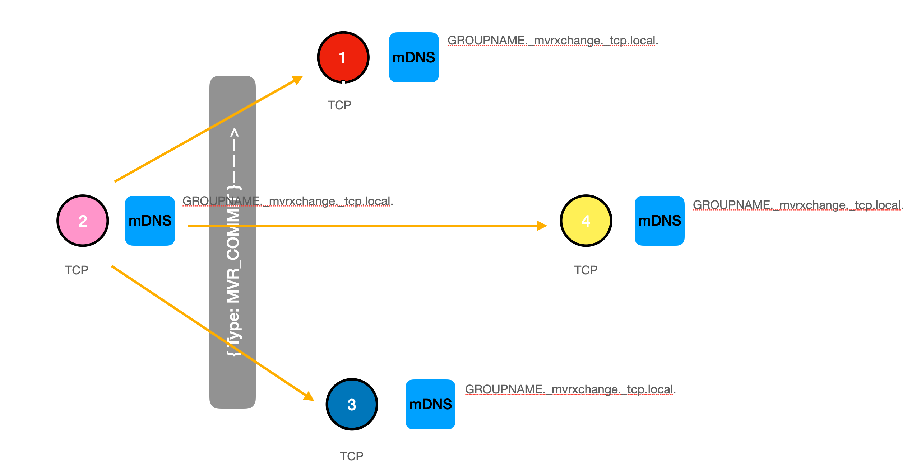</a>
   </div>
   </div>
  
  </div>
</div>

### WebSocket Mode

Figure 7 shows the WebSocket mode for a MVR-xchange client that commits to MVR-xchange group.

##### Figure 7 — *Websocket mode: MVR-xchange client commits to MVR-xchange group.*


<div class="container">
 <div class="row">
  <div class="col-sm border border-dark">
    <div class="text-center border-bottom border-dark font-weight-bold">
         a) MVR-xchange client sends message to server  
    </div>
    <div class="text-center">
        <a href="media/MVR_Commit_1.png">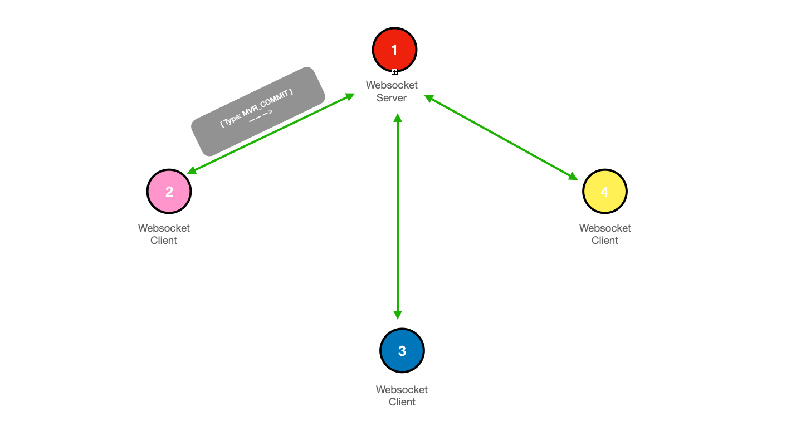</a>
   </div>
   </div>
  <div class="col-sm border border-dark">
    <div class="text-center border-bottom border-dark font-weight-bold">
         b) Server sends messages to all connected MVR-xchange clients but the sender  
    </div>
    <div class="text-center">
        <a href="media/MVR_Commit_2.png">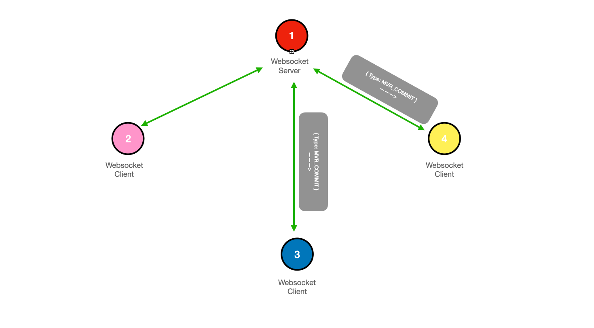</a>
   </div>
   </div>
  </div>
</div>

Figure 8 displays the process when the server is the station who is providing a new MVR file. In this case the MVR info is directly transmitted to the connected stations.

##### Figure 8 — *Server makes the MVR_COMMIT itself, and only sends it to connected MVR-xchange clients*


<div class="container">
 <div class="row">
  <div class="col-sm border border-dark">
    <div class="text-center border-bottom border-dark font-weight-bold">
         Server makes the `MVR_COMMIT` itself, and only sends it to connected MVR-xchange clients 
    </div>
    <div class="text-center">
        <a href="media/MVR_Commit_3.png">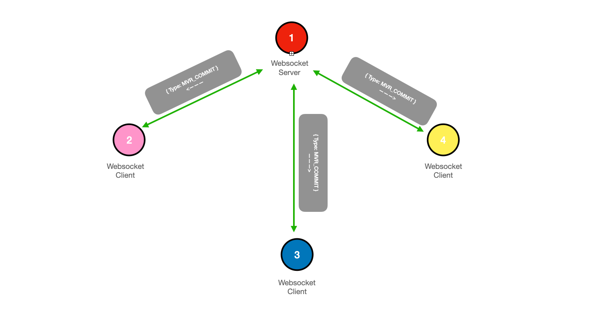</a>
   </div>
   </div>
  </div>
</div>

The defined MVR_COMMIT message Attributes are specified in Table 72.

##### Table 72 — *MVR_COMMIT message Attributes*

| Attribute Name | Attribute Value Type                | Default Value when Optional | Description                                                                   |
| -------------- | ----------------------------------- | --------------------------- | ----------------------------------------------------------------------------- |
| Type       | [String](../generic-value-types#user-content-attrtype-string)                              | Not Optional                |               Defines the type of the message. Should be MVR_COMMIT.             |
| verMajor       | [Integer](../generic-value-types#user-content-attrtype-integer) | Not Optional          | It is mandatory to transmit the current version of the MVR file as specified in Root File. If joining as new member send "0".               |
| verMinor       | [Integer](../generic-value-types#user-content-attrtype-integer) | Not Optional          | It is mandatory to transmit the current version of the MVR file as specified in Root File. If joining as new member send "0".               |
| FileSize       | [Integer](../generic-value-types#user-content-attrtype-integer) | Not Optional          |                |
| FileUUID      | [UUID](../generic-value-types#user-content-attrtype-uuid) |   Not Optional                          | The UUID of the MVR file. Generate a UUID using |
| StationUUID      | [UUID](../generic-value-types#user-content-attrtype-uuid) |   Not Optional                          | UUID for the station inside the network. This UUID should be persistent across multiple start-ups of the same software on the same computer |
| ForStationsUUID      | Array of [UUID](../generic-value-types#user-content-attrtype-uuid) |   []                          | Array with the station UUID that this MVR should be send to. When it is an empty array, the MVR will be send to all connected *MVR-xchange clients* |
| Comment       | [String](../generic-value-types#user-content-attrtype-string)                              |                 | Describes the changes made in this version of the MVR file.                            |
| FileName   | [String](../generic-value-types#user-content-attrtype-string) |                 | Describes the file name that can be used to store the file on disk to preserve it across multiple MVR-xchange clients. The usage of this attribute is optional, when not defined, the receiving  MVR-xchange client can decide which file name it uses to store it on disk.                   |

The defined MVR_COMMIT response Attributes are specified in Table 73.

##### Table 73 — *MVR_COMMIT response Attributes*

| Attribute Name | Attribute Value Type                | Default Value when Optional | Description                                                                   |
| -------------- | ----------------------------------- | --------------------------- | ----------------------------------------------------------------------------- |
| Type       | [String](../generic-value-types#user-content-attrtype-string)                              | Not Optional                |  Defines the type of the message. Should be MVR_COMMIT_RET.                          |
| OK                  | [Bool](../generic-value-types#user-content-attrtype-bool)                       | Not Optional | True when operation is successful, false when there is an error. Check the Message for more information in this case.                                                                                                             |
| Message       | [String](../generic-value-types#user-content-attrtype-string)                              | Empty String | Human readable message when there is an error.                |                             |


```
Request:
{
  "Type": "MVR_COMMIT",
  "verMajor":1, 
  "verMinor":6, 
  "FileUUID":"", 
  "ForStationsUUID":[], 
  "FileSize":256, 
  "Comment":"My complete description of what I have changed",
}
Response:
{
  "Type": "MVR_COMMIT_RET",
  "OK": "true",
  "Message": ""
}
```
    
## `MVR_REQUEST` message

This packet requests a MVR file from a station. You either can request a specific MVR via its UUID or get the last available MVR File by leaving the field empty. The underlying software will then generate a file based on the current state. This also triggers a `MVR_COMMIT` message to other connected stations.

The available MVR UUIDs can be retrieved using the `MVR_COMMIT` message.

If the station does not have the specified MVR file, it returns a MVR_REQUEST Json Response, otherwise it sends the buffer of the MVR file.

NOTE 1 When in WebSocket Mode, the binary frame flag will be used to tell the receiver if a Buffer or JSON is sent.
NOTE 2 When in TCP Mode, the `MVR_PACKAGE_TYPE` flag will be used to tell the receiver if a Buffer or JSON was sent.

Figure 9 shows the Websocket mode for a MVR-xchange client that is requesting a file.

##### Figure 9 — *Websocket mode: MVR-xchange client requesting file*


<div class="container">
 <div class="row">
  <div class="col-sm border border-dark">
    <div class="text-center border-bottom border-dark font-weight-bold">
         a) Station requests a MVR from another station    
    </div>
    <div class="text-center">
        <a href="media/MVR_Request_1.png">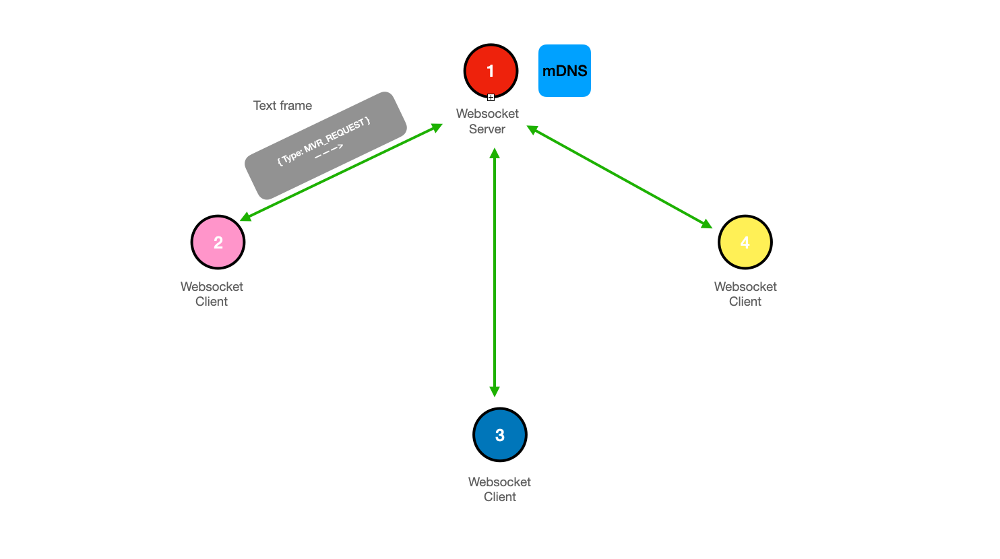</a>
   </div>
   </div>
  <div class="col-sm border border-dark">
    <div class="text-center border-bottom border-dark font-weight-bold">
         b) Server sends the request to the right station  
    </div>
    <div class="text-center">
        <a href="media/MVR_Request_2.png">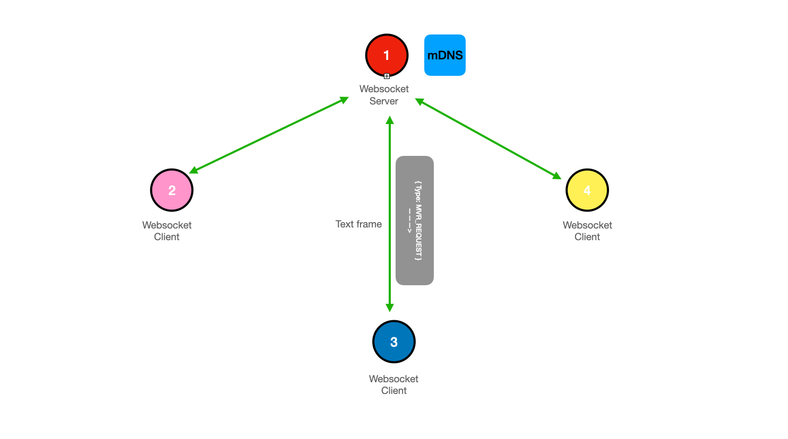</a>
   </div>
   </div>
  </div>
</div>


<div class="container">
 <div class="row">
  <div class="col-sm border border-dark">
    <div class="text-center border-bottom border-dark font-weight-bold">
         c) Station sends the MVR file as binary data to the server 
    </div>
    <div class="text-center">
        <a href="media/MVR_Request_3.png">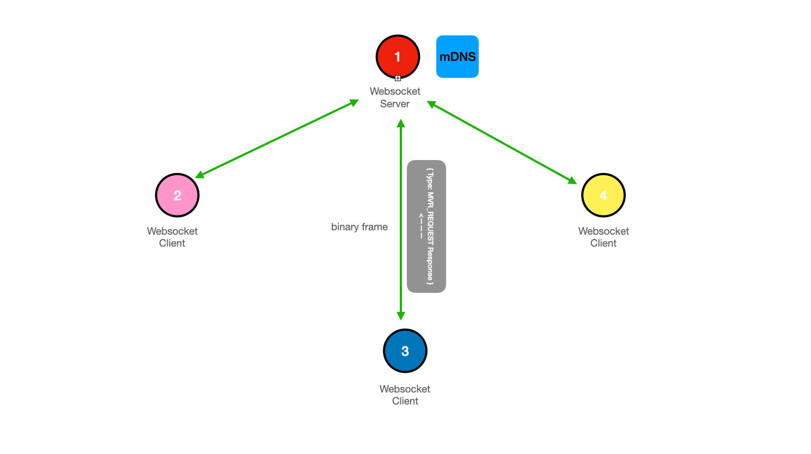</a>
   </div>
   </div>
  <div class="col-sm border border-dark">
    <div class="text-center border-bottom border-dark font-weight-bold">
         d) Server sends the MVR the MVR file as binary data to the station  
    </div>
    <div class="text-center">
        <a href="media/MVR_Request_4.png">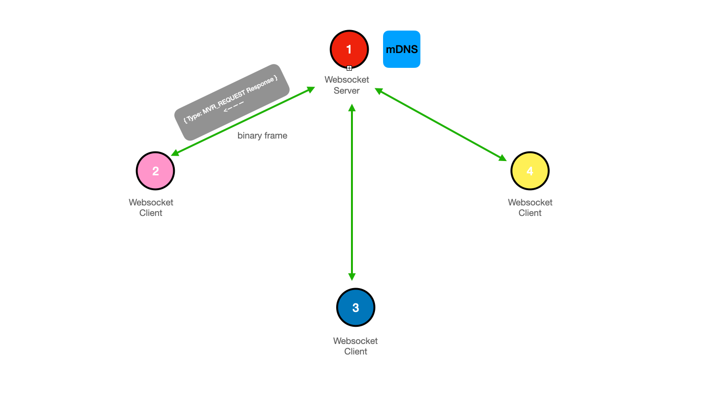</a>
   </div>
   </div>
  </div>
</div>

Figure 10 shows the TCP mode for a MVR-xchange client that is requesting a file.

##### Figure 10 — *TCP mode: MVR-xchange client requesting file*


<div class="container">
 <div class="row">
  <div class="col-sm border border-dark">
    <div class="text-center border-bottom border-dark font-weight-bold">
         a) MVR-xchange client requests a MVR from another station   
    </div>
    <div class="text-center">
        <a href="media/MVR_Request_mDNS1.png">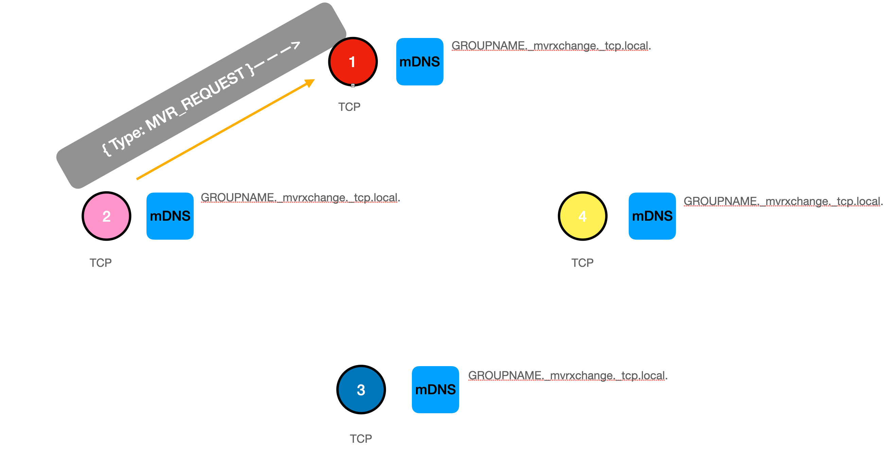</a>
   </div>
   </div>
  <div class="col-sm border border-dark">
    <div class="text-center border-bottom border-dark font-weight-bold">
         b) First requested station does not have the MVR and sends back a failure message,  
    </div>
    <div class="text-center">
        <a href="media/MVR_Request_mDNS2.png">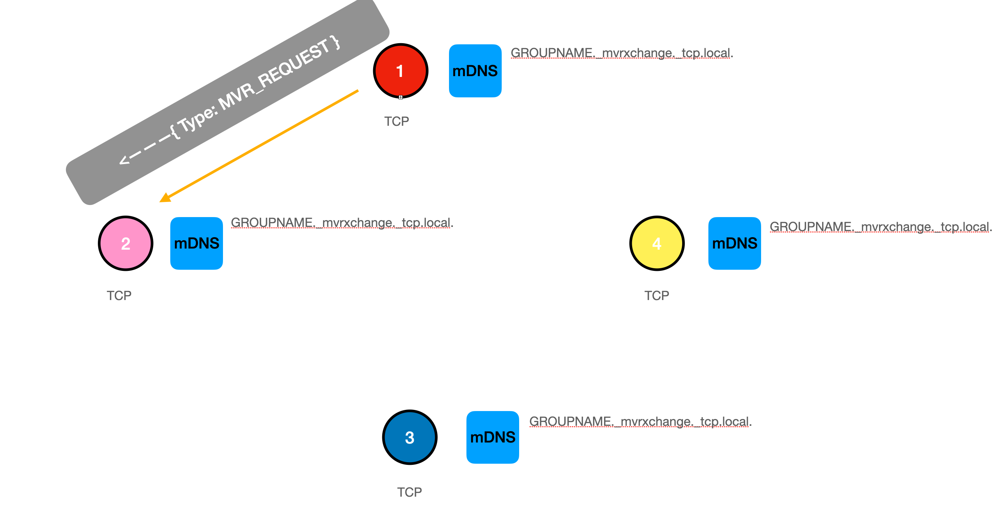</a>
   </div>
   </div>
  </div>
</div>


<div class="container">
 <div class="row">
  <div class="col-sm border border-dark">
    <div class="text-center border-bottom border-dark font-weight-bold">
         c) MVR-xchange client requests a MVR from another station 
    </div>
    <div class="text-center">
        <a href="media/MVR_Request_mDNS3.png">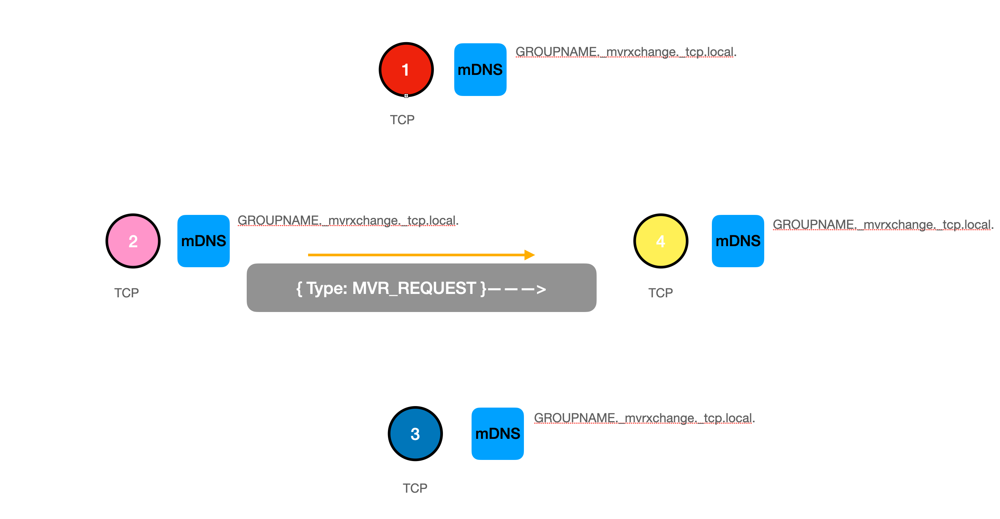</a>
   </div>
   </div>
  <div class="col-sm border border-dark">
    <div class="text-center border-bottom border-dark font-weight-bold">
         d) Second requested station does have the MVR and sends back the MVR file  
    </div>
    <div class="text-center">
        <a href="media/MVR_Request_mDNS4.png">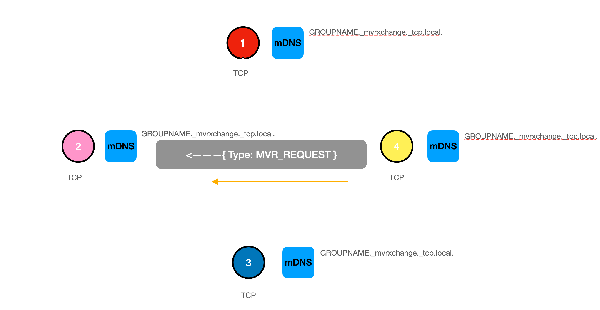</a>
   </div>
   </div>
  </div>
</div>

The defined MVR_REQUEST message Attributes are specified in Table 74.

##### Table 74 — *MVR_REQUEST message Attributes*

| Attribute Name | Attribute Value Type                | Default Value when Optional | Description                                                                   |
| -------------- | ----------------------------------- | --------------------------- | ----------------------------------------------------------------------------- |
| Type       | [String](../generic-value-types#user-content-attrtype-string)                              | Not Optional                | Defines the type of the message. Should be MVR_REQUEST-                           |
| FileUUID      | [UUID](../generic-value-types#user-content-attrtype-uuid) |   Last MVR File from station                          | The UUID of the requested MVR file. If not set, the last available file is sent. |
| FromStationUUID      | Array of [UUID](../generic-value-types#user-content-attrtype-uuid) |                             | The UUID of the station that you want to retrieve the MVR from. |

The defined MVR_REQUEST error response Attributes are specified in Table 75.

##### Table 75 — *MVR_REQUEST error response Attributes*

| Attribute Name | Attribute Value Type                | Default Value when Optional | Description                                                                   |
| -------------- | ----------------------------------- | --------------------------- | ----------------------------------------------------------------------------- |
| Type       | [String](../generic-value-types#user-content-attrtype-string)                              | Not Optional                |                Defines the type of the message. Should be MVR_REQUEST_RET             |
| OK                  | [Bool](../generic-value-types#user-content-attrtype-bool)                       | Not Optional | True when operation is successful, false when there is an error. Check the Message for more information in this case.                                                                                                             |
| Message       | [String](../generic-value-types#user-content-attrtype-string)                              | Empty String | Human readable message when there is an error.                |                             |


Request:
```
{
  "Type": "MVR_REQUEST",
  "FromStationUUID":"", 
  "FileUUID":"", 
}
```
Response:

binary frame

OR
```

{
  "Type": "MVR_REQUEST_RET",
  "OK": "false",
  "Message": "The MVR is not available on this client"
}
```

## `MVR_NEW_SESSION_HOST` message

This message is used to inform other MVR-xchange clients of impending network configuration changes. This message is sent to all nodes in the network.

This message type is meantfor two use cases: 
- Change the Service URL (WebSocket Mode) or the ServiceName (TCP Mode) of a network 
- Switch the Mode of a network

This requires that only either `ServiceName` or `SerivceURL` are set. Setting both will return OK: false.

### Change Service URL/Name

This requires, that the current Network mode and the supplied message data are matching:
- If in WebSocket Mode, the **ServiceURL** shall be set
- If in TCP Mode, the **ServiceName** shall be set

When the receiving nodes are in TCP Mode: 

Each receiver will try to connect to the mDNS service given in `ServiceName` and send a `MVR_JOIN` message. If this is successful, the nodes save the new Service Name and modify their own mDNS service. OK: true is returned. If no connection could be established, OK: false is returned. 

When the receiving nodes are in WebSocket Mode: 

Each receiver will try to connect to the URL given in `ServiceURL` and send a `MVR_JOIN` Message. If this is successful, the nodes save the URL and return OK: true. Otherwise OK: false is returned. 

## Switch Mode of a Network

This requires, that the current Network mode and the supplied message data are **not** matching:
- If in WebSocket Mode, the **ServiceName** shall be set
- If in TCP Mode, the **ServiceURL** shall be set.

When the receiving nodes are in TCP Mode: 

Each receiver will try to switch into WebSocket Mode by connecting to the URL given in `ServiceURL` and send a `MVR_JOIN` Message. If this is successful, then OK: true is returned and the mode is switched. If the URL is not reachable, then OK: false is returned.

When the receiving nodes are in WebSocket Mode: 

Each receiver will try to switch into TCP Mode by connecting to the mDNS service given in `ServiceName` and send a `MVR_JOIN` Message. If this is successful, the nodes switch to TCP Mode and establish their own mDNS client as described above. OK: true is returned in this case. If the new mDNS service is not reachable OK: false is returned.

The defined MVR_NEW_SESSION_HOST message Attributes are specified in Table 76.

##### Table 76 — *MVR_NEW_SESSION_HOST message Attributes*

| Attribute Name | Attribute Value Type                | Default Value when Optional | Description                                                                   |
| -------------- | ----------------------------------- | --------------------------- | ----------------------------------------------------------------------------- |
| Type       | [String](../generic-value-types#user-content-attrtype-string)                              | Not Optional                |Defines the type of the message. Should be MVR_NEW_SESSION_HOST                           |
| ServiceName      | [String](../generic-value-types#user-content-attrtype-string) |   Empty                          | New mDNS Service Name to connect to. If Empty, ignore. Cannot be set together with ServiceURL |
| ServiceURL      |  [String](../generic-value-types#user-content-attrtype-string) | Empty. | New WebSocket Service URL to connect to. If Empty, ignore. Cannot be set together with ServiceURL

The defined MVR_NEW_SESSION_HOST error response Attributes Attributes are specified in Table 77.

##### Table 77 — *MVR_NEW_SESSION_HOST error response Attributes*

| Attribute Name | Attribute Value Type                | Default Value when Optional | Description                                                                   |
| -------------- | ----------------------------------- | --------------------------- | ----------------------------------------------------------------------------- |
| Type       | [String](../generic-value-types#user-content-attrtype-string)                              | Not Optional                | Defines the type of the message. Should be MVR_NEW_SESSION_HOST_RET                            |
| OK                  | [Bool](../generic-value-types#user-content-attrtype-bool)                       | Not Optional | True when operation is successful, false when there is an error. Check the Message for more information in this case.                                                                                                             |
| Message       | [String](../generic-value-types#user-content-attrtype-string)                              | Empty String | Human readable message when there is an error.                |                             |


Request:
```
{
  "Type": "MVR_NEW_SESSION_HOST",
  "ServiceName":"fancyProjectGroup._mvrxchange._tcp.local.", 
  "ServiceURL":"", 
}
```

Response:
```
{
  "Type": "MVR_NEW_SESSION_HOST_RET",
  "OK": "true",
  "Message": ""

}
```
---
